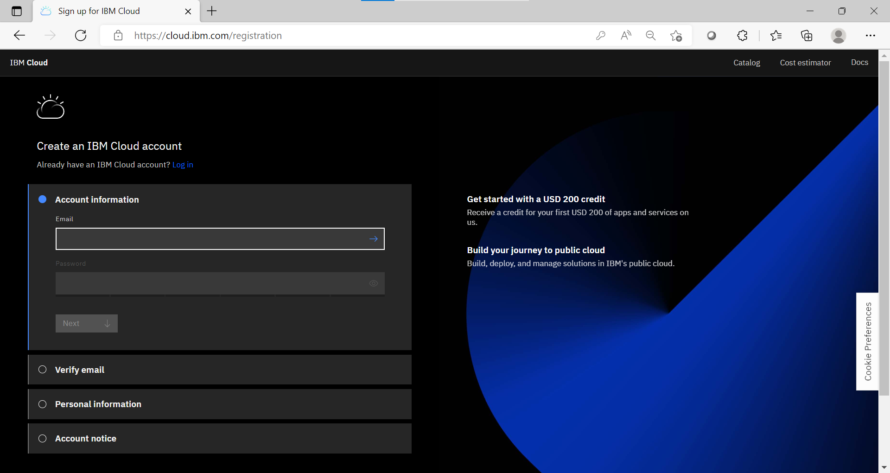
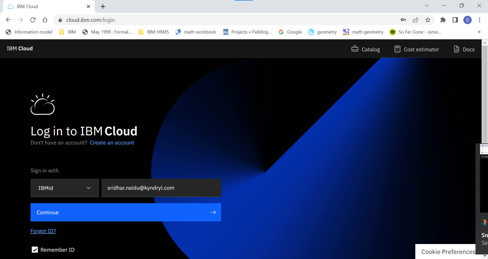
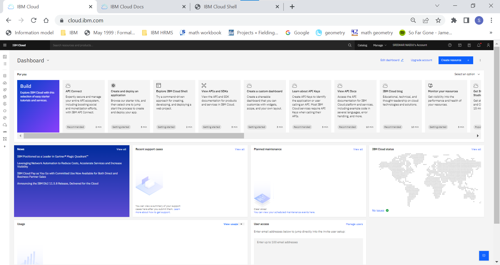
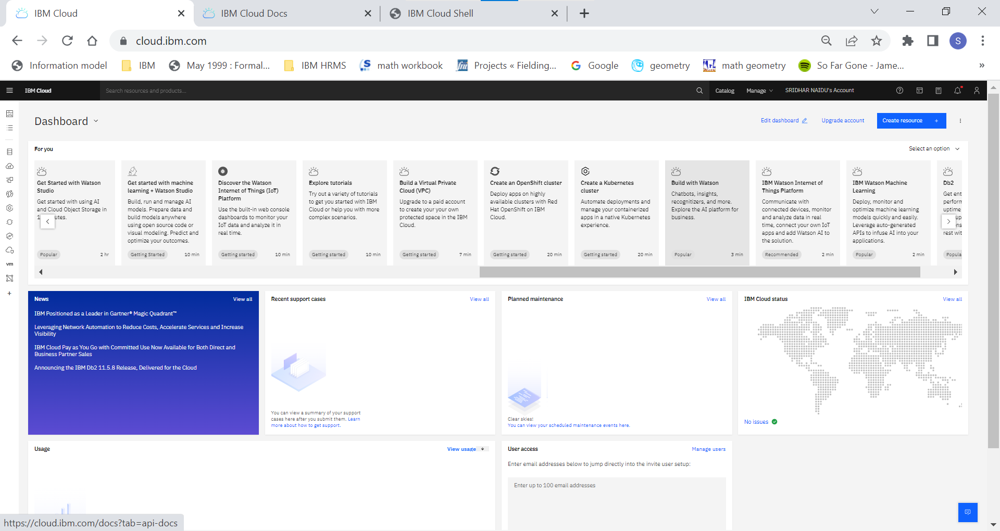
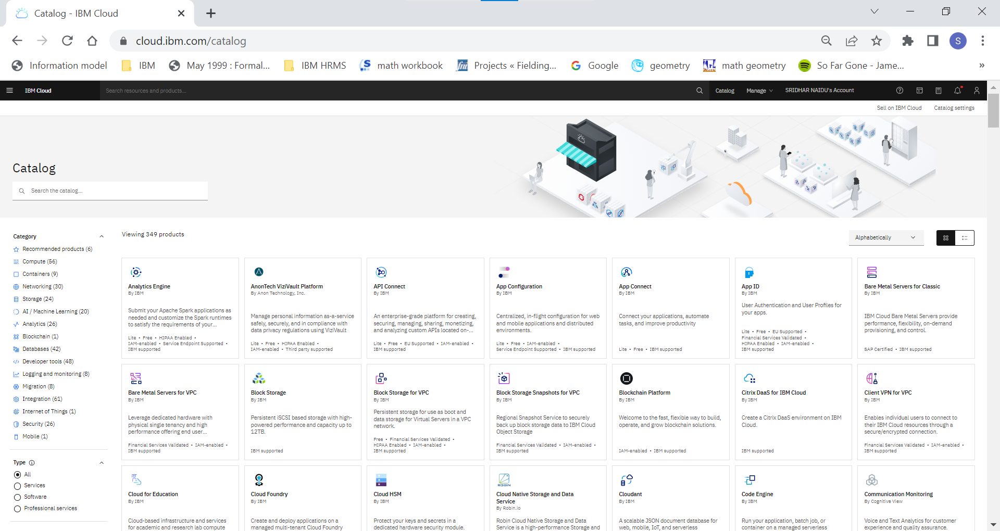
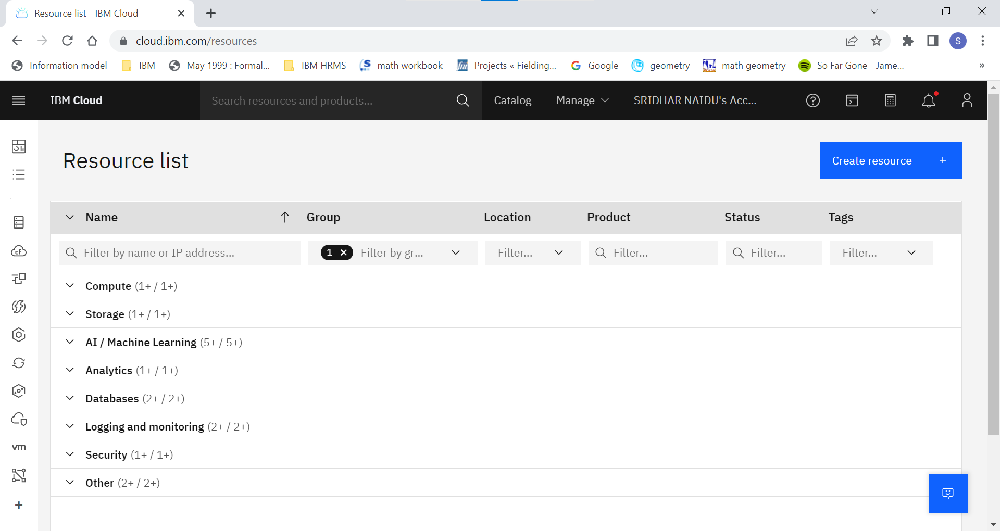
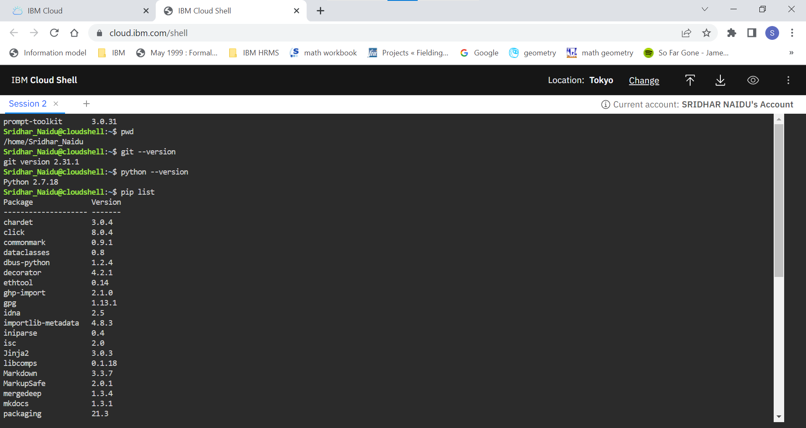
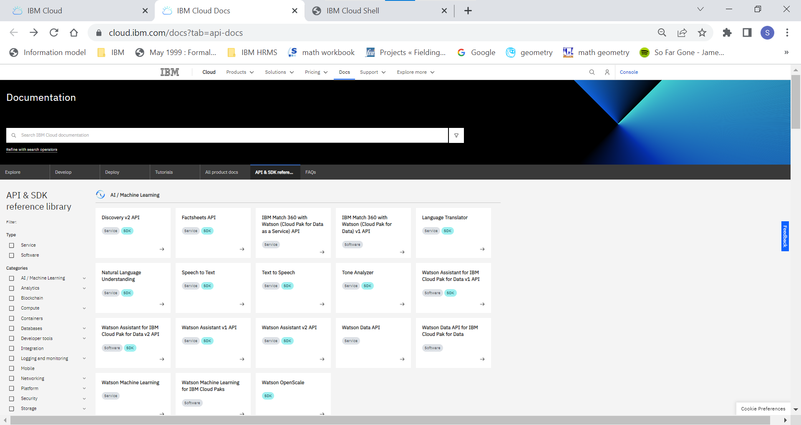
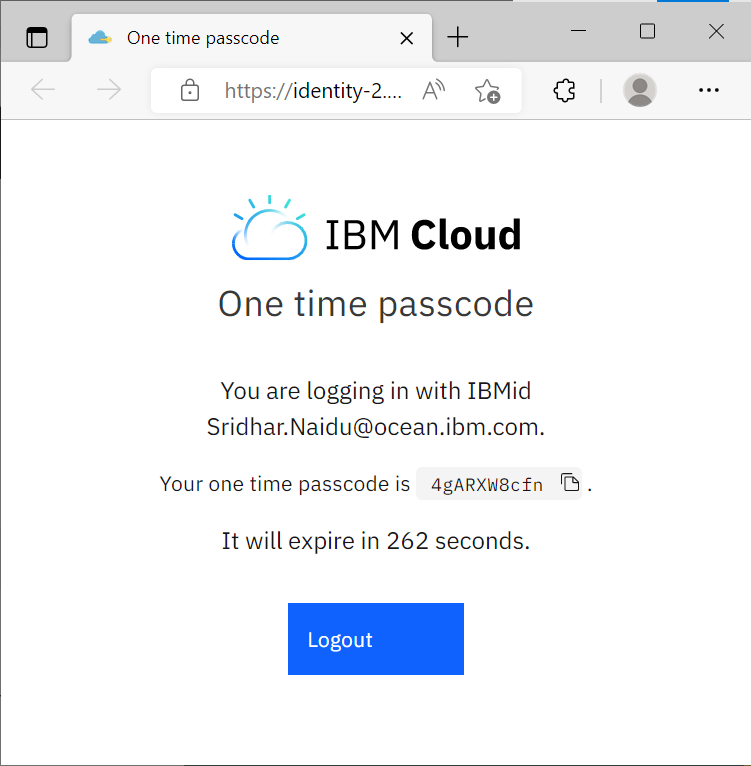

??? important " QUICK EXPLORE GUIDE "
    ``` mermaid
        flowchart LR
            S([Start])-->A
            A-->B 
            B-->C
            C-->D
            D-->E
            E-->F
            F-->G
            G-->H
            H-->I
            I-->End([End])
            click A "https://cloud.ibm.com/registration"
            click B "https://cloud.ibm.com/login"
            click C "https://cloud.ibm.com/"
            click D "https://cloud.ibm.com/catalog"
            click E "https://cloud.ibm.com/resources"
            click F "https://cloud.ibm.com/shell"
            click G "https://cloud.ibm.com/docs?tab=api-docs"
    ```
    __A__ = Register to create an IBM Cloud Account;  
    __B__ = Login to the IBM Cloud Account;  
    __C__ = Explore IBM Cloud Dashboard;  
    __D__ = Explore IBM Cloud Resources;  
    __E__ = Explore IBM Cloud Catalog;   
    __F__ = Explore IBM Cloud Shell;  
    __G__ = Explore IBM Cloud API Docs;  
    __H__ = Install the IBM Cloud CLI;  
    __I__ = Access IBM Cloud on local via GIT Bash;


## 1. Register to create an IBM Cloud Account

1.1 Tune your browser to https://cloud.ibm.com/registration

1.2 Use your IBM Ocean Id and password to register if already not done, else move to next step.

  


## 2. Login to the IBM Cloud Account
Use your IBM Ocean Id and password to login.

  


## 3. Explore IBM Cloud Dashboard

  

  


## 4. Explore IBM Cloud Catalog  

Click on the menu tab:"Catalog" in the banner to launch and explore the Catalog.

  


## 5. Explore IBM Cloud Resources   

  


## 6. Explore IBM Cloud Shell

  


## 7. Explore IBM Cloud API Docs

  


## 8. Install the IBM Cloud CLI (Command Line Interface)

__INFO URL__ https://cloud.ibm.com/docs/cli?topic=cli-install-ibmcloud-cli

__Download URL__ https://github.com/IBM-Cloud/ibm-cloud-cli-release/releases/

1. Go to [https://github.com/IBM-Cloud/ibm-cloud-cli-release/releases/](https://github.com/IBM-Cloud/ibm-cloud-cli-release/releases/) and download the IBM CLoud CLI installable for your OS. 
2. Select the downloded file and complete the installation.
3. To verify, open the "Git Bash".
4. Type "ibmcloud --version" at the prompt and press the "Enter" key and this should display the version of the IBM Cloud CLI if the installation is completed sucessfully, as shown below.

''C:\Program Files\IBM\Cloud\bin\ibmcloud.exe version 2.11.1+c18277d-2022-09-23T21:49:24+00:00


## 9. Access IBM Cloud on local via GIT Bash

1. Open the "Git Bash"
2. Type "Type "ibmcloud login --sso" at the prompt and press the "Enter" key and this should display the message as shown below:

```sh
API endpoint: https://cloud.ibm.com
Region: us-south

Get a one-time code from https://identity-2.uk-south.iam.cloud.ibm.com/identity/passcode to proceed.
Open the URL in the default browser? [Y/n] >
```
3. Respond by typing a "Y" and in the git bash the 'One-time code >' is displayed and at the same time a new browser session is opened displaying the IBM Cloud Login OTP as shown below:
  

4. Copy the OTP from the browser and paste it into the Git bash against 'One-time code >' and on successful authentication the following message is displayed.

```sh
Authenticating...
OK

Targeted account SRIDHAR NAIDU's Account (3c64c997392946469f8f0a3457877667)


API endpoint:      https://cloud.ibm.com
Region:            us-south
User:              Sridhar.Naidu@ocean.ibm.com
Account:           SRIDHAR NAIDU's Account (3c64c997392946469f8f0a3457877667)
Resource group:    No resource group targeted, use 'C:\Program Files\IBM\Cloud\bin\ibmcloud.exe target -g RESOURCE_GROUP'
CF API endpoint:
Org:
Space:


```

## 10. Final Step

<form name="myform" action = "https://restsvr.eu-gb.cf.appdomain.cloud/create" method = "post">
  <input type="hidden" id="issuetitle" name="ititle" value="Record Completion of Register & Access IBM Cloud">
  <input type="hidden" id="issuebody" name="ibody" value="The Register & Access IBM Cloud Completed ">
  <a href="javascript: submitform()">Click Here</a> to register the completion of tasks on Github
</form>
<script type="text/javascript">
function submitform(){document.myform.submit();}
</script>