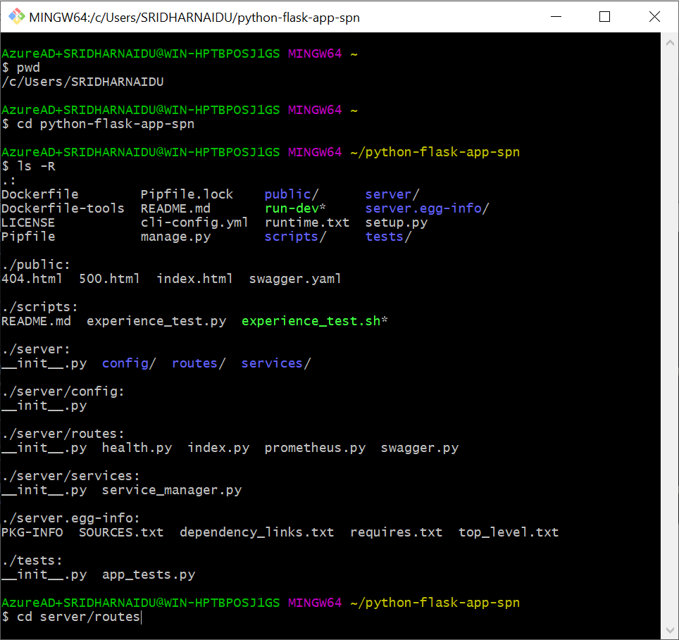
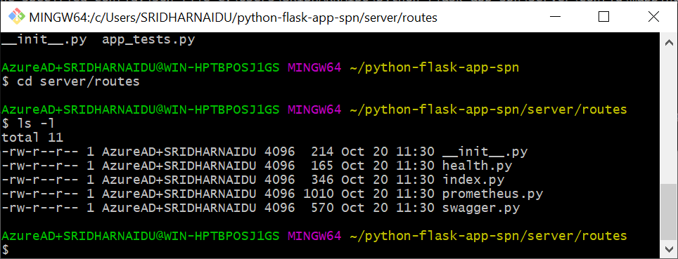
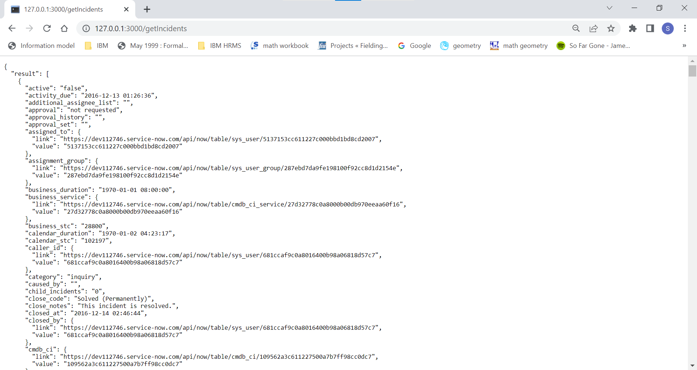

#Creating a Flask Microservice Program for ServiceNow API

## 1. Verify the current directory and list the files recursively in Python App directory and sub-directories

  

1.1 Type `pwd` and press the "Enter" key to verify your are in your Python App directory, else change to this directory.

1.2 Type `ls -R` and press enter to see the recursive directory listing of files in Python App directory.

1.3 Locate from the list the first level directories `public`, `scripts` and `server` 

## 2. Change to the microservices directory 'Server/routes'

Type `cd server/routes` and list the files by typing `ls -l`

  

## 3. Create a new file 'snowAPI.py' in the `server/routes`folder

3.1  Copy the below code snippet by clicking the icon:"copy to clipboard" on the right or Copy the below 20 plus lines of code snippet by selecting and pressing `Ctrl + C`.

***
``` sh

from flask import jsonify, request, json, redirect, render_template
from server import app

import requests
from requests.auth import HTTPBasicAuth

# get inputs from SNow 
snow_username  = "admin"
snow_password = "*aU=TZ7gT3at"
api_url = "https://dev112746.service-now.com/api/now/table/incident?sysparm_limit=10"
basic_auth = HTTPBasicAuth(snow_username, snow_password)

@app.route('/getIncidents')
def GIncidents():
	
	#send get request
    response = requests.get(api_url, auth=basic_auth)

	#recieve the response data in json format
    data =  response.json()
    return data
```
***

3.2 Create the new file by typing `code snowAPI.py` at git bash command prompt and this will open the new blank file in Visual Code.

3.3 Paste the earlier copied lines of code in Visual Code by pressing `Ctrl + V` and then press `Ctrl + S` to save the file.

3.4 Replace the Snow password and instance name with the details saved from [access-servicenow-cloud/#4-your-developer-instance](../access-servicenow-cloud/#4-your-developer-instance) as shown below:

    


``` sh
snow_username  = "admin"
snow_password = "<replace with the current password"
api_url = "https://<replace with your snow instance name>.service-now.com/api/now/table/incident?sysparm_limit=10"

```

3.5 When done please save the file by pressing the keys `Ctrl + s` in the Visual Code.

## 4. Run the Python App on Local

Switch back to Git Bash and type `python manage.py run` and press enter. On successful outcome you should see the message:
`* Running on http://127.0.0.1:3000`

## 5. Launch the new Microservice - getIncidents in a browser
Launch a browser and tune to `http://127.0.0.1:3000/getIncidents` and this should display the response as shown below:

  


## 6. Final Step
Congratulations you have successfully run your Python Flask Microservice to get SNow Incidents using your local python Server.

<form name="myform" action = "https://restsvr.eu-gb.cf.appdomain.cloud/create" method = "post">
  <input type="hidden" id="issuetitle" name="ititle" value="Successfully completed the Snow get Incidents Python Flask Microservice">
  <input type="hidden" id="issuebody" name="ibody" value="Works Perfectly Fine">
  <a href="javascript: submitform()">Click Here</a> to register the completion of this task on Github
</form>
<script type="text/javascript">
function submitform(){document.myform.submit();}
</script>
