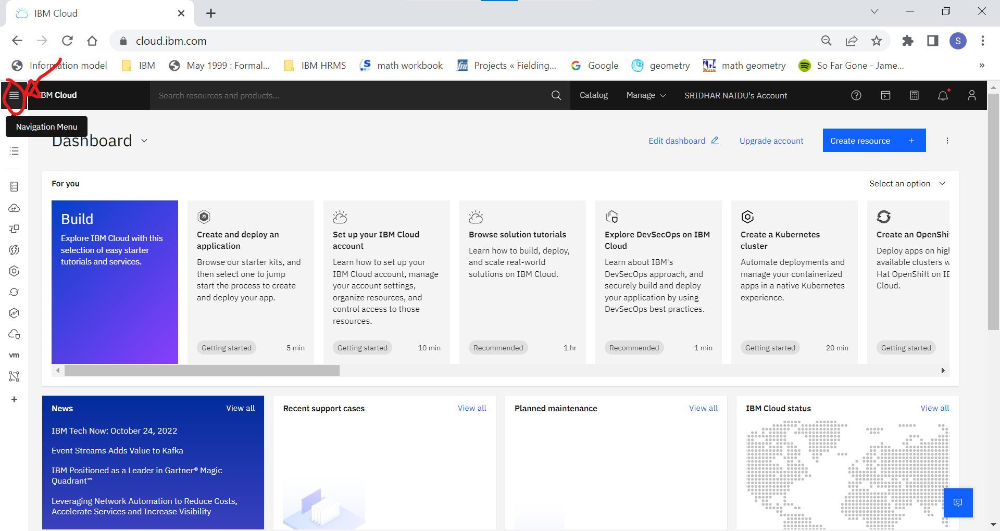
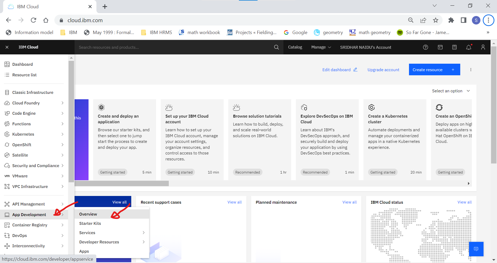
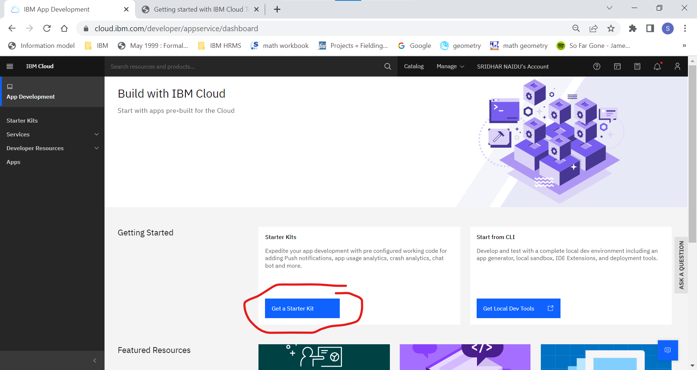
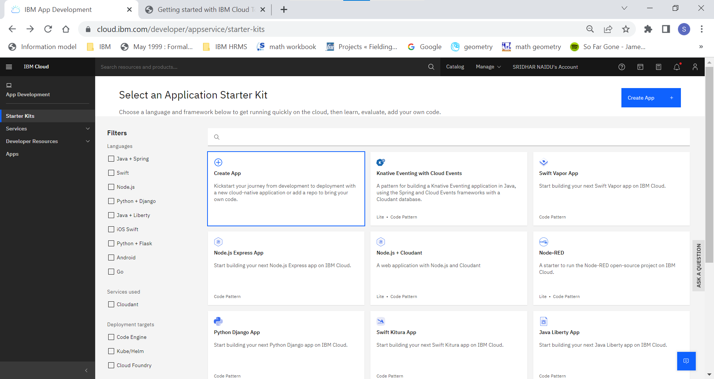
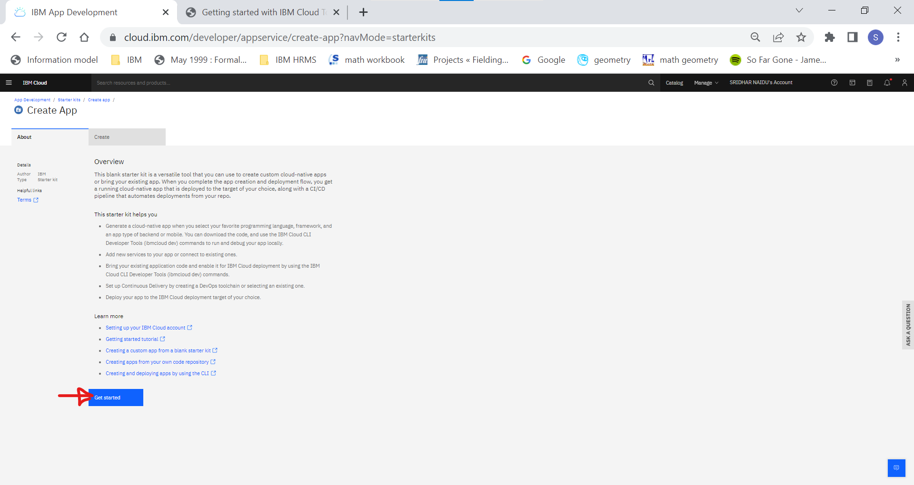
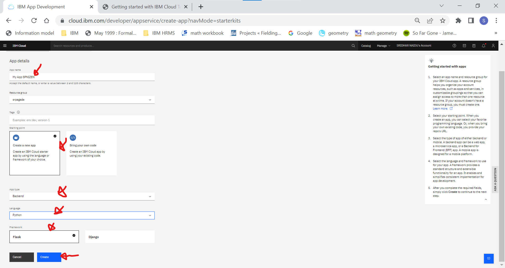
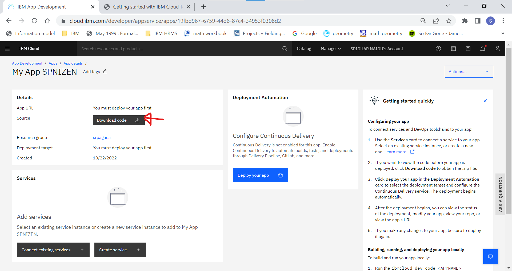

#Create a Python Flask Application on the IBM Cloud

???+ important " QUICK EXPLORE GUIDE "
    ``` mermaid
        flowchart LR
            S([Start])-->1
            1-->2 
            2-->3
            3-->4
            4-->5
            5-->6
            6-->7
            7-->8
            8-->9
            9-->End([End])
    ```


## 1. Login to the IBM Cloud Account

  

Use your Ocean enterprise email id and password to login if already not done, else move to next step.

## 2. Click on the Hamburger/List Menu icon on the top left.

  

This will pull out the menu drawer to show the menu descriptions against each listed icon.

## 3. Click on App Development -> Overview

    

This will navigate to the App Develpment Overview/Landing page.

## 3. Click on Get a Stater Kit

  

## 4. Click on Create App 

  


## 5. Click on Get Started

  

## 6. Input/Select the defaults and Click on Create  

  1. App name: Accept the default or input your own App Name. 
  2. Resource Group: Accept the default.
  3. Tags: Accept the default or add any valid tags as shown in the Examples.
  4. Starting Point: Select Create a new app.
  5. App Type: Select as Backend.
  6. Language: Select Python from the dropdown list.
  7. Framework: Select Flask
  8. Click on the button:"Create"  

  

  This will provision the App and display the App details, please see screenshot in next step.

## 7. Click on Download Code  

  

Once the download is complete, the zipped file should be available in the download folder on the local drive.


## 8. Final Step

<form name="myform" action = "https://restsvr.eu-gb.cf.appdomain.cloud/create" method = "post">
  <input type="hidden" id="issuetitle" name="ititle" value="Record Completion of Register & Access IBM Cloud">
  <input type="hidden" id="issuebody" name="ibody" value="The Register & Access IBM Cloud Completed ">
  <a href="javascript: submitform()">Click Here</a> to register the completion of tasks on Github
</form>
<script type="text/javascript">
function submitform(){document.myform.submit();}
</script>
