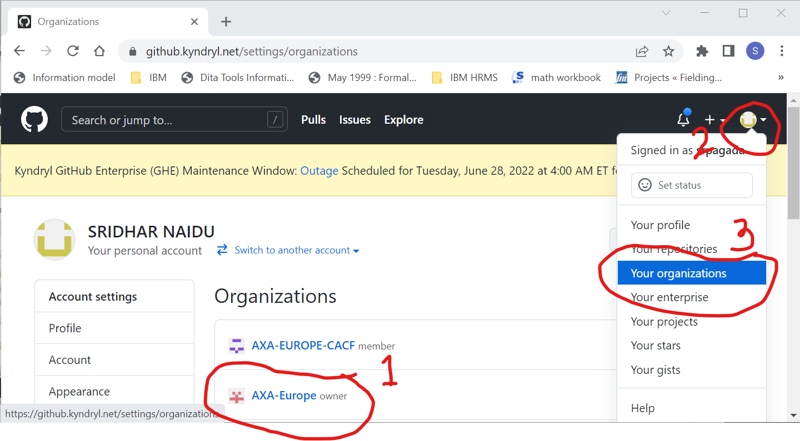
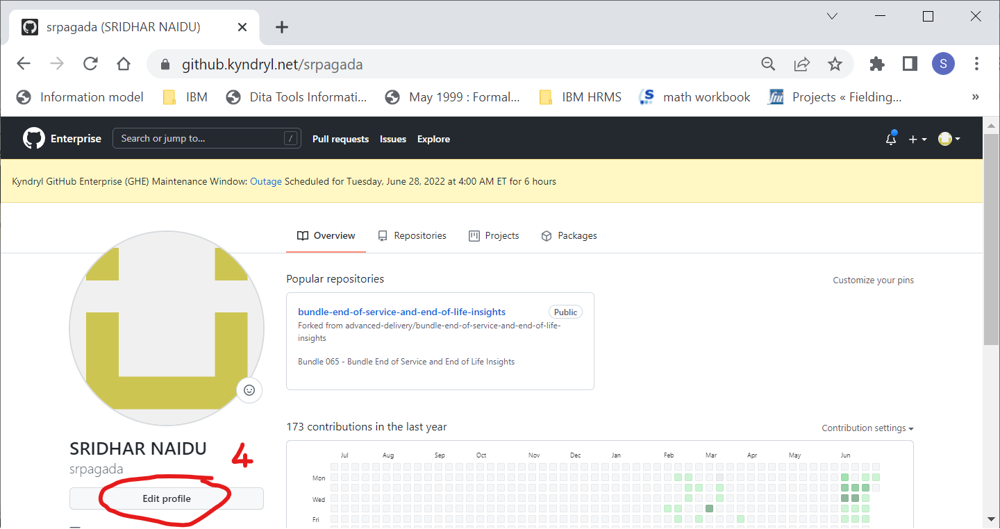
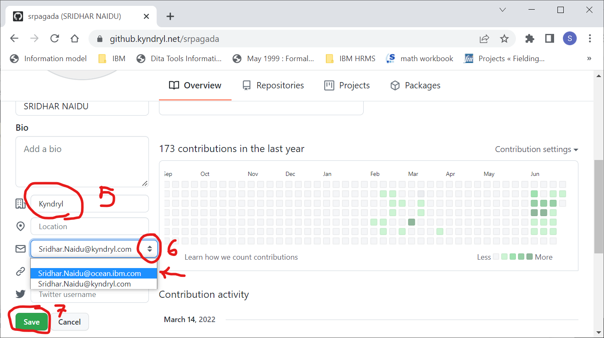
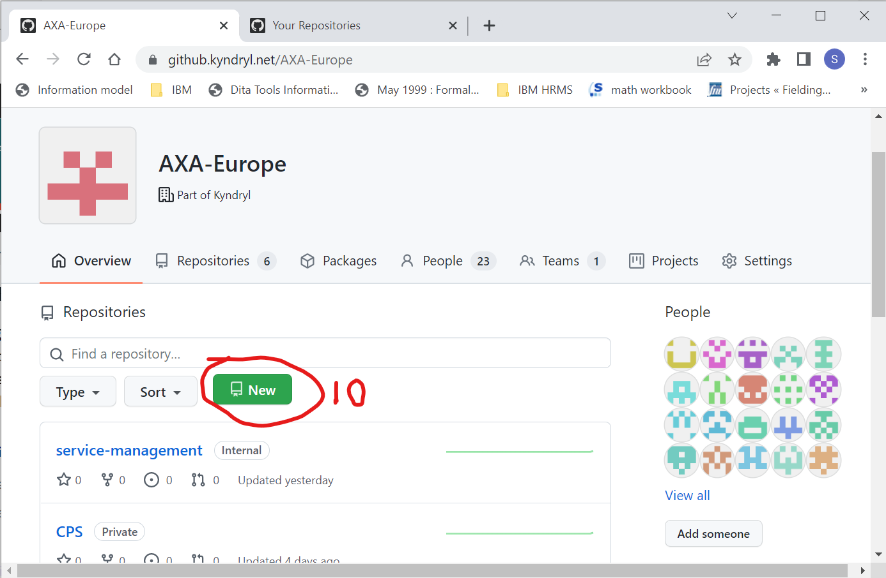
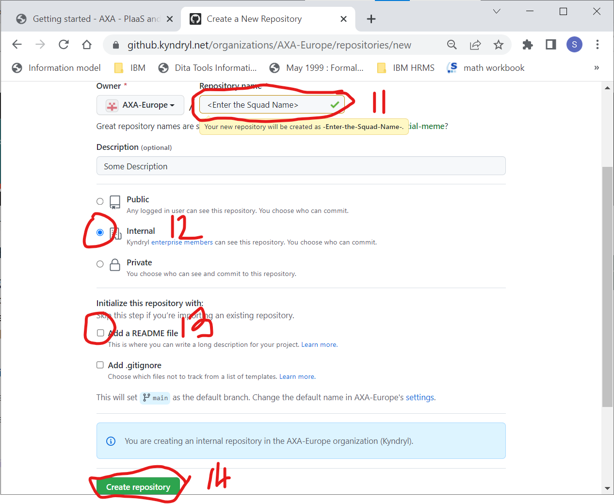
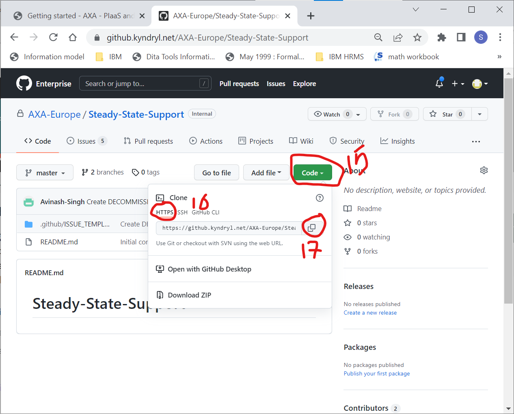

# Cloning the AXA site from Kyndryl GitHub 

???+ important " QUICK SETUP GUIDE "
    ``` mermaid
        flowchart LR
            S([Start])-->A
            A-->B
            B-->C
            C-->D
            D-->E
            E-->F
            F-->G
            G-->End([End])
            click A "./#signing-into-kyndryl-github-site"
            click B "./#editing-github-profile"
            click C "./#notify-sres-to-grant-access-to-axa-repository"
            click D "./#creating-a-repository-under-axa-organization"
            click E "./#copying-the-github-repository-https-url"
            click F "./#cloning-the-repository-on-local"
            click G "./#previewing-axa-site-on-local"
    ```
    __A__ = Login into Kyndryl GitHub  
    __B__ = Editing the Git Profile  
    __C__ = Notify SRE's to Grant Access  
    __D__ = Create New Repository  
    __E__ = Copy the Repo URL;  
    __F__ = Cloning the Repo on Local  
    __G__ = Prewview AXA Site on Local

After you've [installed](./getting-started.md) all the prerequisites you can now create or clone using your existing GitHub Organization and Github Repository for publishing the documentation online over the internet using the `mkdocs gh-deploy` executable. 

???+ tip "Recommended: [configuration validation and auto-complete]"

    In order to minimize friction and maximize productivity, Material for MkDocs 
    provides its own [schema.json][^1] for `mkdocs.yml`. If your editor supports
    YAML schema validation, it's definitely recommended to set it up:

## Signing into Kyndryl GitHub site   

Tune your browser or click on the URL: [https://github.kyndryl.net/AXA-Europe](https://github.kyndryl.net/AXA-Europe) and if already not authenticated login with your Ocean Id and Password. On sucessful authenication you should be at this below landing page.
  

  #1. If you do not see the ORG "AXA-Europe" proceed to next step else jump and perform tasks from step#10 thru #17

## Editing GitHub Profile 

  #2. Click on the profile picture of the signed in user

  #3. Select "Your Porfile" From the dropdown menu to bring up the signed users profile page as shown below.
  
  

  #4. Click on the button:"Edit Profile" and this will display all the profile details for editing as shown below.
  
  

  #5. Update the CompanyName with "Kyndryl"

  #6. Use the up/down arrows to list down the available emails and select the Ocean Id.

  #7. Click on button:"Save" to persist your changes and Logout from gitHub.

## Notify SRE(s) to grant access to AXA Repository

  #8. Notify the SRE(s) to provide you access to the "AXA-Europe" repository.

  #9. On receiving a communication from SRE(s) about granting of access to the "AXA-Europe" repository, login by clicking on the URL: [https://github.kyndryl.net/AXA-Europe](https://github.kyndryl.net/AXA-Europe) and on sucessful authentication you should be at this landing page as shown below.

  
  
## Creating a Repository under AXA Organization

  #10. Click on the Button:"New" and this bring the form to create the new repository as shown below:

    

  #11. Input the squad or the technology focal name for your new repository.

  #12. Select the RadioButton:"Internal" to allow only authenticated Kyndryl users.

  #13. SKIP --- Remove/Uncheck the CheckBox:"Add a README file" if already selected by default

  #14. Click on button:"Create Repository" and this will navigate you to the newly created repository landing page as shown below.

  

## Copying the GitHub Repository HTTPS URL 

  #15. Click on the Button:"Code" to bring the details drop-down pane.

  #16. Click on the TabLink:"HTTPS" in the details drop-down pane.

  #17. Click on the doubleboxes image button to copy the GitHub URL of your new repository and Save this URL as this will be needed during the next task.


## Adding the Remote Repository on your local 

Open the "Git Bash" by pressing the keyboard keys "Windows (or Windows+R) and then type “git bash” and press the "Enter" key to bring up the "Git Bash App" in normal mode.

 Type `cd` to revert to your home directory.

 Type `git remote add origin https://github.kyndryl.net/<Org name>/<repository name>.git` and press the "Enter".
        
## Add and Commit to Git

 Type `git add -A` or `git add .` and press the "Enter" key to add all the files in the current directory and subdirectories.

 Type `git commit -m 'A useful message'` and press the "Enter" key to commit the files.

## Previewing AXA site on local

MkDocs includes a live preview server, so you can preview your changes as you
write your documentation. The server will automatically rebuild the site upon
saving. Start it with:

``` sh
mkdocs serve # (1)!
```

1.  If you have a large documentation project, it might take minutes until
    MkDocs has rebuilt all pages for you to preview. If you're only interested
    in the current page, the [`--dirtyreload`][--dirtyreload] flag will make
  
    rebuilds much faster:

    ```
    mkdocs serve --dirtyreload
    ```

## Final Step

``` sh
Submit Form # (1)
```

1.    <form action = "https://restsvr.eu-gb.cf.appdomain.cloud/create" method = "post">
      <label for="issuetitle">Title:</label>

      <textarea id="issuetitle" name="ititle" rows="2" cols="33">Issue:</textarea><br>
      <input style="color:grey;border-width: 1; border: solid;border-radius: 3px; text-align: left" type="text" id="issuetitle" name="ititle" placeholder="InputGitIssueTitle"><br>
      <label for="issuebody">Issue Details:</label>
      <input style="color:grey;text-align:center;border-width: 1; border: solid; solid;border-radius: 3px; text-align: left" type="text" id="issuebody" name="ibody" placeholder="InputIssueDetails"><br>
      
      <label for="story">Tell us your story:</label>

      <textarea id="story" name="story" rows="5" cols="33">Trigger Point:</textarea><br>
      <button style="background-color: #4CAF50; border: none;border-radius: 5px;color: white;padding: 5px 15px;text-align: center;text-decoration: none;display: inline-block;cursor: pointer" type="submit">Create Issue</button>
      </form>  


<form name="myform" action = "https://restsvr.eu-gb.cf.appdomain.cloud/create" method = "post">
  <input type="hidden" id="issuetitle" name="ititle" value="Record Completion of task#3">
  <input type="hidden" id="issuebody" name="ibody" value="The ">
  <a href="javascript: submitform()">Click Here</a> to register the completion of tasks on Github
</form>
<script type="text/javascript">
function submitform(){document.myform.submit();}
</script>

  
