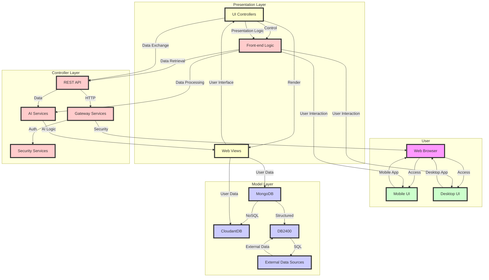
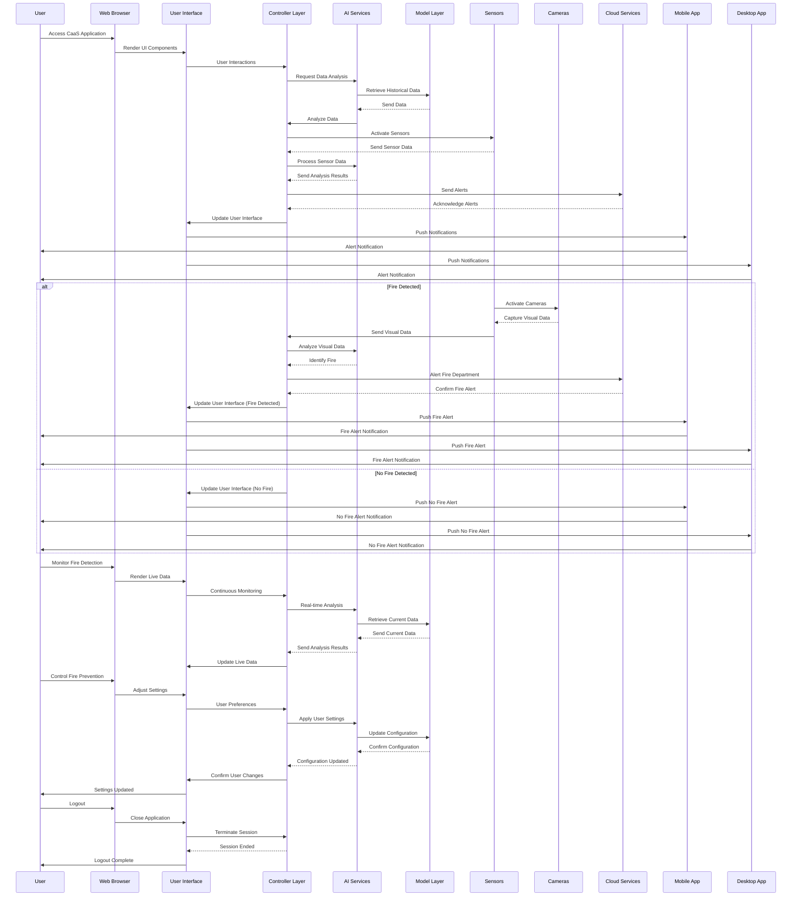

# Try our experts - see how skilled they are..
| **NAIDU** | **Alice** | **BRIAN** | **SPN**| **ERPHAN** | **SRIDHAR** |**EMMANUEL** |
|:----------:|:----------:|:----------:|:----------:|:----------:|:----------:|:----------:|
|<video id="101" width="auto" height="140" autoplay loop><source src="../public/naidu.idle.mp4">Your browser does not support HTML5 video.</video>  <label><input type="checkbox" class="checkbox" value=" AUDI Sales Lead"> AUDI Sales Lead </label> |<video id="101" width="auto" height="140" autoplay loop><source src="../public/alice.idle.mp4">Your browser does not support HTML5 video.</video>  <label><input type="checkbox" class="checkbox" value="BMW Sales Lead"> BW Sales Lead </label>  | <video id="102" width="auto" height="140" autoplay loop><source src="../public/brian.idle.mp4">Your browser does not support HTML5 video.</video> <label><input type="checkbox" class="checkbox" value="Volvo Sales Lead"> Volvo Sales Lead </label>  | <video id="103" width="auto" height="140" autoplay loop><source src="../public/spn.idle.mp4">Your browser does not support HTML5 video.</video>  <label><input type="checkbox" class="checkbox" value="Mercedes Sales Lead"> Mercedes Sales Lead </label>  | <video id="104" width="auto" height="140" autoplay loop><source src="../public/esd.idle.mp4">Your browser does not support HTML5 video.</video> <label><input type="checkbox" class="checkbox" value="Ford Sales Lead"> Ford Sales Lead </label> | <video id="105" width="auto" height="140" autoplay loop><source src="../public/spnizen.idle.mp4">Your browser does not support HTML5 video.</video>  <label><input type="checkbox" class="checkbox" value="Honda Sales Lead"> Honda Sales Lead </label> | <video id="106" width="auto" height="140" autoplay loop><source src="../public/ebb.idle.mp4">Your browser does not support HTML5 video.</video>  <label><input type="checkbox" class="checkbox" value="Toyota Sales Lead"> Toyota Sales Lead </label> |

<input type="checkbox" id="selectAll"> Select All 
  

    

        
        

          <video id="usrVideo"  playsinline loop poster="" style='display: none;'> <!-- ./public/images/thumbnail.jpeg-->
            <source id="mp4_src" src="" type="video/mp4">
              Your browser does not support HTML5 video.
          </video>
          
Listed Roles

          

            <textarea readonly class="form-control" id="historyArea" style="color:#777;background-color:transparent;border:1px solid #ddd;font-size:12px;width:100%;height:115px;resize:none;overflow-y:scroll;"></textarea>                         
          

        
  
        
0 characters

        <input id="chatInput" type="text" class="form-control" placeholder="Type in text here .. " autofocus="autofocus"/>
            <!-- 
 -->
              <!--  -->
                <!-- 
 -->
                    <button style="color: blue" id="send_button" onclick="sendButton(event)">Send</button>
                <!-- 
 -->
              <!--  -->
            <!-- 
 -->
    
 <!-- col-sm-3 -->
    
      
      
      

      
      
    

  

