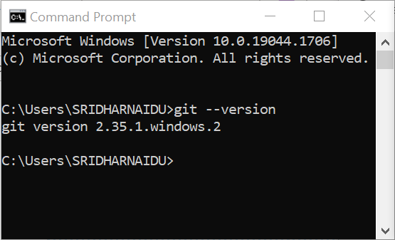
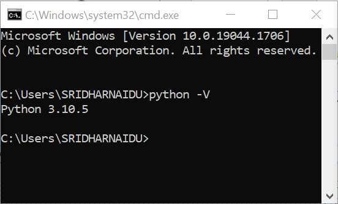
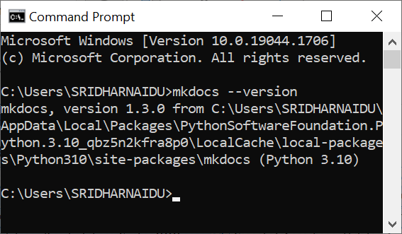

???+ important " QUICK SETUP GUIDE "
    ``` mermaid
        flowchart LR
            S([Start])-->A
            A-->B 
            B-->C
            C-->D
            D-->E
            E-->End([End])
            click A "https://git-scm.com/"
            click B "./#github-configuration-key-auth" "This is a tooltip for a link"
            click C "https://www.python.org/downloads/"
            click D "./#steps-to-install-mkdocs"
            click E "https://code.visualstudio.com/" "This is a tooltip for a link"
    ```
    __A__ = Install Git;  
    __B__ = Generate SSH & Public Key Auth;  
    __C__ = Install Python;  
    __D__ = Install MkDocs;  
    __E__ = Install MS VisualCode;

## GIT + GitHub

  Why git and GitHub?

  * Part of Enterprise toolbox strategy
  * Most adopted and known source versioning control tool
  * Check how big is GitHub today in this Octoverse <a href="https://octoverse.github.com/" target="_blank">report</a>
    * 140M+ Users
    * 73M+ Developers
    * 128M+ Public Repos

  git versus GitHub

  | **git** | **GitHub** |
  |:-----------------------|:-----------------------|
  | Installed on your `machine` | Hosted in a `cloud` environment |
  | First released in `2005` | Company launched in `2008` |
  | Maintained by `The Linux Foundation` | Purchased in 2018 by `Microsoft` |
  | Primary a command-line tool | Managed through a web portal |
  | Provides a desktop interface called `Git Gui` | Provides desktop interface called `GitHub Desktop` |
  | Single user, no user management | Multi-tenant and built-in user management |
  | Minimum external integrations, no native automation | Automation and integration available through a marketplace |
  | Competes with `Mercurial`, `Subversion`, `IBM RTC` | Competes with `Bitbucket` and `GitLab` |
  | Open source license | Free, paid, and enterprise plans |
  |  |  |

  Source: [Git vs. GitHub: What is the difference between them?](https://www.theserverside.com/video/Git-vs-GitHub-What-is-the-difference-between-them)


### Steps to install Git

1. Go to [https://git-scm.com/](https://git-scm.com/) and download the git installable for windows. 
2. Select the downloded file and complete the installation.
3. To verify, open the "Windows Command Prompt" by pressing the keyboard keys "Windows (or Windows+R) and then type “cmd” and press the "Enter" key to bring up the Command Prompt in normal mode.
4. Type "git --version" at the windows prompt and press the "Enter" key and this should display the version of the git if the installation is completed sucessfully, as shown below.
     

### GitHub Configuration (Key Auth)

1. Open the "Git Bash" by pressing the keyboard keys "Windows (or Windows+R) and then type “git bash” and press the "Enter" key to bring up the "Git Bash App" in normal mode.

2. Type "ssh-keygen -t ed25519 -C "your_enterprise_email@enterprise.com" at the bash prompt and press the "Enter" key. 

3. The message: "Generating public/private ed25519 key pair." should be displayed along with a prompt "Enter file in which to save the key (/c/Users/<YourDirectory>/.ssh/id_ed25519):" awaiting for the user input.

4. Press the "Enter" key to accept the default location.

5. This will prompt "Enter passphrase (empty for no passphrase):
" awaiting for the user input.

6. Type in the "passphrase" and press the "Enter" key.

7. This will prompt "Enter same passphrase again:" awaiting for the user input.

8. Type in the "passphrase" again and press the "Enter" key.

9. If both the passphrase is matching the following messages are displayed:
  "Your identification has been saved in /c/Users//<YourDirectory>/.ssh/id_ed25519"
  Your public key has been saved in /c/Users//<YourDirectory>/.ssh/id_ed25519.pub

  !!! The key fingerprint is:
      SHA256:ua4nXcJYfnrHt1/yHNICTObTpUK0M6GBSUw6PhAgBL0 sridhar.naidu@enterprise.com

      *The key's randomart image is:
                +--[ED25519 256]--+
                |=+..  +oo. o     |
                |. . . .+  + o    |
                |   o o   . B   . |
                |  E o . ..* + o  |
                |     o =S  * o   |
                |      o +.o + .  |
                |       ..= . o.o.|
                |      ..+ . o ++o|
                |      .+.. . ..o+|
                +----[SHA256]-----+


## Python
Python is an easy to learn, powerful programming language. It has efficient high-level data structures and a simple but effective approach to object-oriented programming. Python’s elegant syntax and dynamic typing, together with its interpreted nature, make it an ideal language for scripting and rapid application development in many areas on most platforms.

### Steps to install Python

1. Go to [https://www.python.org/downloads/](https://www.python.org/downloads/) and download the Python installable for windows and complete the installation.

## Verify the required pre-requisites

It is recommended to first verify if Git, Python and mkdocs are already installed on your local machine. 
To do so follow the below steps: 

* Open the "Windows Command Prompt" by pressing the keyboard keys "Windows (or Windows+R) and then type “cmd” and press the "Enter" key to bring up the Command Prompt in normal mode

    1. Type "git --version" at the windows prompt and press the "Enter" key and this should display the version of the git if already installed as shown below.
    {width="300"; align=right }

        If a message such as "'git' is not recognized as an internal or external command, operable program or batch file." is displayed. 

        Proceed with the installation of "Git", Go to [https://git-scm.com/](https://git-scm.com/) and download the git installable for windows. Select the downloded file and complete the installation.

    2. Type "python --version" at the windows prompt and press the "Enter" key and this should display the version of the python if already installed as shown below.
    

        Click here to proceed with the installation of "Python", if a message such as "'python' is not recognized as an internal or external command, operable program or batch file." is displayed. 

    3.  Type "mkdocs --version" at the windows prompt and press the "Enter" key and this should display the version of the mkdocs if already installed as shown below.
    

        Click here to proceed with the installation of "Mkdocs", if a message such as "'mkdocs' is not recognized as an internal or external command, operable program or batch file." is displayed.  


## MkDocs 

MkDocs is a fast, simple and downright gorgeous static site generator that's geared towards building project documentation. Documentation source files are written in Markdown, and configured with a single YAML configuration file. 

### Steps to Install MkDocs

### with pip <small>recommended</small> { #with-pip data-toc-label="with pip" }

Open the "Git Bash" by pressing the keyboard keys "Windows (or Windows+R) and then type “git bash” and press the "Enter" key to bring up the "Git Bash App" in normal mode.

=== "Latest"

    ``` sh
    pip install mkdocs
    ```
---

__Note:__ Please upgrade PIP to the latest version as recommended and re run the installation of mkdocs

## Material for MKDocs

Material for MkDocs is a theme for [MkDocs], a static site generator geared towards (technical) project documentation. Can install Material for MkDocs with [`pip`][pip], the Python package manager.

### Steps to Install Material for MkDocs

### with pip <small>recommended</small> { #with-pip data-toc-label="with pip" }

Material for MkDocs is published as a [Python package] and can be installed with `pip`, ideally by using a [virtual environment]. If not, scroll down and expand the help box. Install with:

=== "Latest"

    ``` sh
    pip install mkdocs-material
    ```

=== "8.x"

    ``` sh
    pip install mkdocs-material=="8.*" # (1)!
    ```

    1.  Material for MkDocs uses [semantic versioning][^1], which is why it's a
        good idea to limit upgrades to the current major version.

        This will make sure that you don't accidentally [upgrade to the next
        major version], which may include breaking changes that silently break
        your site. Additionally, you can use `pip freeze` to create a lockfile,
        so builds are reproducible at all times:

        ```
        pip freeze > requirements.txt
        ```

        Now, the lockfile can be used for installation:

        ```
        pip install -r requirements.txt
        ```

  [^1]:
    Note that improvements of existing features are sometimes released as
    patch releases, like for example improved rendering of content tabs, as
    they're not considered to be new features.

This will automatically install compatible versions of all dependencies:
[MkDocs], [Markdown], [Pygments] and [Python Markdown Extensions]. Material for
MkDocs always strives to support the latest versions, so there's no need to
install those packages separately.

---

__Tip__: If you don't have prior experience with Python, we recommend reading 
[Using Python's pip to Manage Your Projects' Dependencies], which is a really
good introduction on the mechanics of Python package management and helps you
troubleshoot if you run into errors.

  [Python package]: https://pypi.org/project/mkdocs-material/
  [virtual environment]: https://realpython.com/what-is-pip/#using-pip-in-a-python-virtual-environment
  [semantic versioning]: https://semver.org/
  [Markdown]: https://python-markdown.github.io/
  [Pygments]: https://pygments.org/
  [Python Markdown Extensions]: https://facelessuser.github.io/pymdown-extensions/
  [Using Python's pip to Manage Your Projects' Dependencies]: https://realpython.com/what-is-pip/


## Visual Studio Code
Visual Studio Code is a lightweight but powerful source code editor which runs on your desktop and is available for Windows, macOS and Linux. It comes with built-in support for JavaScript, TypeScript and Node.js and has a rich ecosystem of extensions for other languages (such as C++, C#, Java, Python, PHP, Go) and runtimes (such as .NET and Unity). Begin your journey with VS Code with these introductory videos.

### Steps to install VS Code

1. Click on the [Visual Studio Code installer](https://code.visualstudio.com/sha/download?build=stable&os=win32-x64-user) and downlaod the installer for Windows.

2. Once it is downloaded, run the installer (VSCodeUserSetup-{version}.exe). This will only take a minute.

3. By default, VS Code is installed under C:\Users\{Username}\AppData\Local\Programs\Microsoft VS Code.

4. Open the "VS Code" by pressing the keyboard keys "Windows (or Windows+R) and then type “code” or "vs" and press the "Enter" key to bring up the "Visual Studio App" in normal mode.