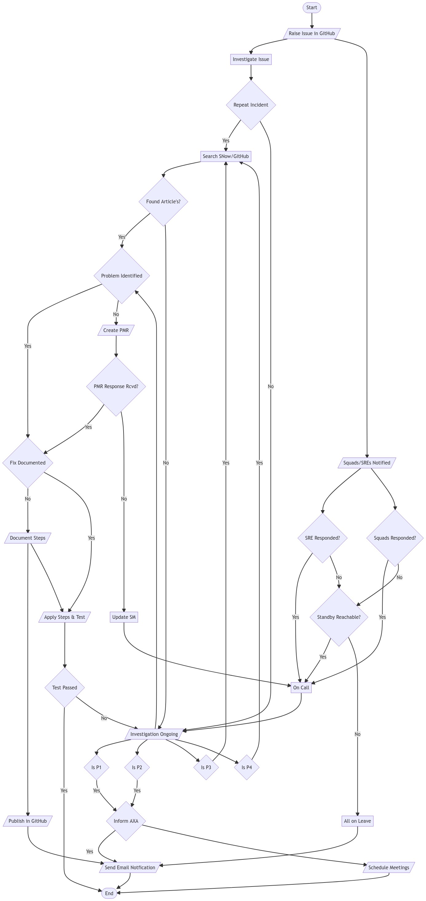

???+ important " PLEASE FOLLOW THE BELOW DEFINED FLOW "
    ``` mermaid
        flowchart LR
            A-->B
            B-->C
            C-->D
    ```
    A - Raise Git Issue;
    B - View ROTA SRE & SQUADS;
    C - Assign to Issue;
    D - Search SNow, GitPages Product Website;


    


!!! notes "SRE Allocated"
    Primary: Sridhar P Naidu 
    Secondary: Avinash Singh

??? important " PLEASE FOLLOW THE BELOW DEFINED FLOW "
    ``` mermaid
        flowchart TB
        A([Start]) --> RIIG[/Start here on creation of incident/];
        RIIG --> II[Investigate Issue];
        II --> RI{Repeat Incident};
        RI -->|Yes| SNKB[Search SNow/GitHub];
        SNKB --> FA{Found Article's?};
        FA -->|Yes| PI{Problem Identified};
        PI -->|Yes| FD{Fix Documented};
        PI -->|No| CPMR[/Create PMR/];
        CPMR --> RRFPMR{PMR Response Rcvd?};
        FA -->|No| NI[/Investigation Ongoing/];
        FD -->|No| DFS[/Document Steps/];
        DFS --> FIGH[/Publish in GitHub/];
        DFS --> AS[/Apply Steps & Test/];
        FIGH --> SEN;
        FD -->|Yes| AS;
        AS --> TP{Test Passed};
        TP -->|Yes| E([End]);
        TP -->|No| NI;
        RI -->|No| NI;
        NI --> PI;  
        NI --> SR1{Is P1};
        NI --> SR2{Is P2};
        NI --> SR3{Is P3};
        NI --> SR4{Is P4};
        SR1 -->|Yes| IEnterprise{Inform Enterprise};
        SR2 -->|Yes| IEnterprise{Inform Enterprise};  
        SR3 -->|Yes| SNKB;
        SR4 -->|Yes| SNKB;
        RIIG --> IN1[/Squads/SREs Notified/];
        IN1 --> SRER{SRE Responded?};
        SRER -->|Yes| OC[On Call];
        SRER -->|No| SREI{Standby Reachable?};
        SREI -->|Yes| OC;
        SREI -->|No| AOL[All on Leave];
        AOL --> SEN;
        IN1 --> SOR{Squads Responded?};
        SOR -->|Yes| OC;
        SOR -->|No| SREI;
        OC --> NI;
        RRFPMR -->|Yes| FD;
        RRFPMR -->|No| USMT[Update SM];
        USMT --> OC;
        IEnterprise -->|Yes| SEN[/Send Email Notfication/];
        IEnterprise --> SMTGS[/Schedule Meetings/];
        SEN --> E;
        SMTGS --> E;
    ``` 