#Running the Python Flask Application on Local

???+ important " QUICK EXPLORE GUIDE "
    ``` mermaid
        flowchart LR
            S([Start])-->1
            1-->2 
            2-->3
            3-->4
            4-->5
            5-->6
            6-->7
            7-->8
            8-->9
            9-->End([End])
    ```


## 1. Open a Git Bash session and verify your home directory

You can open the "Git Bash" by pressing the keyboard keys "Windows (or Windows+R) and then type "bash" or “git bash” and press the "Enter" key to bring up the "Git Bash App" in normal mode.

Type `pwd` and press the "Enter" key to verify your are in your home directory, else change to your home directory.

## 2. List the recently downloaed zipped file from the Downloads directory

Type `ls -lt Downloads/*.zip` and press the "Enter" key to display all the zipped files. 

  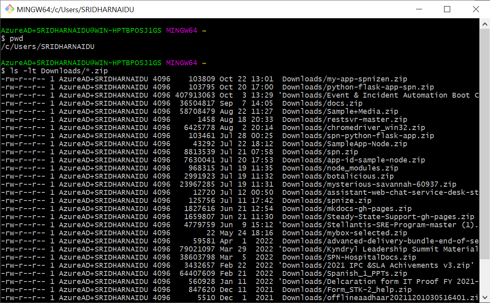

## 3. Mark and Copy the file name

  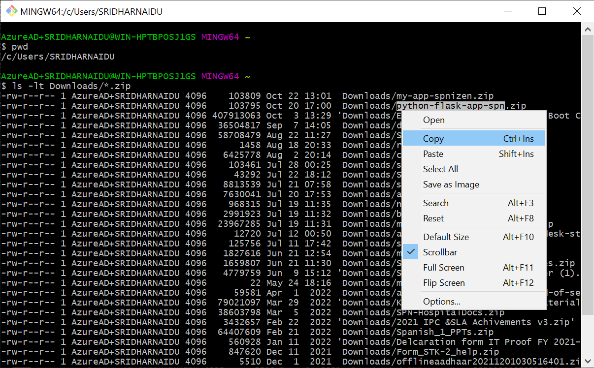


In the listed files locate the previously downloaded zipped file from the IBM Cloud. Mark/highlight the complete file name then right click to bring the context menu then select copy as shown in the screen shot above.

## 4. Create a directory with the copied file name and change into the new directory

  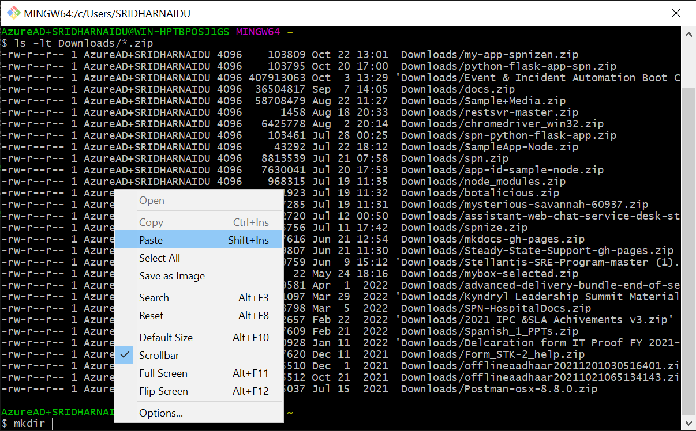

Type `mkdir` give a space and again right click to bring the context menu and select paste as shown in the screen shot below.

  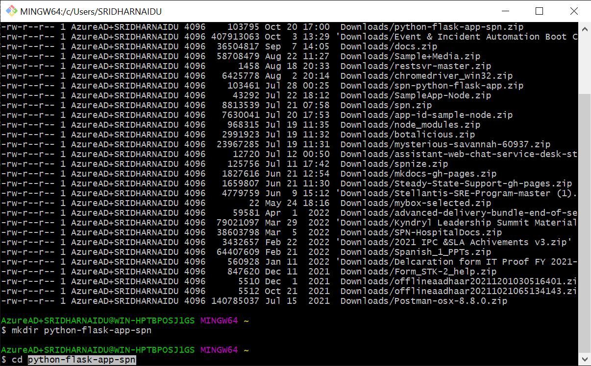

Press enter to create the directory, next change into this directory by typing `cd` give a space then right click to bring the context menu then select paste and press enter.

## 5. Verify your in the App directory
Type `pwd` and press the "Enter" key to verify your are in your newly create directory, and type `ls -l` and press enter to see `total 0` as there are no files.

  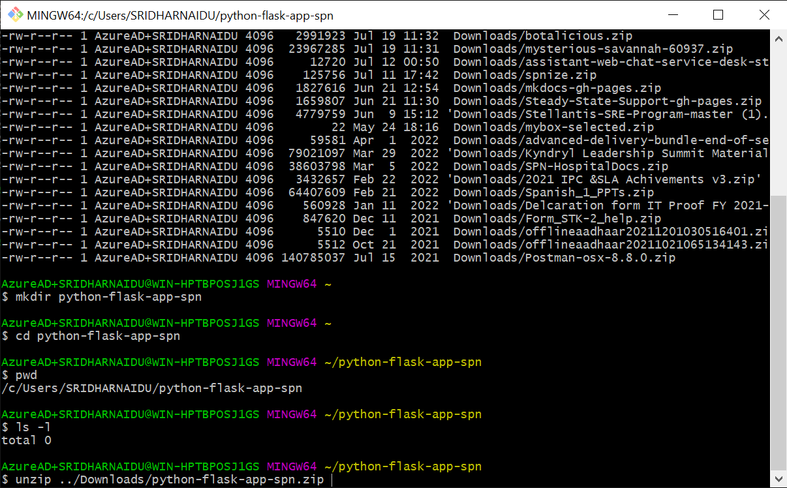

## 6. Unizp the contents from the downloaded zipped file
Type `unzip ../Downloads/` and again right click to bring the context menu and select paste and press tab to pre-fill the complete zipped file along with .zip extension as shown in the screen shot above.   

The contents from the zipped file are extracted with messages as shown in the screen shot below. 

  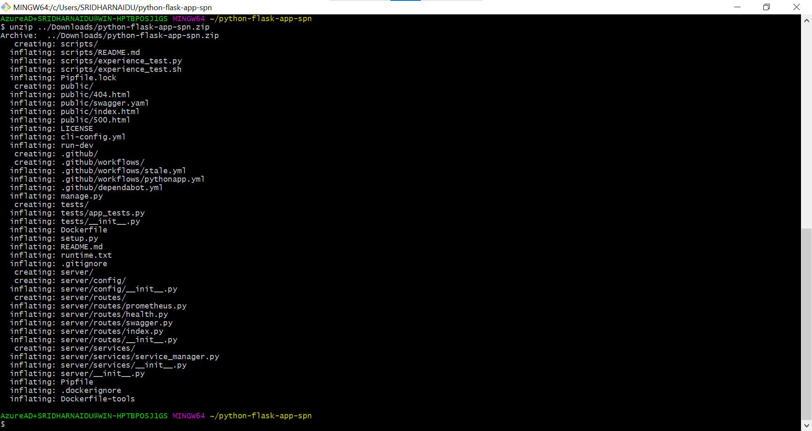

## 7. View the list of the extracted files
Type `ls -l` and press enter to see the extracted files. Please try to locate the `README.md` and `manage.py` in the list.

  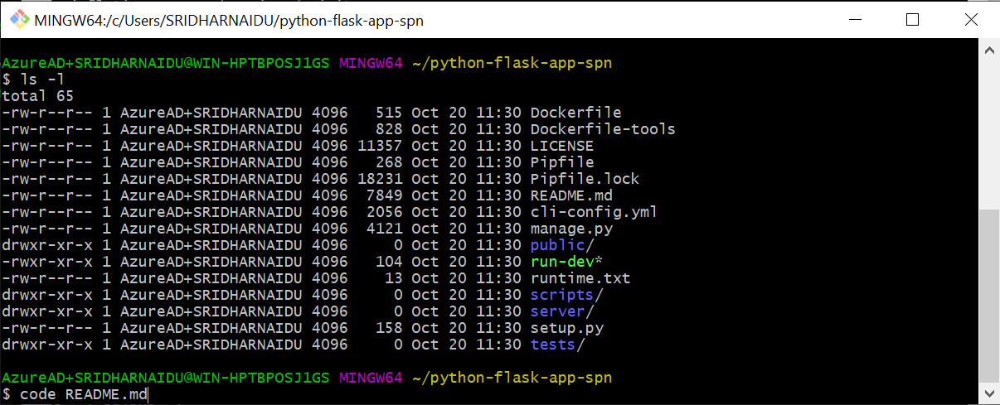

## 8. Open the README.md in Visual Code
Type `code README.md` and press enter to launch and read the file in Visual Code. Please wait to see a new Visual Code application window. Shift and maximize this window and try to locate `pipenv install` the `README.md` file. Copy the `pipenv install`.

  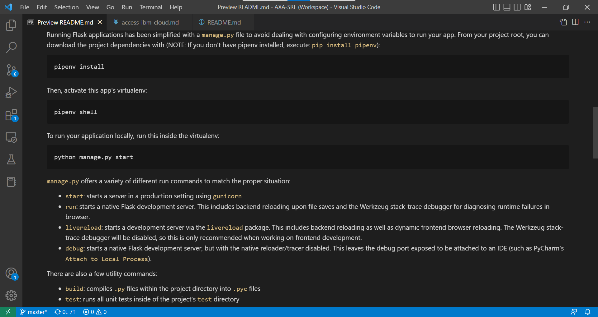

## 9. Switch back to Git Bash and Install the dependent module libraries

Install the below listed dependent module libraries:
```sh
pip install pipenv
pip install flask
pip install jinja2
pipenv install
```

  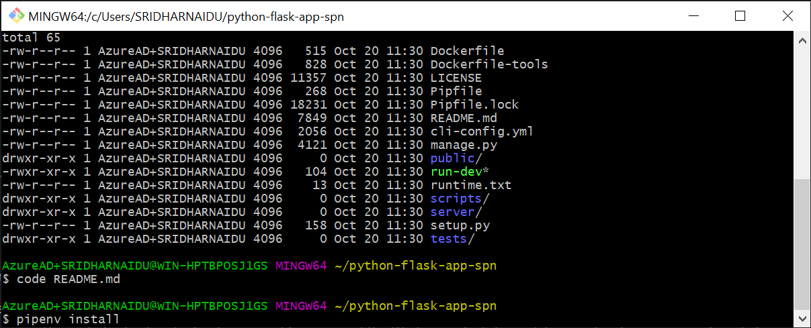

## 10. Create a virtual python environment on your local
Make sure there are no errors when   the above command execution was completed. Type `pipenv shell` and press enter to create a virtual python environment on your local.

  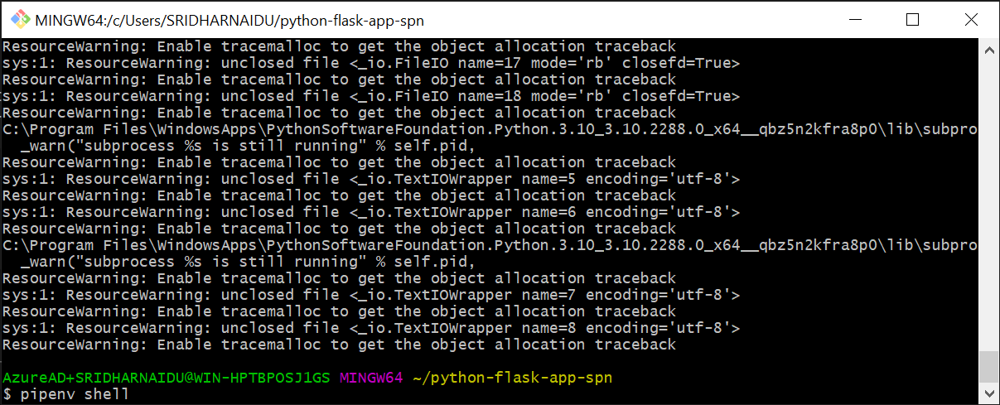

  Ignore any missing directory message on completion.

  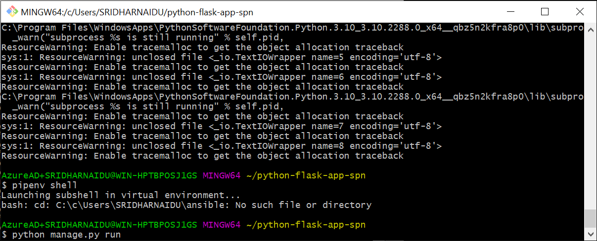

## 11. Execute the Python App on Local
 Type `python manage.py run` and press enter and this should start and bring up the python app on your local displaying the message `Running on http://127.0.0.1:3000` and also `Running on a specific IP address` wherein you can use this to access from a different device browser.

  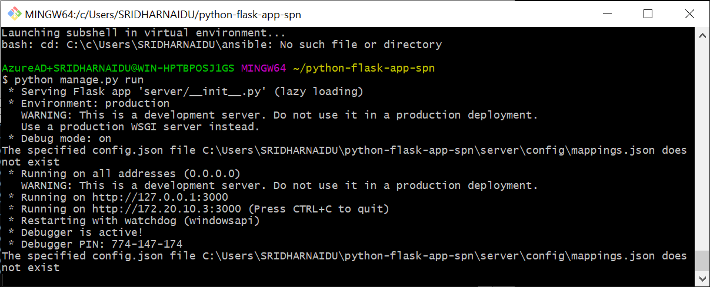

## 12. View the Python App in a browser
Open a new browser session and tune into `http://127.0.0.1:3000` and this should display the python app landing page as shown below:

  


## 13. View the Python App Flask Microservice - health
Type `http://127.0.0.1:3000/health` and this should display the FLask microservice endpoint JSON response as shown below:

  

## 14. View the Python App Flask Microservice - swagger/api-docs
Type `http://127.0.0.1:3000/swagger/api-docs/` and this point to the FLask Swagger API microservice endpoint and display the following response as shown below:

  


## 15. Final Step
Congratulations you have successfully run your Python App on your local.

<form name="myform" action = "https://my-app-spnizen.eu-gb.cf.appdomain.cloud/create" method = "post">
  <input type="hidden" id="issuetitle" name="ititle" value="Record Completion of successfully run your Python App on your local.">
  <input type="hidden" id="issuebody" name="ibody" value="The Register & Access IBM Cloud Completed ">
  <a href="javascript: submitform()">Click Here</a> to register the completion of this task on Github
</form>
<script type="text/javascript">
function submitform(){document.myform.submit();}
</script>
