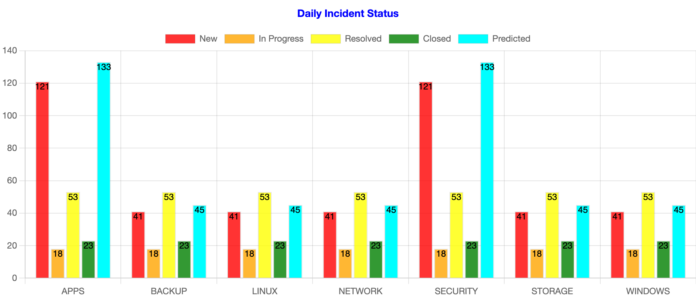
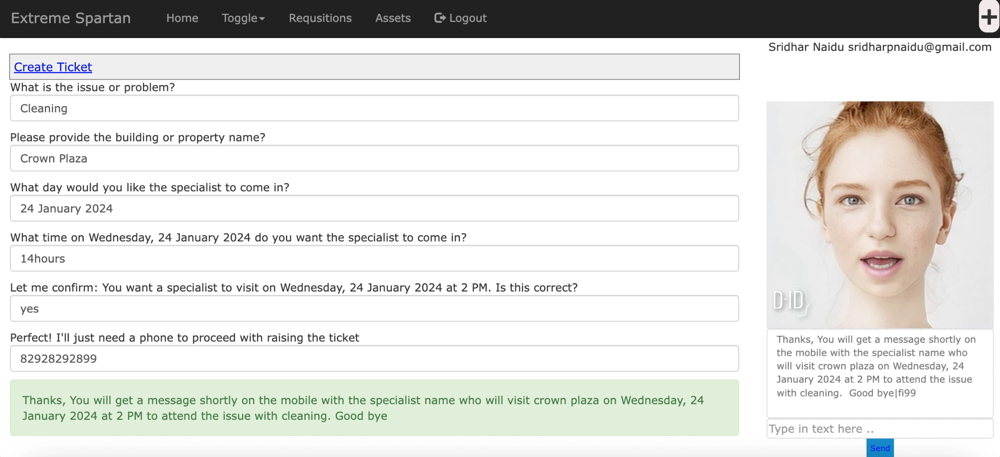

## 1. Cognitive Bots Marketplace

AI Bots Marketplace is a digital platform or ecosystem that serves as a centralized hub for connecting businesses and organizations with artificial intelligence (AI) chatbots and conversational agents. It acts as a marketplace or repository where a variety of AI bot solutions are made available for purchase, customization, or integration.

  | **Cognitive AI DP** | **Short description** |**Expertise**| **Deployable Industries** |
  |----------|:-----------------------|:-----------------|:-----------------|
  |<video id="101" width="320" height="240" autoplay loop><source src="./assets/images/alice.mp4">Your browser does not support HTML5 video.</video>| Alice - is a highly skilled Project Manager and Certified Scrum Master (CSM) known for her exceptional ability to deliver successful projects while fostering Agile practices and collaboration. With a wealth of experience in both traditional project management and Agile methodologies, Alice is the ideal choice for driving projects to excellence.  | Project Management, Scrum Master| Application Development  <a href="/cognitive-automation/db1/" target="_blank" rel="noopener noreferrer">Try Me!!</a> |
  |<video id="102" width="320" height="240" autoplay loop><source src="./assets/images/brian.mp4">Your browser does not support HTML5 video.</video>| Brian is an IBM SPSS Storage Systems Backup Expert with an exceptional track record in safeguarding critical data and ensuring uninterrupted business operations. With a deep understanding of IBM SPSS storage solutions, Plays a pivotal role in designing and implementing robust backup and recovery strategies for organizations.| Squad Leader - BAS| ALL INDUSTRIES (M) |
  |<video id="103" width="320" height="240" autoplay loop><source src="./assets/images/spn.mp4">Your browser does not support HTML5 video.</video>| SPN  - As Chief Architect, Sridhar P Naidu has orchestrated the intricate design and architecture of all AI-driven products, ensuring they align seamlessly with the ever-evolving technological ecosystem. His unparalleled expertise in this domain has propelled Extreme-Spartan to the forefront of innovation.  | Enterprise Architecture | ALL INDUSTRIES (M) |
  |<video id="104" width="320" height="240" autoplay loop><source src="./assets/images/prs_jason.idle.mp4">Your browser does not support HTML5 video.</video>| Deploy Jason, a trained Product Engineer with a passion for leveraging the power of artificial intelligence and natural language processing to create exceptional conversational experiences. Jason specializes in Watson Assistant, IBM's cutting-edge AI-powered chatbot platform, and is at the forefront of revolutionizing how businesses engage with their customers. | Product Engineering| ALL INDUSTRIES (M) |
  |<video id="105" width="320" height="240" autoplay loop><source src="./assets/images/spn.ctsre.mp4">Your browser does not support HTML5 video.</video>| SPN - A true innovator at heart, Sridhar P Naidu has breathed life into cutting-edge ideas, infusing AI into every facet of our product suite. His passion for driving change and pushing the boundaries of what's possible, has catalyzed a wave of innovation that continues to shape the future of infrastructure services. | Client Transformation Leader - Site Reliability Engineering, Cheif Architect and Cognitive Programmer.| ALL INDUSTRIES (M) |
  |<video id="105" width="320" height="240" autoplay loop><source src="./assets/images/prs_daryll.idle.mp4">Your browser does not support HTML5 video.</video>| Jason - is an experienced Agile Coach with a passion for driving organizational excellence through Agile methodologies. With a strong background in Agile principles and a proven track record of guiding teams to success, [Coach's Name] is a valuable asset to any organization looking to enhance their agility.  | AGILE Coach| ALL INDUSTRIES (M) |

## 2. Cognitive AI Charts
Organizations possess a wealth of information that, if harnessed effectively, can lead to significant insights and actionable outcomes. Cognitive AI Graphs are powerful tools that not only visualize complex data but also provide a comprehensive understanding of the underlying issues and a roadmap to resolve them, preventing financial impacts due to missed SLAs. 

## 3. Cognitive Forms
In the modern age of digitalization, the creation and management of forms are pivotal for both individuals and organizations. Cognitive AI Forms provide an innovative solution that allows for the seamless generation of forms, with the added capability of integration with any backend database. 

This breakthrough technology, available through the AI Bots Marketplace, is set to revolutionize how forms are developed and utilized across various sectors.

<video id="190" width="100%" height="auto" controls autoplay loop><source src="./assets/images/cognitiveforms.mov">Your browser does not support HTML5 video.</video>

## 4. Cognitive Content Creation/Publishing
In the digital age, content creation and publishing are at the core of engaging audiences and conveying information effectively. Cognitive Content Creation and Publishing with AI Bots from the marketplace is a game-changing solution that harnesses artificial intelligence to revolutionize the way content is generated, refined, and distributed across various industries. This innovative tool empowers content creators, marketers, and businesses to achieve new levels of creativity and efficiency.

## 5. Cognitive AI Meetings
In today's fast-paced business landscape, efficient and productive meetings are crucial. The Cognitive AI Meetings Manager is a groundbreaking solution that leverages the power of AI to enhance meeting scheduling, coordination, and productivity. This innovative tool brings together subscribed Cognitive Bots from the Bot Marketplace and organization representatives to facilitate seamless and outcome-driven meetings.

## 6. Cognitive Creative Programming
Cognitive Creative Programming represents a fascinating intersection of cognitive computing and creative AI technology. It's a field where developers, artists, and innovators explore the potential of artificial intelligence to generate, enhance, or facilitate creative content. One of the exciting applications within this space is the use of AI bots to aid in creative processes, whether in art, music, literature, or even game development. 

## 7. Cognitive AI Conversations
Cognitive AI Conversations represent the next frontier in human-computer interactions. It's a domain where AI bots are designed not just to respond but to understand, learn, and engage in conversations at a level that simulates human-like cognitive abilities. AI bots are reshaping the way humans interact with technology, whether it's through chatbots, virtual assistants, or even in therapeutic applications.

## 8. Cognitive Biography
Biographies are a powerful way to capture the essence of an individual's life journey. Cognitive AI technologies can play a significant role in automating the process of creating biographies. 

## 9. Cognitive Workbench
In the rapidly evolving landscape of artificial intelligence (AI), organizations and individuals seek a streamlined and accessible approach to embark on their AI journey. The Cognitive AI Workbench emerges as the ultimate digital platform, a one-stop-shop designed to empower both novices and experts in their pursuit of AI-driven innovation. 

The Cognitive AI Workbench is a comprehensive digital platform that serves as a launchpad for individuals, businesses, and industries aiming to harness the potential of AI technologies. It offers a centralized environment for all things AI.

<video id="190" width="100%" height="auto" controls><source src="./assets/images/cognitivewb.mov">Your browser does not support HTML5 video.</video>

## 10. Cognitive Music Composer
In the realm of art and creativity, the Cognitive Music Composer stands as a testament to the limitless possibilities of technology. This revolutionary tool harnesses the power of AI bots sourced from the Bot Marketplace to compose music that transcends boundaries and explores the depths of human emotion. 

## 11. Cognitive AI Bootcamps
In an increasingly AI-driven world, it's essential to prepare the next generation for the opportunities and challenges that lie ahead. Cognitive AI Bootcamps offer an exciting and educational pathway for students from Grade 1 through 12 to embrace the world of AI, fostering their love for learning and innovation. 

