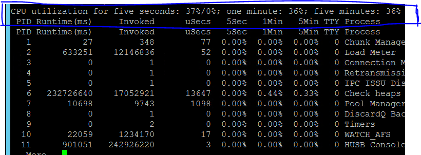
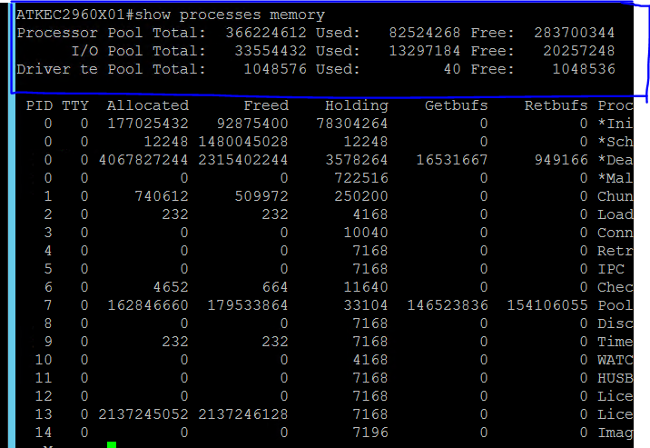
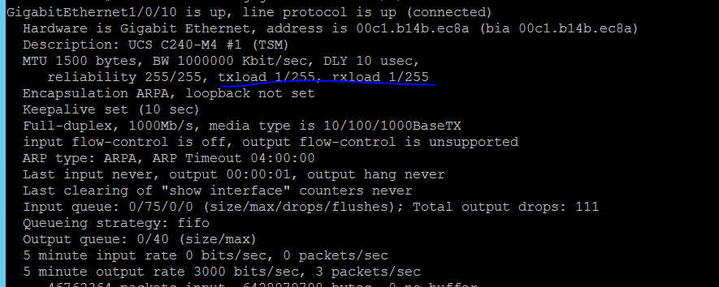
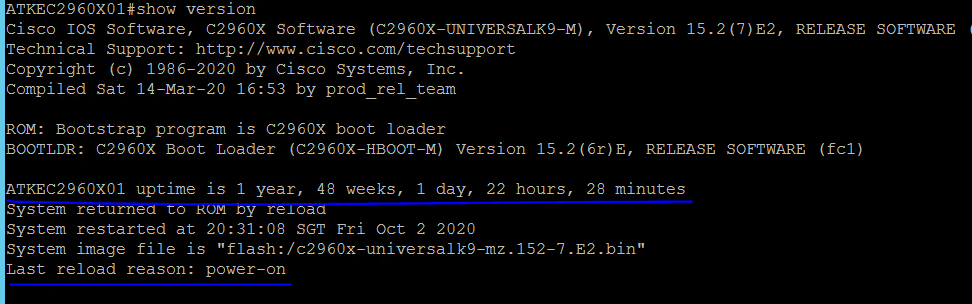
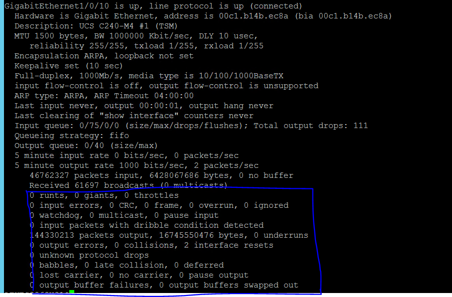
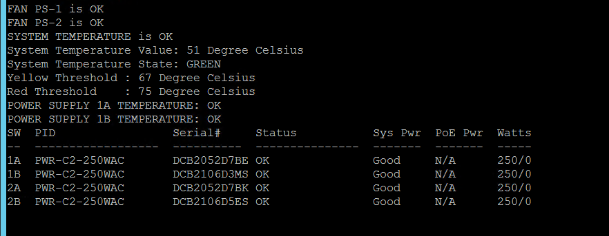

## 1. Introduction

### 1.1 Node Down Incident

Description:                                                 
When a node or device is down or unreachable via remote monitoring

Sample Incident:                                             
[ seloc2960x01 7/3/2018 1:10 AM City = $ NodeName=SELOC2960X01.cloud.ibm.com IP 172.16.154.60, Alert Node is Down and not reachable Severity=5 ]

Steps to follow:

1.	Validate whether or not the suspected device is a network device from latest SESDR.                      
Login to Jump Server and do a SSH or HTTPS to the suspected device and login to the device using a valid login username/password.
2.	Using appropriate option (CLI command or GUI menu) check the up-time of the device and validate the node-down alert, whether or not Genuine based on how long has the device been up!
3.	Update the ticket logs with appropriate status report or artifacts after this initial validation.
4.	If the device found to be UP since ever, then alert is a False alert, then keep it monitoring for an hour or so in SLA-HOLD with appropriate justification comments in the ticket and then can be closed if no further alerts received.
5.	If the alert is a Genuine alert and the device is found to be Down or unreachable.. follow necessary troubleshooting steps and manager on duty to immediately trigger the escalation matrix and coordination with all relevant stakeholders (platform teams, duty managers) while handling any high priority P1/P2 tickets especially high utilization alerts

Checking UP-TIME on Cisco Catalyst Switches:
    

### 1.2 Interface Down Incident

Description:                                                  
When an active Interface goes DOWN and the uplink/downlink connection breaks.

Sample Incident:                                             
[ atkenx937202 6/14/2018 4:55 PM Interface Ethernet1/29 for  NodeName=ATKENX937202.cloudfabric.intrsre IP 172.16.154.214, interface status is Down Severity=5 ]

Steps to follow:

1.	Validate whether or not the suspected device is a network device from latest SESDR.                      
Login to Jump Server and do a SSH or HTTPS to the suspected device and login to the device using a valid login username/password.
2.	Using appropriate CLI command or GUI menu, check the current status of the suspected Interface on the suspected device.
3.	Update the ticket logs with the findings and artifacts after this initial validation of the alert.
4.	If the Interface found to be UP since ever, then the alert is a False alert, then keep it monitoring for an hour or so in SLA-HOLD with appropriate justification comments in the ticket and then can be closed if no further alerts received.
5.	If the Interface found to be Down currently or in recent past during the problem-period then the alert is a Genuine alert.. follow necessary troubleshooting steps and manager on duty to immediately trigger the escalation matrix and coordination with all relevant stakeholders (platform teams, duty managers ) while handling any high priority P1/P2 tickets especially high utilization alerts.

Checking Interface status on Cisco Catalyst Switches:
    

### 1.3 CPU High-Utilization Incident

Description:                                                  
When the average CPU usage increases beyond its accepted threshold level : 70% warning level and 85% critial level

Sample Incident:                                             
[ seloc2960x01 7/6/2018 12:22 AM City = $ NodeName= SELOC2960X01.cloudfabric.intrsre IP 172.16.154.60 CPU Load :75 % , Alert High CPU Severity=4 ]

Steps to follow:

1.	Validate whether or not the suspected device is a network device from latest SESDR.                   
Login to Jump Server and do a SSH to the suspected device and login to the device using a valid login username/password.
2.	Using appropriate CLI command check the current CPU utilization on the device.
3.	Update the ticket logs with the findings and artifacts after this initial validation.
4.	If the actual CPU utilization is found to be normal during the problem-period then alert is a False alert, keep it monitoring for an hour or so in SLA-HOLD with appropriate justification comments in the ticket and then close the ticket if no further alerts received.
5.	If the actual CPU utilization is found or was found to be high during the problem-period beyond the accepted threshold.. then the alert is considered a Genuine alert and follow necessary troubleshooting steps  and manager on duty to immediately trigger the escalation matrix and coordination with all relevant stakeholders (platform teams, duty managers ) while handling any high priority P1/P2 tickets especially high utilization alerts.

Checking CPU Utilization on Cisco Catalyst Switches:
   

### 1.4 Memory High-Utilization Incident

Description:                                                  
When the average Memory usage increases beyond its accepted threshold level : 70% warning level and 85% critial level

Sample Incident:                                             
[ seclapicm201 $ {DateTime} 172.16.144.129 NodeName=SECLAPICM201.cloudfabric.intrsre IPaddress 172.16.144.129 memory used is 21 MB Severity=5 seclapicm201 Friday, May 12, 2017 12:17 PM 172.16.144.129 NodeName=SECLAPICM201.cloudfabric.intrax a IPaddress 172.16.144.129 memory used
is 21 MB Severity=4 ]

Steps to follow: 

1.	Validate whether or not the suspected device is a network device from latest SESDR.                   
Login to Jump Server and do a SSH to the suspected device and login to the device using a valid login username/password.
2.	Using appropriate CLI command check the current memory utilization on the device.
3.	Update the ticket logs with the findings and artifacts after this initial validation of the alert.
4.	If the actual memory utilization is found to be normal during the problem-period then alert is a False alert, keep it monitoring for an hour or so in SLA-HOLD with appropriate justification comments in the ticket and then close the ticket if no further alerts received.
5.	If the actual memory utilization is found or was found to be high during the problem-period beyond the accepted threshold.. then the alert is considered a Genuine alert and follow necessary troubleshooting steps  and manager on duty to immediately trigger the escalation matrix and coordination with all relevant stakeholders (platform teams, duty managers ) while handling any high priority P1/P2 tickets especially high utilization alerts.

Checking Memory Utilization on Cisco Catalyst Switches:
  

### 1.5 Interface High-Utilization Incident

Description:                                                  
[Type-1] When the average Rx utilization on an Interface increases beyond its accepted threshold level : 70% Warning level and 85% Critical level

[Type-2] When the average Tx utilization on an Interface increases beyond its accepted threshold level : 70% Warning level and 85% Critical level

Sample Incident:                                             
[ seclc2960x01 3/15/2020 9:33 PM City = $${N=SwisEntity;M=CustomProperties.City} NodeName=SECLC2960X01.cloudfabric.intrsre IP 172.16.154.30 Interface GigabitEthernet2/0/1 ? Enterprise INTERCO 6k has a received utilization of 79.Alert High Interface Utilization Severity=4 Attention commas replaced by dots  ] [Rx utilization]

[ nekoc2960x01 4/19/2018 6:06 AM City =$${N=SwisEntity;M=CustomProperties.City} NodeName=NEKOC2960X01.cloud.ibm.com IP172.16.154.132 Interface GigabitEthernet1/0/24 ? UCS C240-M4 #1(TSM) has a transmitted utilization of 75 %,Alert High Interface UtilizationSeverity=4  ]  
[Tx utilization]

Steps to follow: 

1. Validate whether or not the suspected device is a network device from latest SESDR.
Login to Jump Server and do a SSH or HTTPS to the suspected device and login to the device using a valid login username/password.
2. Using appropriate CLI command or GUI menu check the current interface utilization on the device.
3. Update the ticket logs with the findings and artifacts after this initial validation of the alert
4. If the actual interface utilization is found to be normal during the problem-period then alert is a False alert, keep it monitoring for an hour or so in SLA-HOLD with appropriate justification comments in the ticket and then close the ticket if no further alerts received
5. If the actual interface utilization is found or was found to be high beyond the accepted threshold during the problem-period.. then the alert is considered a Genuine alert and follow necessary troubleshooting steps  and manager on duty to immediately trigger the escalation matrix and coordination with all relevant stakeholders (platform teams, duty managers ) while handling any high priority P1/P2 tickets especially high utilization alerts.

Checking Interface Utilization on Cisco Catalyst Switches:
  

### 1.6 Node Reboot Incident

Description:                                                  
Whenever a node reboots, it generates an alert which needs to be verified manually to ascertain whether the event was part of a planned activity or an unplanned activity.

Steps to follow:

1. Validate whether or not the suspected device is a network device from latest SESDR.            
Login to Jump Server and do a SSH or HTTPS to the suspected device and login to the device using a valid login username/password.
2. Using appropriate CLI command or GUI menu check the current up-time on the device.
3. Update the ticket logs with the findings and artifacts after this initial validation of the alert
4. If the current up-time is not found to be recent during the problem-period then alert is a False alert, keep it monitoring for an hour or so in SLA-HOLD with appropriate justification comments in the ticket and then close the ticket if no further alerts received
5. If the current up-time is found or was found to be during the problem-period, then the alert is considered a Genuine alert.
Check for an ongoing change-activity involving device reboot tasks by Network team. If no change activity found then update the ticket logs with appropriate comments and escalate to next level support within specified SLA period, for further investigation.

Checking Last Reboot time of Cisco Catalyst Switch:
    

### 1.7 Packet-Loss Incident

Description:                                                  
When a network connectivity issue leads to packet loss beyond accepted threshold is observed to a specific node

Steps to follow:

1. Validate whether or not the suspected device is a network device from latest SESDR.             
Login to Jump Server and do a ping to the IP of the suspected node and analyze ping response time in “ms”, whether is it abnormal (intermittent or more than 10ms)
2. Find out respective network port on appropriate Leaf switch and analyze traffic statistics on the suspected network port that the node is connected to.
3. Update the ticket logs with the findings and artifacts after this initial validation of the alert
4. If the network port doesn't see any abnormal traffic statistics, e.g. packet drops during the problem-period as reported then alert is a False alert, keep it monitoring for an hour or so in SLA-HOLD with appropriate justification comments in the ticket and then close the ticket if no further alerts received
5. If the network port doesn't see any abnormal traffic statistics, e.g. packet drops during the problem-period as reported then, then the alert is considered a Genuine alert and follow the escalation matrix to route the ticket to next level support team within SLA period.

Checking Interface Statistics Count on Cisco Catalyst Switches:
  

### 1.8 Hardware-components (e.g Power-supply, Fan-tray, Temperature) Monitoring Incident

Description:                                                  
When a power-supply module or Fan tray goes down. When current operating temperature on the device goes up beyond accepted threshold

Sample Incident:                                             
[ nasuc2960x01 11/11/2019 7:10 AM City = $${N=SwisEntity;M=CustomProperties.City} NodeName=NASUC2960X01.cloudfabric.intrsre IP ${N=SwisEntity;M=Node.IP_Address}, Hardware Alert Switch 1 - Power Supply 1 on NASUC2960X01.cloudfabric.intrsre is Critical Severity=3 ]

Steps to follow:

1. Validate whether or not the suspected device is a network device from latest SESDR.            
Login to Jump Server and do a SSH or HTTPS to the suspected device 
2. Using appropriate CLI command or GUI menu check the status of the suspected component on the device as reported.
3. Update the ticket logs with the findings and artifacts after this initial validation of the alert
4. If the specific hardware component is not found to be faulty during the problem-period then alert is a False alert, keep it monitoring for an hour or so in SLA-HOLD with appropriate justification comments in the ticket and then close the ticket if no further alerts received
5. If the specific hardware component (power-supply, FAN, temperature) is found or was found to be faulty during the problem-period, then the alert is considered a Genuine alert.
6. If a Power-supply module or Fan module found to be faulty, raise a TSS onsite CE assist ticket for physical investigation of the faulty component and its replacement, if required so. 
7. If a replacement part required, TSS team will do the needful to coordinate with the Vendor and replace the faulty component.
8. When the faulty component comes back up, update the ticket logs with appropriate comments and close the ticket. For any other issue, escalate to next level support within specified SLA period, for further investigation.

Checking Power-supply / Temperature Status on Cisco Catalyst Switches:
  
  

