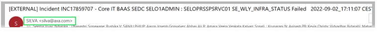
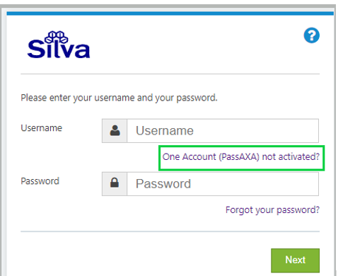

## 1. SNOW(ServiceNow) New user access
### 1.1 Request for SNOW MCMS tool access

Team Lead/member to raise an SR(Service Request) to snow team with the following details

 * Account: <i>AXA</i>
 * Summary: <i>Request for SNOW access</i>
 * Email id: <i>Provide clone id or Kyndryl email id of the new user</i>
 * Snow Instance <i>(Ex. Europe/North America ...etc)</i>
 * Submit the SR to IMI_SCCD_SUPPORT queue in SNOW

### 1.2 Request for Silva tool access

  1.	People manager to share users’ Kyndryl email id with AXA PMO (Fatiah Khachaa) for whom SILVA access is required.
  2.	AXA PMO (Fatiah Khachaa) will share the above users’ details with AXA requesting to grant SILVA access.
  3.	Once AXA grants access to Silva, user will receive SILVA automated mail notification for Incident and Service request from silva@axa.com
      
  4.	After getting this automated mail, open SILVA link https://silva.service-now.com/ . Below window will open. Click on One Account (PassAXA) not activated?
      
  5.	New window will open, put users’ Kyndryl email address ( xxxxxxx@kyndryl.com) and press NEXT

## 2. Sharepoint Access

   For Automated  - Reports Folder 

   * Link - https://kyndryl.sharepoint.com/sites/AXAReportdelivery
   * Send a mail to the below admins to access the above link
   * Admins - Jimmy Warnault (Jimmy.Warnault@kyndryl.com) or Badrane Houmadi (Badrane.Houmadi@kyndryl.com)

For Box Data to Share Point for AXA

  * Link - https://kyndryl.sharepoint.com/sites/AXAKyndryl77 
  * Send a mail to the Admin to get access to the above link
  * Admin - SANJU PHILIP (Sanju.Philip@kyndryl.com)

## 3. Useful Links

 1. <a href="https://ibmimieu.service-now.com/nav_to.do?uri=%2Fhome.do" target="_blank">SNOW</a>  
 2. <a href="https://www.ibm.com/services/connect/portal/" target="_blank">ISC Portal</a>   (email id: ISCadmin@us.ibm.com)
 3. <a href="https://ppydalinmbz01.sl.bluecloud.ibm.com/services/in/lpa/doPQALogin.action?param=x" target="_blank">LPA Tool</a>
 4. <a href="https://mycertifications.v6fusion.com/" target="_blank">mycertification</a>
 5. <a href="https://time.ibm.com/week" target="_blank">Time@kyndryl</a>
 6. <a href="https://wd5.myworkday.com/kyndryl/d/home.htmld" target="_blank">Workday</a> 
 7. <a href="https://portal.mediassist.in/Home.aspx" target="_blank">Medi Assist</a>
 8. <a href="https://cloud.workhuman.com/conversations/?client=kyndryl&setCAG=false#/kyndryl/16909975/dashboard" target="_blank">Checkpoint</a>
 9. <a href="https://www.ibm.com/mysupport/s/my-cases?language=en_US" target="_blank">MySupport tool</a>
 10. <a href="https://kcmp-axa-cloud-fra.multicloud-ibm.com/privacy" target="_blank">Multicloud Management Platform</a>
 11. <a href="https://kyndryl.sharepoint.com/" target="_blank">Kyndryl Homepage </a>

