# PIAAS Daily Reports
## List of Reports

|Sl. No. |Report Name |Report Usage|Duration|Manual or Automated|Report Owner|
|:----------- | :--------- | :-------------| :------------- | :------------| :------------- |
|1 | [Hypercare](#Hypercare Report) |External | 2H | Manual | Abbas and Suma |
|2 |[Backup Report](#Backup) |External|15m|Automated|Suma|
|3|[Silva/He02](#Silva)|External|15m|Automated|Suma|
|4|[DataStore Report](#DS)|External|15m|Automated|Suma and Abbas|
|5|[E2E Report](#E2E)|External|15m|Automated|Suma|
|6|[Daily WIF Report](#WIF)|External|20m|Manual|Abbas|
|7|[I2BCK SLA/SLO (2nd Copy Replication)](#i2bck)|External|1.5H|Manual|Abbas|
|8|[PIAAS I2BCK](#PIAAS I2BCK)|External|40m|Manual|Abbas|

## 1. Hypercare Report

   Hypercare Report is a report for daily operations standup meeting which has the details of previous day highlights of all the teams for Enterprise Account.
   Most of the contents are provided by respective team’s/Squads.
   
Topics covered in HC report

   * Incident Management
   * Change Management
   * Datastore Optimization Action Plan
   * Backup Status Report
   * Capacity Report
   * Cloud Infra Availability Report
   * Hotspots for each region covered by respective regional SDM
   * On call Rota (Enterprise and Enterprise).
   Sample of the HC report- which covers both for PiaaS and CoreIT
???+ "Screenshot of the report"
     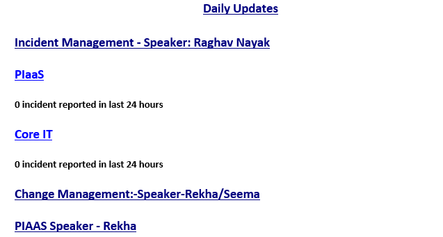
     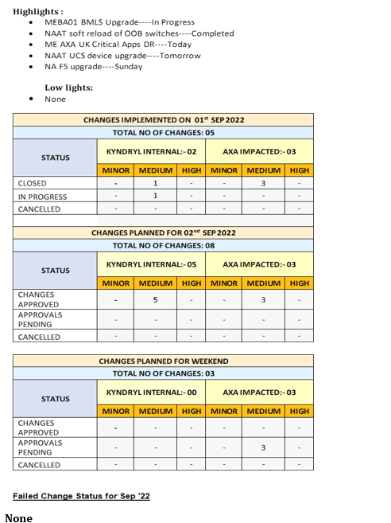
     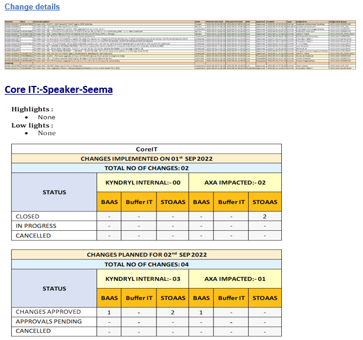
     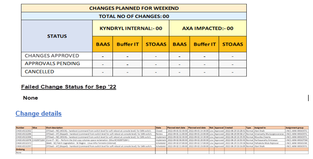
     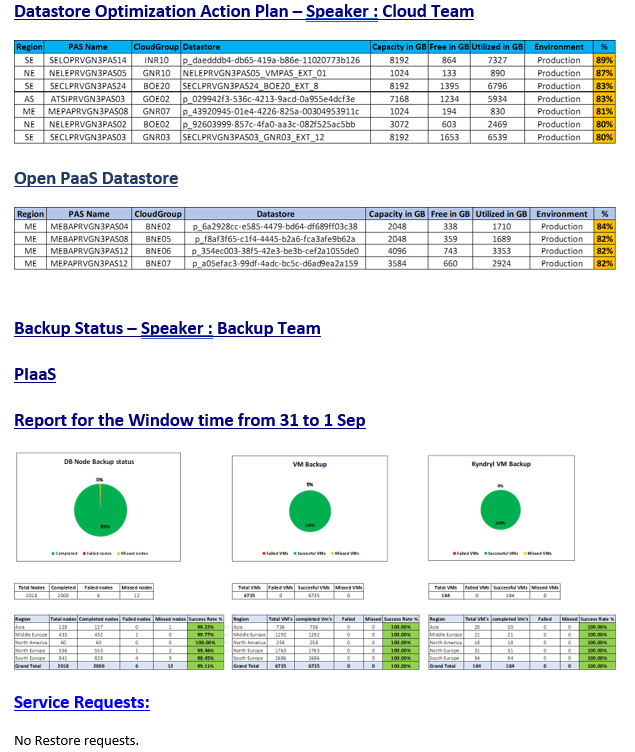
     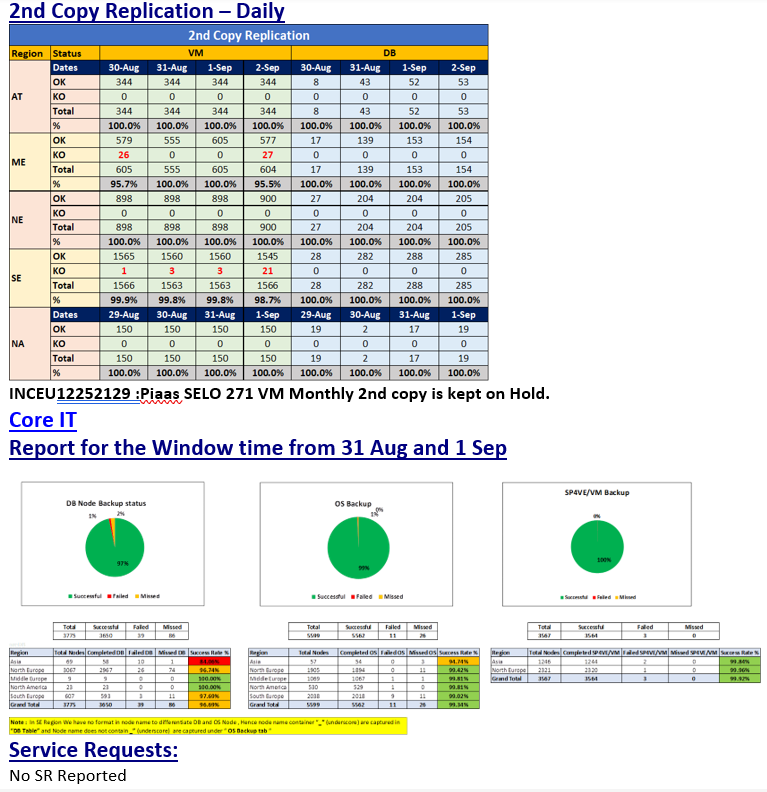
     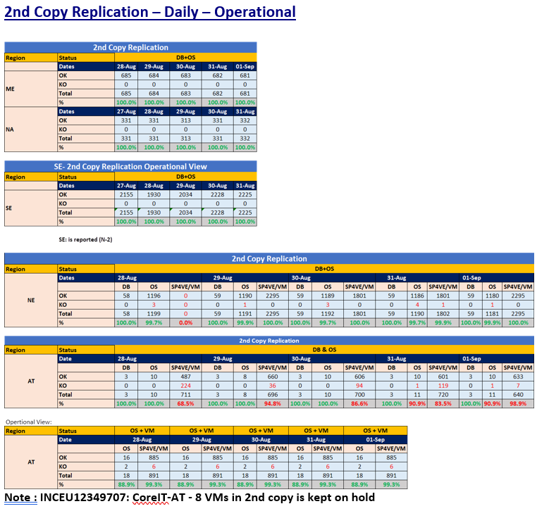
     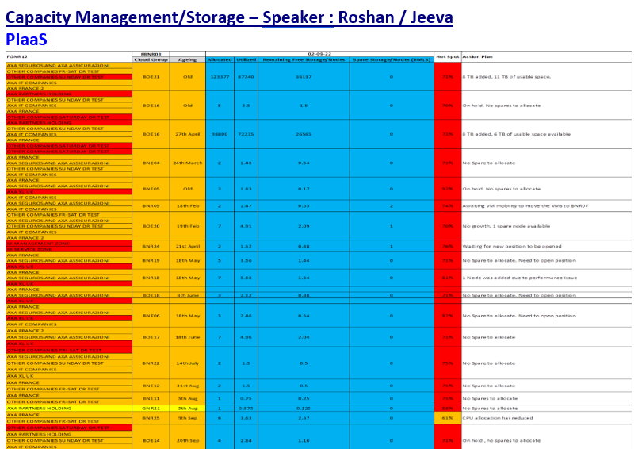
     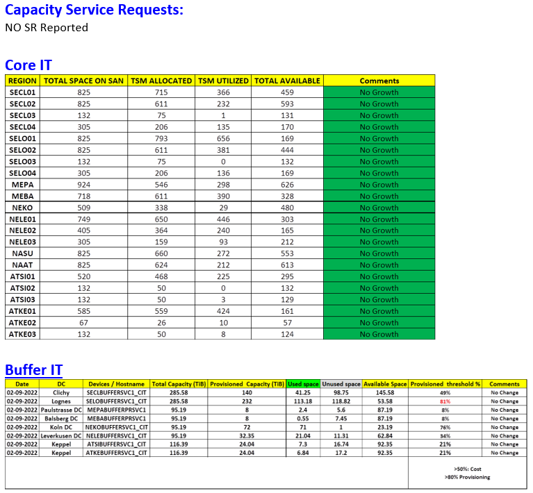
     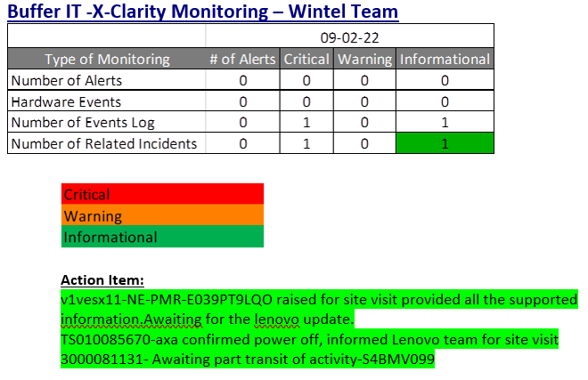
     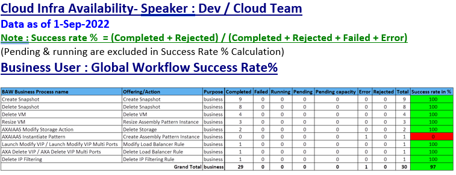
     <b>Hot Spots</b>
     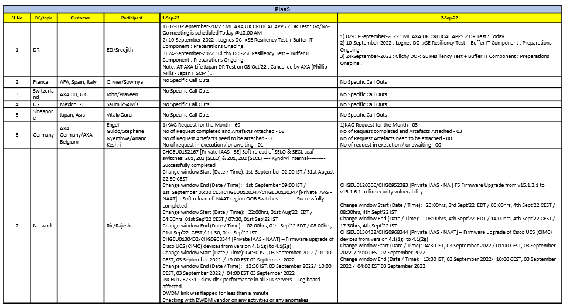
     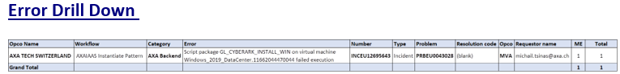
     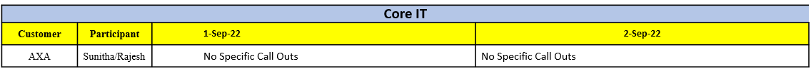
     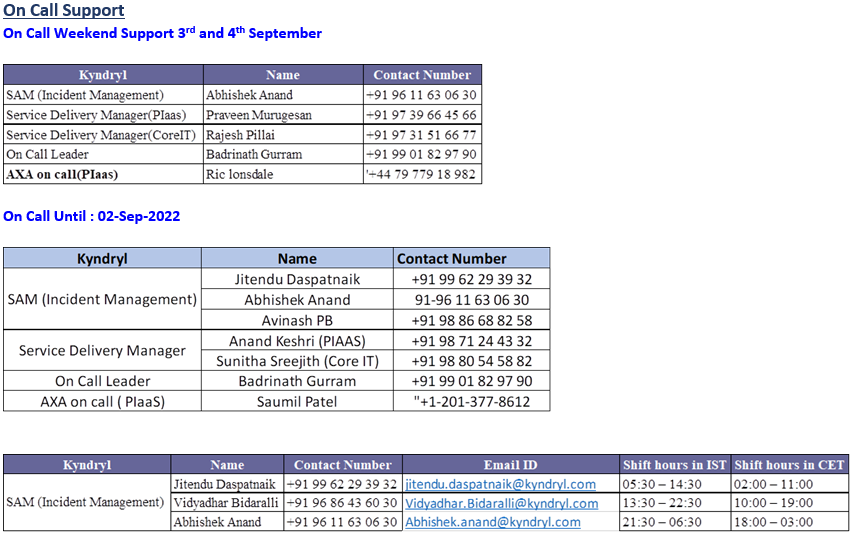

## 2. Backup Report

???+ "Steps to create the report"

     <b><i>Step 1:</b></i>
     Use the file named “ Backup Daily Report_new_dd-mm-yyyy
     
     <b><i>Step 2:</b></i>
     Rename the file with today's date.

     <b><i>Step 3:</b></i>
     Required to update 3 tabs – Chart, OS and DB. Only OS and DB tab are updated, Chart tab will be automatically filled.
     
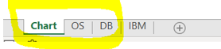

     <b><i>Step 4:</b></i>
     Go to the OS tab and clear the contents from A to O excluding heading.

     <b><i>Step 5:</b></i>
     Go to the DB tab and clear the contents from A to R excluding heading

     <b><i>Step 6:</b></i>
     Required automated reports are available on share folder location as given below
     https://enterprise.sharepoint.com/sites/EnterpriseReportdelivery/SitePages/ProjectHome.aspx?OR=Teams-HL&CT=1661402483534&clickparams=eyJBcHBOYW1lIjoiVGVhbXMtRGVza3RvcCIsIkFwcFZlcnNpb24iOiIyNy8yMjA3MzEwMTAwNSIsIkhhc0ZlZGVyYXRlZFVzZXIiOmZhbHNlfQ%3D%3D
     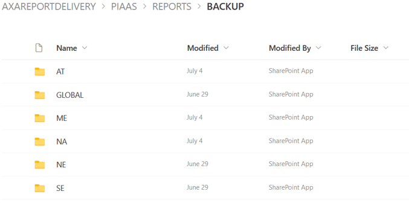

     <b><i>Step 7:</b></i>
     Go the folder eg – AT – go the respective year xxxx month XX and respective day for which the report to be updated.

     <b><i>Step 8:</b></i>
     Go the OS backup tab, and copy from b to p excluding the heading and paste in to the OS tab of backup report file.

     <b><i>Step 9:</b></i>
     Go the DB backup tab, and copy from b to s excluding the heading and paste in to the DS tab of backup report file.

     <b><i>Step 10:</b></i>
     Repeat the same for all other regions ME, NE, NA and SE and paste them one below the other in respective tabs.

     <b><i>Step 11:</b></i>
     Once the pasting is done and sort by host name for both OS and DB Tab

     <b><i>Step 12:</b></i>
     The automated report will be available by 6:00 Pm everyday for next day’s report. Previous day data is always captured for next day report.

     <b><i>Step 13:</b></i>
     This report should be sent to backup team to update the 3rd table -IBM data. 

     <b><i>Step 14:</b></i>
     Backup team will update the third one and send back to update the HC report and the final report is viewed as below
     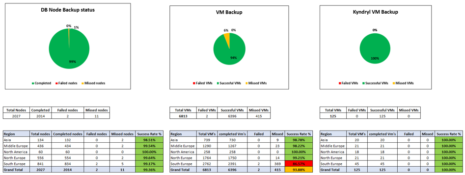

## 3. Silva/He02

???+ "Steps to create the report"
      
      <b><i>Step 1:</b></i>
      IPHE02 Report is available on Share point on daily basis 

      <b><i>Step 2:</b></i>
      Location of the file
      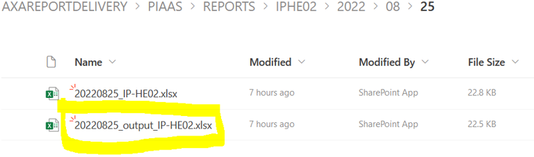

      <b><i>Step 3:</b></i>
      CMDB logs will be received from automated mail every day at 3:00 PM
      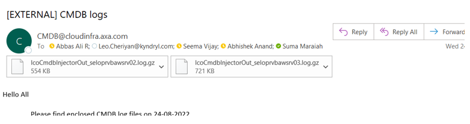
      Download them and extract the gz files.
      Upload IPHE02 and CMDB logs to the Enterprise shareBoxfolder – as given below on daily basis

      https://sre365.sharepoint.com/sites/AGO1/GSBX952307/Midtermshare/Forms/AllItems.aspx?ga=1&id=%2Fsites%2FAGO1%2FGSBX952307%2FMidtermshare%2FCMDB%20injector%2F19%2D8%2D2022&viewid=a5533f91%2D343a%2D4d5d%2Daf2f%2D08b797331fb3

## 4. Datastore Report

???+ "Steps to create the report"
     
     <b><i>Step 1:</b></i>
     Source data is received from cloud team via email

     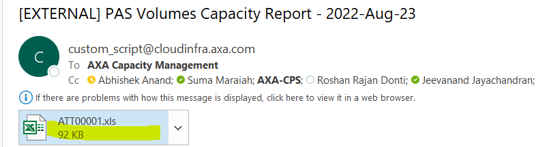

     <b><i>Step 2:</b></i>
     Download and open the file, delete columns  B, C, E and I and apply filters, Datastore column , search for cache, and delete all the rows corresponding to it

     <b><i>Step 3:</b></i>
     % should be calculating on the last column  = Utilized in GB/Capacity in GB.

     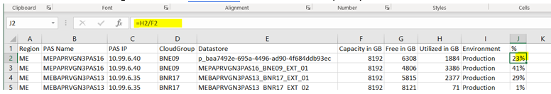

     <b><i>Step 4:</b></i>
     Filter the % column for <80% and delete.

     <b><i>Step 5:</b></i>
     Then open data store template 

     <b><i>Step 6:</b></i>
     It will have 3 tabs, Previous day, Today and ME-Open paas
     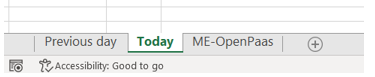

     <b><i>Step 7:</b></i>
     Copy from today from a to J column and paste it on Previous day tab

     <b><i>Step 8:</b></i>
     From the automated file, filter for cloud group starting with series BNE, copy and paste the data in ME openPaas tab.

     <b><i>Step 9:</b></i>
     Rest of the data in Today’s tab.

     <b><i>Step 10:</b></i>
     Both Today’s data and ME-Open Paas data is shared in Hypercare report and sent to Cloud team
     Report looks as below –

     Today
     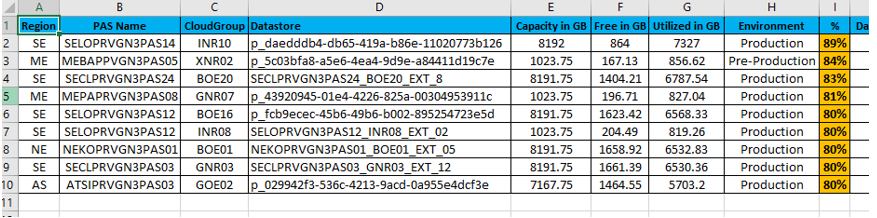
     ME-Open Paas
     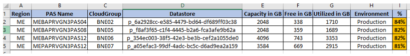

## 5. E2E Report

???+ "Steps to create the report"

     <b><i>Step 1:</b></i>
     This report looks in to PIF data -APIS User for the last 90 days

     <b><i>Step 2:</b></i>
     There's a template created in snow – which pulls the data for this condition

     <b><i>Step 3:</b></i>
     Extract the data from snow.

     <b><i>Step 4:</b></i>
     Use the E2E file.

     <b><i>Step 5:</b></i>
     Open the E2E report, clear the cells from A to U excluding heading.

     <b><i>Step 6:</b></i>
     Copy the extracted data and paste it to the E2E report 2nd tab Sheet 1
     
     <b><i>Step 7:</b></i>
     Refresh the data in sheet 2.

     <b><i>Step 8:</b></i>
     This should be uploaded on BOX
     
     <b><i>Step 9:</b></i>
     https://enterprise.ent.box.com/folder/99039804970

     <b><i>Step 10:</b></i>
     The same file should be sent to Enterprise on every Monday.
     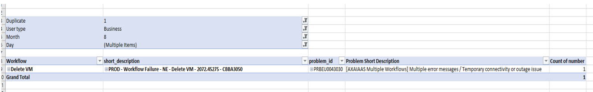

 
## 6. Daily WIF Report

## 7. I2BCK SLA/SLO (2nd Copy Replication)

## 8. PIAAS I2BCK Report

???+ "Steps to create the report"

      <b><i>Step 1:</b></i>
         Working report Name - PIaaS_I2BCK_DLY_audit_logs - VM and DB View DD-Month– Update the date for which report is prepared

      <b><i>Step 2:</b></i>
         Share point link for automated report:  https://enterprise.sharepoint.com/sites/EnterpriseReportdelivery/SitePages/ProjectHome.aspx
         

      <b><i>Step 3:</b></i>
          Path to download the automated report - Enterprise Report delivery - EnterpriseREPORTDELIVERY\PIAAS\REPORTS\I2BCK\OPERATIONAL
           
      <b><i>Step 4:</b></i>
          For NA we use N-1 report for other regions we should use same day report

      <b><i>Step 5:</b></i>
         Go to DB View & VM View
         
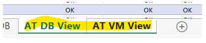

      <b><i>Step 6:</b></i>
         Copy the data from F to S Colum
         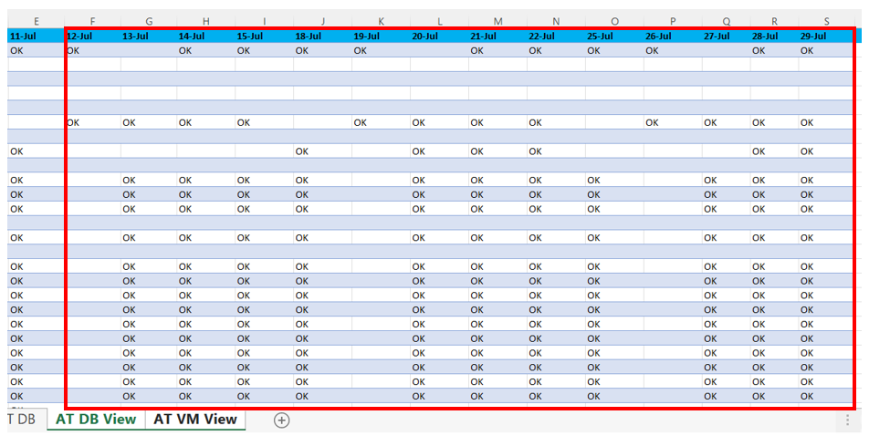

      <b><i>Step 7:</b></i>
         Paste the date from E Colum.
         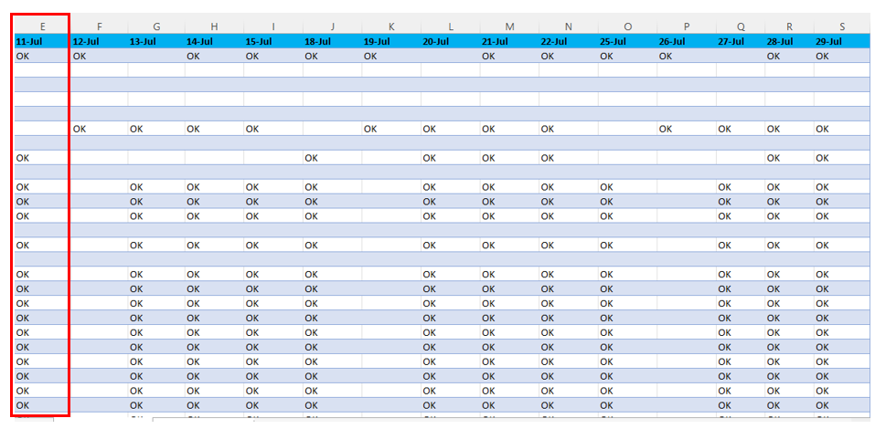

      <b><i>Step 8:</b></i>
         Delete the data in in S Colum.
         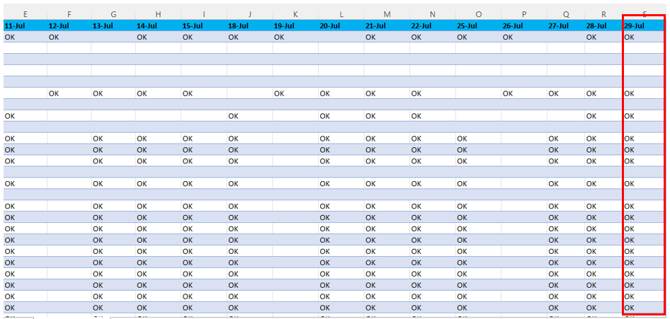

      <b><i>Step 9:</b></i>
         In S Colum enter the date for which we are preparing the report
         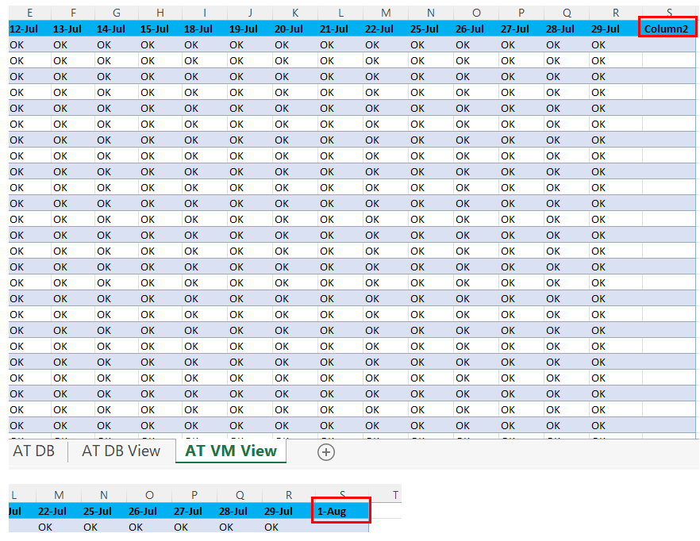

      <b><i>Step 10:</b></i>
         Validate the DB Details in DB View in working report with the automated report.

      <b><i>Step 11:</b></i>
         To validate download the automated report from share point link. For the region we are working on.
         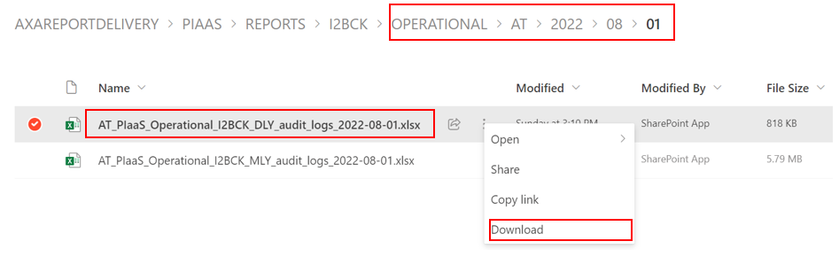   

      <b><i>Step 12:</b></i>
         In automated report put a vlookup formula in L Colum 
         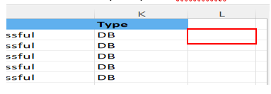
        
=Vlookup(Select B2 Colum in automated report, Select complete A Colum of DB view in working report,1,0)

         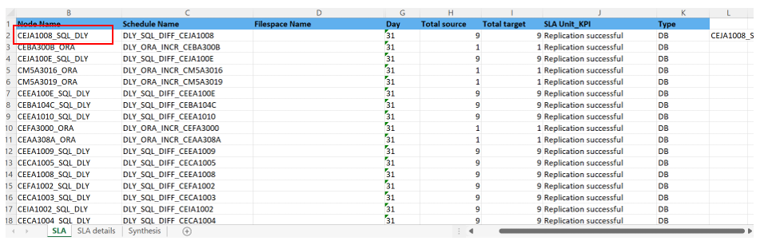
         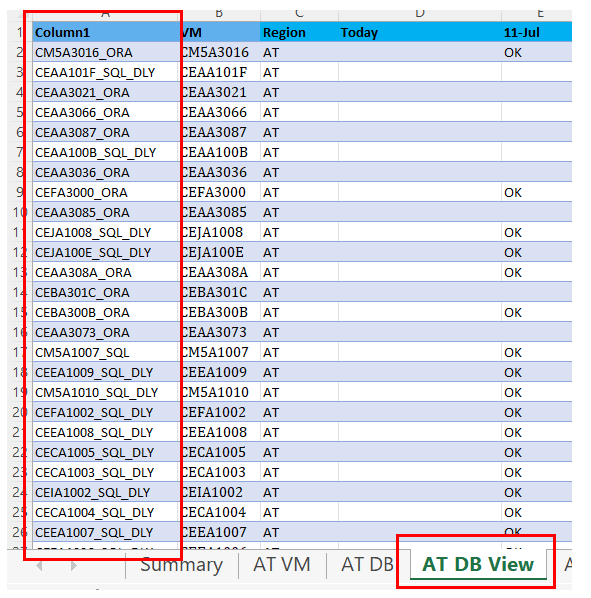

      <b><i>Step 13:</b></i>
         Drag and drop formula till the end of the sheet.

      <b><i>Step 14:</b></i>
         Apply filler on and Select N/A in L Colum.
         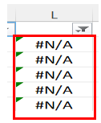

      <b><i>Step 15:</b></i>
         In K column Type if there is DB.
         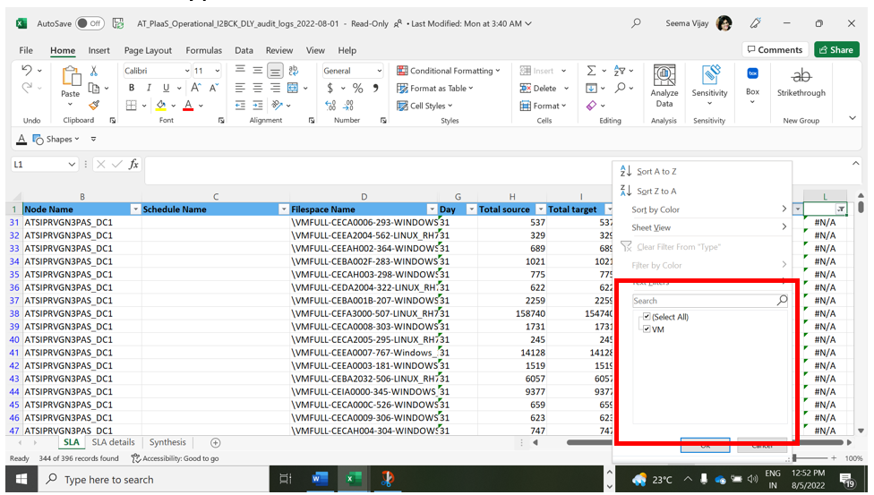

      <b><i>Step 16:</b></i>
         If there is no DB no action required. If we find DB we’ll have to select that and should copy the Node Name in B column and should paste it in DB view working sheet A column at the end of the sheet.
         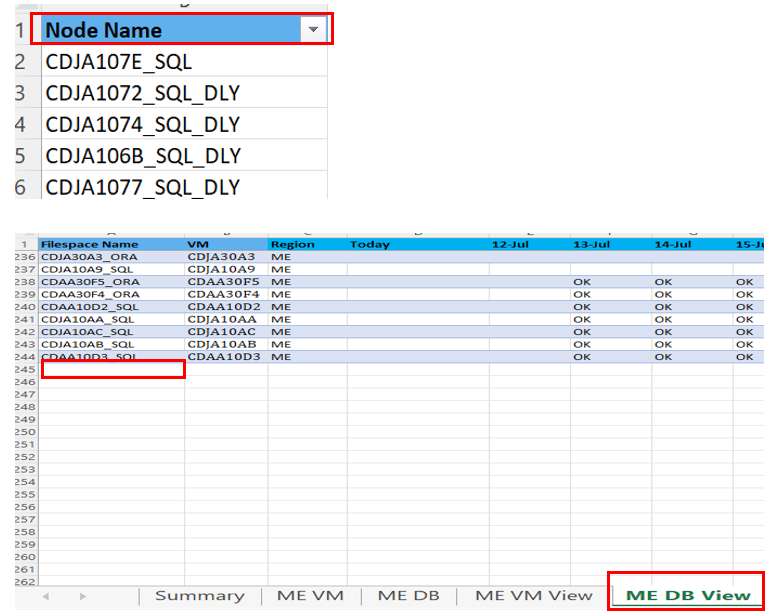

      <b><i>Step 17:</b></i>
         Validate the VM Details in VM View in working report with the automated report.

      <b><i>Step 18:</b></i>
         In automated report put a vlookup formula in L Colum
         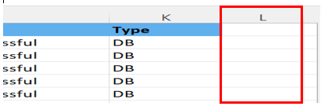
         
=Vlookup(Select D2 Colum in automated report, Select complete A Colum of VM view in working report,1,0)

         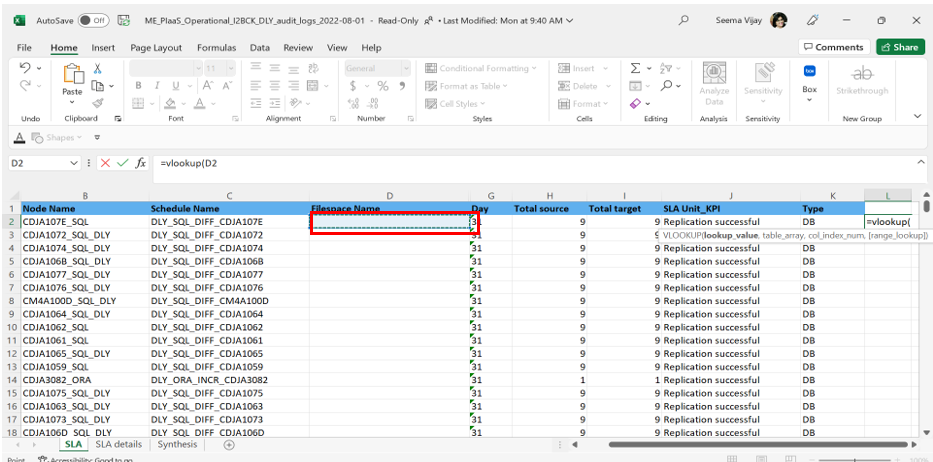
         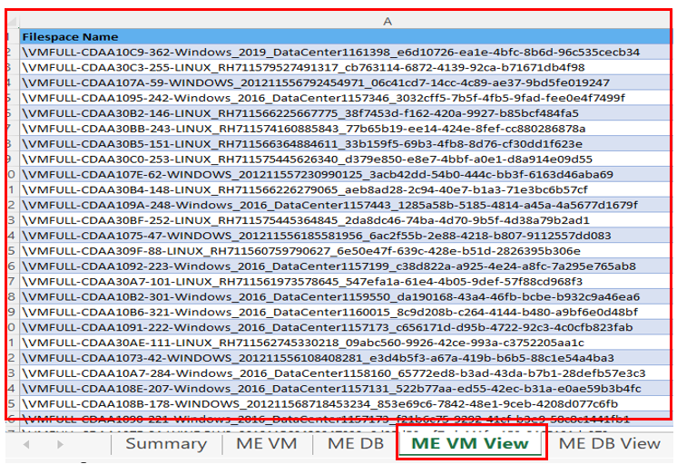

      <b><i>Step 19:</b></i>
         Drag the formula till the end of the sheet.

      <b><i>Step 20:</b></i>
         Apply filler on and Select N/A in L Colum.
         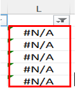

      <b><i>Step 21:</b></i>
         In K column “Type” if there is VM.
         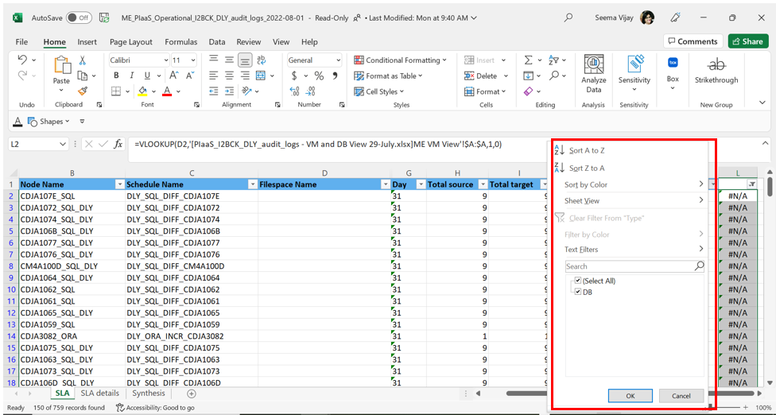

      <b><i>Step 22:</b></i>
         If there is no VM no action required. If we find VM we’ll have to select that and should copy the Filespace Name in D column and should paste it in DB view working sheet A column at the end of the sheet.
         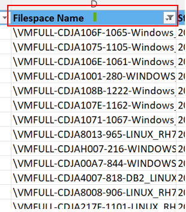
         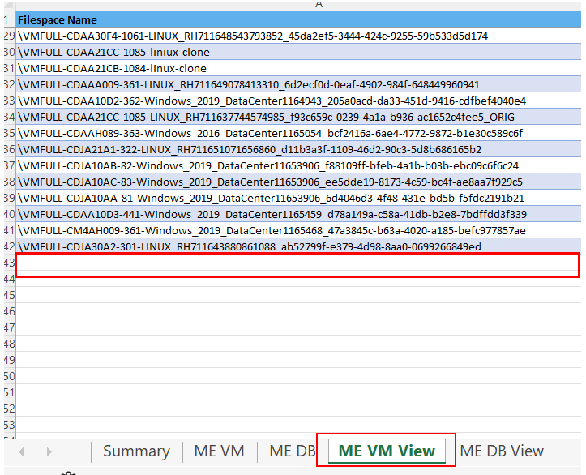

      <b><i>Step 23:</b></i>
         Updating replication status on working sheet.
         Replication successful = OK
         Replication Failed = KO

      <b><i>Step 24:</b></i>
         For DB data. In Working Sheet D Colum “Today” in ME DB View we’ll have to put a formula. 
         =VLOOKUP(Select A2 ,in automated report select data from B to J,9,0)
         Sample formula =VLOOKUP([@[Filespace Name]],'[ME_PIaaS_Operational_I2BCK_DLY_audit_logs_2022-08-01.xlsx]SLA'!$B:$J,9,0)
         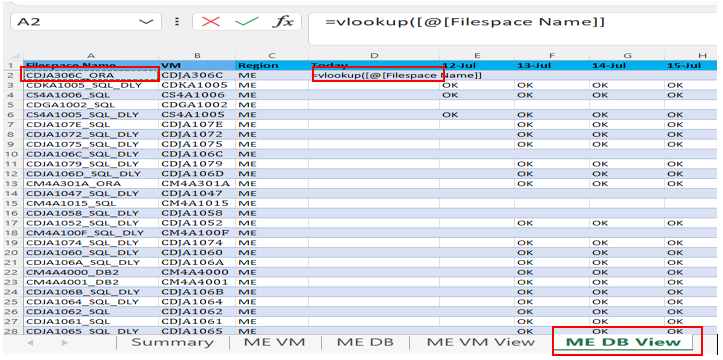
         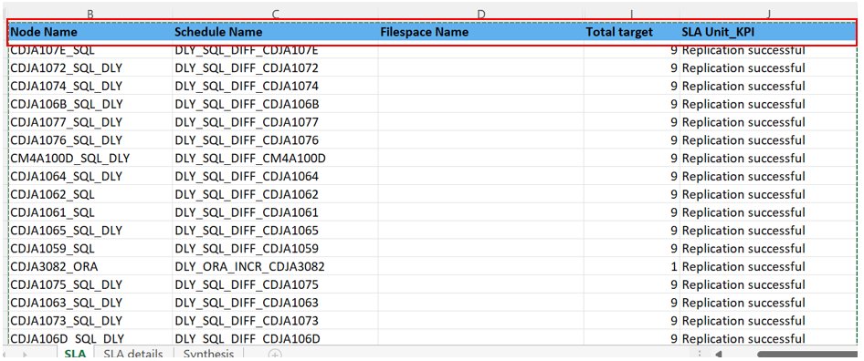

      <b><i>Step 25:</b></i>
         Once the formula us applied value will appear on D Colum working Sheet.
         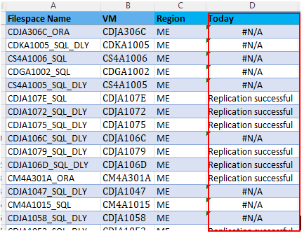

      <b><i>Step 26:</b></i>
         Apply filter and Select Replication successful. In “S” column mention “OK “  if we have any Replication failed values select that from the filter and & mention “S” Colum. For N/A values we should leave that blank in “S” Colum. Once we fill the data in S Colum. Delete the data from D column.
         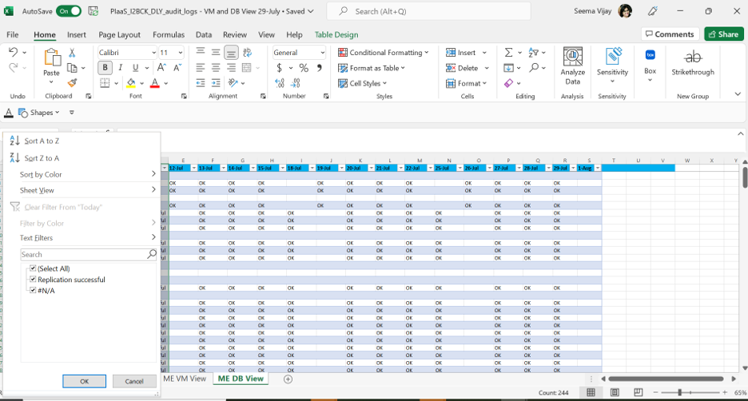

      <b><i>Step 27:</b></i>
         For VM data. In Working Sheet D Colum “Today” in VM View we’ll have to put a formula. 
         
=VLOOKUP(Select A2 ,in automated report select data from D to J,7,0)

         Sample formula
         
=VLOOKUP([@[Filespace Name]],'[ME_PIaaS_Operational_I2BCK_DLY_audit_logs_2022-08-01.xlsx]SLA'!$D:$J,7,0))

      <b><i>Step 28:</b></i>
         Apply filter and Select Replication successful. In “S” column mention “OK “  if we have any Replication failed values select that from the filter and & mention “S” Colum. For N/A values we should leave that blank in “S” Colum. Once we fill the data in S Colum. Delete the data from D column.

      <b><i>Step 29:</b></i>
         Entering Value in DB and VM for region we are working on in working sheet. Move to DB tab. Refresh the sheet 
         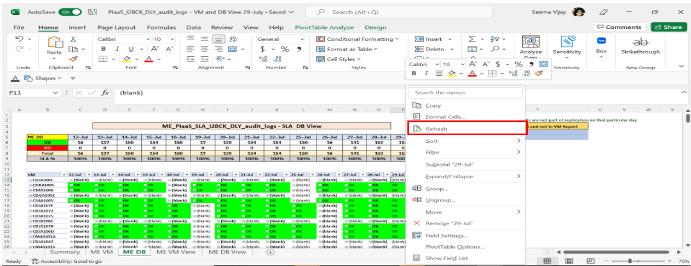

      <b><i>Step 30:</b></i>
         Post refreshing do the right click and select Show field list. In Pivot table fields select the date for which we are working on. Once is selected check if value is appearing in main sheet. Repeat the same steps for VM as well.
         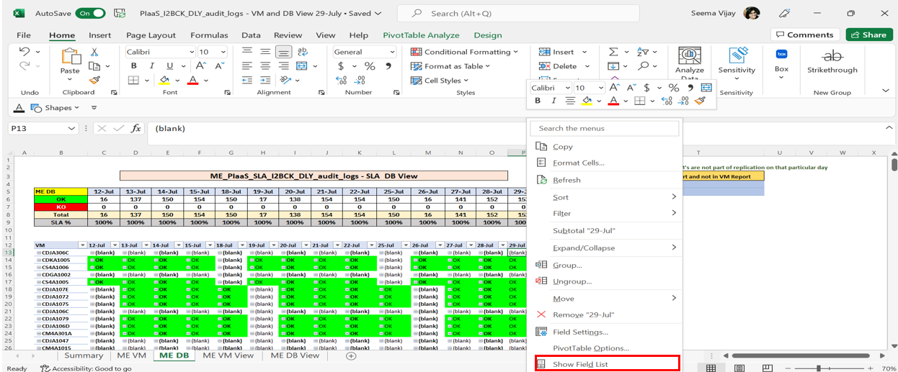
         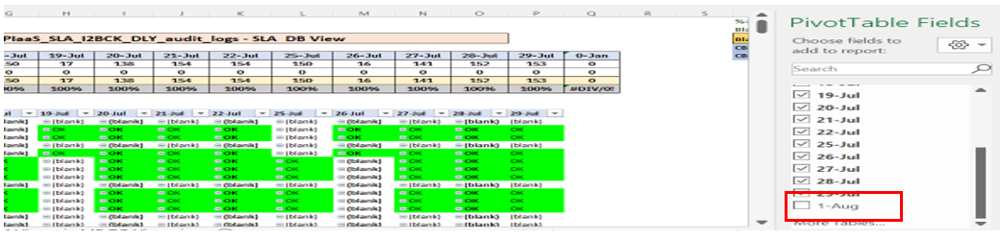
         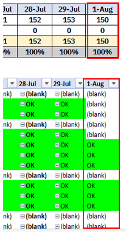

      <b><i>Step 31:</b></i>
         Validate the data is accurate in Summary tab of working sheet.
         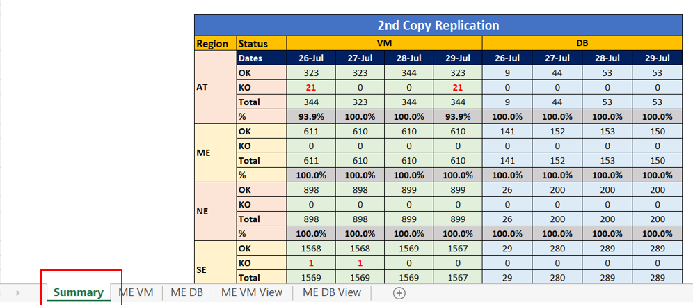

      <b><i>Step 32:</b></i>
         Repeat the above steps for all the regions.

      <b><i>Step 33:</b></i>
         Uploading the file to ISC portal.

      <b><i>Step 34:</b></i>
         ISC portal link - https://www.ibm.com/services/connect/portal/

      <b><i>Step 35:</b></i>
         Once logon to ISC portal click on document. Click on Access Documents and other collaborative features.
         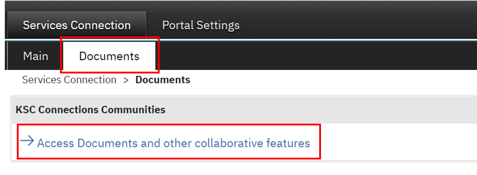

      <b><i>Step 36:</b></i>
         Once we click on Access Documents and other collaborative features. It will take you new page. Select Enterprise report.
         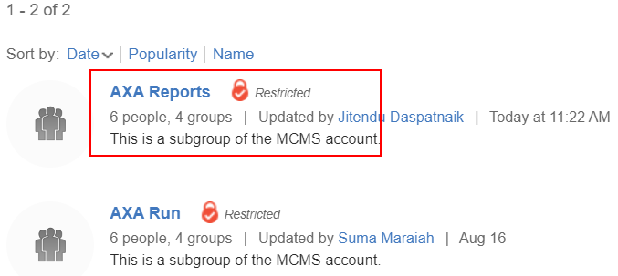

      <b><i>Step 37:</b></i>
         Select Enterprise I2BCK_Reports.
         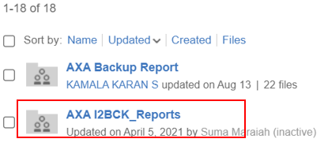

      <b><i>Step 38:</b></i>
         Select Daily.
         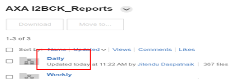

      <b><i>Step 39:</b></i>
         Click on Add. Select new upload
         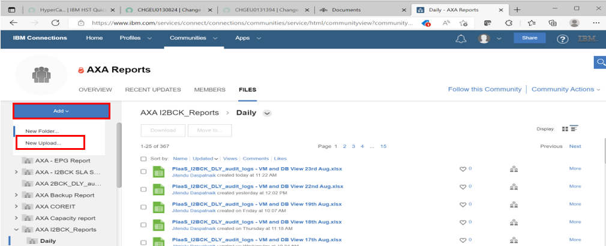

      <b><i>Step 40:</b></i>
         Browse a file and upload the file.
         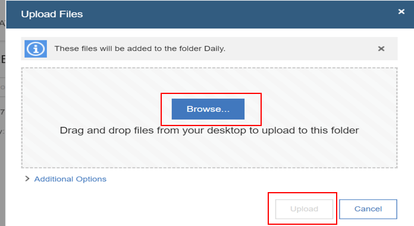

      <b><i>Step 41:</b></i>
         Post upload we’ll have send email to following email id’s.

      To : Suma Maraiah <Suma.Maraiah@enterprise.com>; Kalli Reddy <Kalli.Reddy@enterprise.com>; Parthasarathy Srinivasan <Parthasarathy.Srinivasan@enterprise.com>; Enterprise_Backup <sre_backup@enterprise.com>; Abbas Ali R Abbas.Ali.R@enterprise.com

      CC: SUNITHA SREEJITH <Sunitha.Sreejith@enterprise.com>; SANJU PHILIP <Sanju.Philip@enterprise.com>; Enterprise-PIAAS-AccountTeam <Enterprise-PIAAS-AccountTeam@enterprise.com>; Enterprise-SAMs Enterprise-SAMs@Enterprise.com Seema Vijay Seema.Vijay@enterprise.com .

      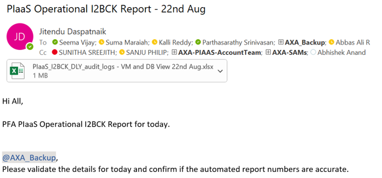