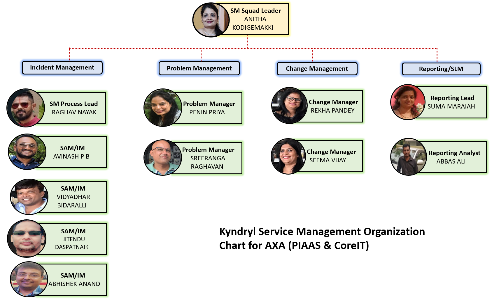
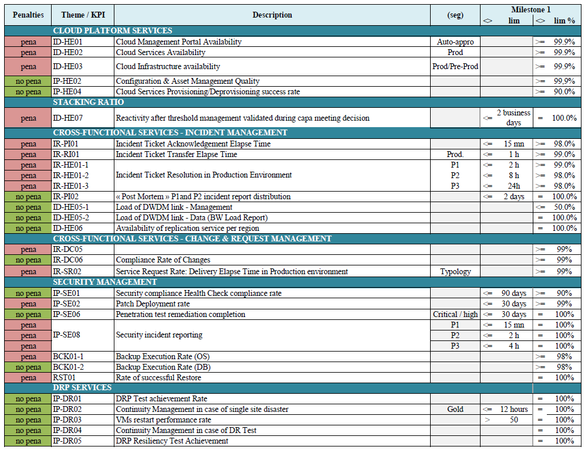
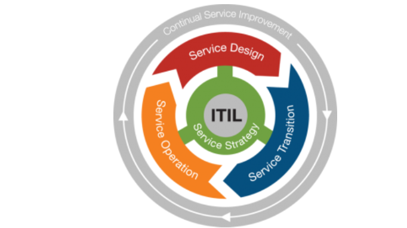

# <u><b>AXA Service Management</u></b>

## 1. Introduction

IT Service Management or ITSM is the set of activities that can help manage the services delivered to end-users. Based on the ITIL framework of best practices, ITIL service management provides a set of best practices and techniques for selecting, planning, delivering, and maintaining IT services within a business that aligns the IT department's actions and expenses with changing business demands. It was created by the United Kingdom's Central Computer and Telecommunications Agency (CCTA) in 1989, AXELOS developed and released the most recent version, ITIL 4, in 2019.

## 2. Overview and Organization:

???+ Team_Values

       
       <ul style=list-style-type:square><li>FOSTER RICH, EFFECTIVE, TIMELY COMMUNICATION WITH CUSTOMER, STAKEHOLDERS AND TEAM MEMBERS
       </li>
<li>
       MAINTAIN A COLLABORATIVE WORKING ENVIRONMENT THAAT ALLOWS FOR RICH, DEEP TEAM ITERACTION
       
</li><li>
       SUSTAIN HIGH-PERFORMING, CROSS-FUNCTIONAL CORE TEAMS
       
</li>
       <li>
       ENSURE THE HIGHEST OF QUALITY THROUGH CONTINIOUS INTEGRATION PAIR-WORKING AND TEST-DRIVEN DEVELOPMENT
       
</li>
       <li>
       SOLICIT FEEDBACK AND WORK TO IMPROVE
       
</li>
       <li>
       CONSTANTLY DELIVER VALUE AND FOCUS
       ON WHAT THE CUSTOMER MEANS NOT 
       WHAT THEY ASK FOR
       
</li>
       <li>
       LEARN CONTINUOUSLY
       </li>
       

## 3. The Team 
|     Name               |            Email                    |       Role             |
| :--------------------- | :---------------------------------- | :--------------------- | 
|   Anitha Kodigemakki   |   Anitha.kodigemakki@kyndryl.com    |    Squad Lead          |
|   Penin Priya          |   Penin.Priya@kyndryl.com           |    Team Lead           |
|   Avinash PB           |   Avinash.Pb@kyndryl.com            |    SAM/IM              |
|   Jitendu Daspatnaik   |   Jitendu.Daspatnaik@kyndryl.com    |    SAM/IM              |
|   Abhishek Anand       |   Abhishek.Anand@kyndryl.com        |    SAM/IM              |
|   Vidyadhar Bidaralli  |   Vidyadhar.Bidaralli@kyndryl.com   |    SAM/IM              |
|   Sreeranga Raghavan   |   Sreeranga.Raghavan@kyndryl.com    |    Problem Manager     |
|   Rekha Pandey         |   Rekha.Pandey@kyndryl.com          |    Change Manager      |
|   Seema Vijay          |   Seema.Vijay@kyndryl.com           |    Change Manager      |
|   Suma Maraiah         |   Suma.Maraiah@kyndryl.com          |    Reporting Lead      |
|   Abbas Ali R          |   Abbas.Ali.R@kyndryl.com           |    Reporting Analyst   |
|         |            |     |

## 4. SM Organization Chart

## 5. Roles & Responsibilities

<b>ITSM Lead</b>

  * Accountable for the end-end Service Management delivery Incident, problem, change & Reporting.
  * Identify the gaps in the IPC process and work with stakeholders to optimize the service 
  * Analyse and give insights on SLA/KPI negotiations to make it more business oriented 

<b>Service Availability Managers/Incident Managers</b>

  * Drive the efficiency and effectiveness of the Incident Management process. P1/P2s
  * Ensure escalation process/policy, relating to Incident and Major Incident Management exist and are maintained.
  * Monitor , track and communicate  process execution activities to identify, initiate and manage required action to meet service level agreements.

<b>Problem Managers</b>

  * Manage the lifecycle of all Problems, prevent Incidents from happening, and to minimize the impact of incidents that cannot be prevented.
  * Perform day-to-day RCA co-ordination
  * Support the technical/support team by assisting in Resolution Feasibility & planning resolution actions  and Justification with Account Mgmt/customer as required 

<b>Change Managers</b>

  * Ensure all changes are reviewed and validated before submit to CAB meeting. Quality of the change and prerequisites are clearly documented
  * Communication with the affected employees
  * Maintain and manage the SLAs, KPIs on a weekly/monthly basis and drive for improvement with team members, Driving the team to close Open change records. 
  * Document and create change management reports

<b>SLA & Reporting</b>

  * Provide weekly/monthly, Incident volume trend, Mean Time To Resolution and SLA reports for accounts assigned to you. Timely delivery of reports 
  * Contribute to client success by providing the up-to-date reports to account SLAs as agreed.
  * Enable automation and innovative to automate the reports
  * Work on SLA improvement and drive actions with respective stakeholders
  * Contribute to establish and mature Service Level Management Governance

## 6. AXA Service Level Management
### 6.1 Kyndryl-AXA: Agreed SLA/KPI penalty & non-penalty
???+ SLA_KPI
    

### 6.2. Top 3 Cloud KPIs (penalty)

#### *6.2.1 ID-HE01*
 
 Cloud Management Portal Availability
     
  **Functional Description**

  This indicator aims at following the availability rate of the Cloud management Orchestrator portal and API usage.

  **Indicator Definition**

  Indicator ID-HE01: measures the availability rate of the Cloud management Orchestrator portal and API usage.

  **Service Level**

  ID-HE01 >= 99,9%

  **Calculation method**

  ID-HE01 = [(agreed time of availability during the period - total duration of the unavailability) / (agreed time of availability during the period)]
  where the total duration of unavailability = sum of the durations of unavailability measured for all the Incidents.

#### *6.2.2 ID-HE02*
 
Cloud services Availability
     
  **Functional Description**

  This indicator aims at following the Cloud Services availability via the portal and API.

  **Indicator Definition**

  ID-HE02 Indicator: measures the Cloud Services availability rate.

  **Service Level**

  ID-HE02 >= 99,90%
  The Service Level applies to each Regional value of the KPI,

  **Calculation method**

  ID-HE02 = (agreed time of availability during the period of the PAS - total duration of unavailability of the PAS ) / (agreed time of availability during the period of the PAS)

#### *6.2.3 ID-HE03*
 
Cloud Infrastructure availability
     
  **Functional Description**

  This indicator aims at following the availability rate of Infrastructures physical or virtual supporting the Applications (all environments included). Any one of the regional datacentre being available for less than the agreed time of availability during the period triggers the penalty.

  **Indicator Definition**

  ID-HE03 Indicator: measure the availability rate of Cloud Infrastructure running the AXA Application VMs

  **Service Level**

  Service Level applies to each Data Center value, the penalty weight been equally split between each Datacentre.
  ID-HE03 >= 99,90%

  **Calculation method**

  ID-HE03 = [(agreed time of availability during the period - total duration of unavailability restraint) / (agreed time of availability during the period)]
  where the total duration of unavailability = the highest duration of unavailability of Infrastructures supporting the Applications.
  ID-HE03 = [Availability time – Unavailability time] / Availability time * 100

## 7. Education - ITIL Basic concepts
###  7.1. What is ITIL?

ITIL is a list of volumes that describe a framework for the best practices to deliver IT services. These practices are drawn from the private and public sectors worldwide. ITIL has the following benefits: 

    - Reduced IT costs
    - Improved IT services
    - Improved customer satisfaction
    - Standards and guidance
    - Improved productivity
    - Improved skills and experience
    - Improved delivery of 3rd party services

ITIL has gone through several revisions and comprises five books, focusing on the various processes and stages of the IT service lifecycle. Their most recent update, ITIL 4 began to start rolling out in Q1 of 2019, focusing on a more agile, flexible, and customizable version of ITIL, modified for modern businesses.

### 7.2. What is ITSM?
IT Service Management focuses on implementing, managing, and delivering IT services to ensure the organization's goals are met. ITSM uses the appropriate mix of people, processes, and technology to ensure they can provide value to the organization. 

### 7.3. ITSM Key Concepts

To properly understand ITIL and ITSM, it is important to understand some key terms and concepts.

 1. Value: Value is the perceived benefits, usefulness, and importance of something. It is subjective in nature with respect to stakeholders, organization, and customers  
 2. Co-creation of value: This refers to a strategy that encourages customer involvement to provide them with a greater experience 
 3. Service: It refers to a means of giving value to customers, with favorable outcomes without having to manage specific costs and risks 
 4. Service relationship: It refers to the co-operation between a service provider and a service consumer
 5. Service provider: It is the role performed by an organization that provides services to customers
 6. Service consumer: It represents the customer, user or sponsor of the service
 7. Organization: It represents a group of people that have their own functions with responsibilities, authorities, and relationships to achieve their objectives
 8. Service relationship management: It refers to the joint activities performed by service providers and service consumers to ensure co-creation of value  
 9. Output: It refers to the physical or non-physical deliverables created as a result of an activity
 10. Outcome: It refers to the result of a stakeholder, enabled by one or more outputs
 11. Utility: It refers to the functionality offered by a product for service to meet a need of the organization
 12. Warranty: It refers to the assurance provided that a product or service will meet the agreed requirements discussed

### 7.4. IT Service Lifecycle

It is an approach to IT Service Management that organizations of all sizes can be used to manage the full lifecycle of IT and other services. It helps coordinate and control across processes, systems, and functions.

The service lifecycle can be divided into 5 stages. Let's take a closer look at each of these stages and the processes within them. 

#### 7.4.1. Service strategy

The service strategy stage describes the steps and objectives required to manage IT services. The stage also makes sure that these services are aligned with the goals of the organization. The processes within the stage are: 

<b>Strategy Management for IT Service</b>

Strategy management for IT service is a process to define and maintain the 4Ps of Strategy (i.e., perspective, position, plans, and patterns). It ensures the creation of a strategy for an IT Service & its Management throughout the service lifecycle.

<b>Financial Management</b>

The financial management process helps understand and manage costs and opportunities involved with the service. The different activities under it are:

 * Accounting: Tracking how service providers spend money
 * Budgeting: Planning how service providers would spend money
 * Charging: Securing payment from customers for the services provided to them

<b>Service Portfolio Management</b>

The service portfolio management process represents the entire set of activities that are managed by a service provider. This process organizes the process by which a process is identified, described, evaluated, selected, and chartered.

<b>Demand Management</b>

The demand management process helps understand and influence customer demand. It uses:

 * User profiles: Characterizes different groups of users for a given service
 * Patterns of Business Activity: Represents the way users in different user profiles interact with a service over a period of time

<b>Business Relationship Management</b>

Business relationship management seeks to establish a positive relationship with customers. It identifies the requirements of potential and existing customers and ensures the development of appropriate services to meet those needs.

#### 7.4.2. Service Design

This stage focuses on the design of the services and all the other supporting elements that enable the service to be introduced into a live environment. Four areas need to be taken into consideration when designing a service:

People: HR and organizational structure to support the service
Processes: Service Management process required to support the service
Products: Technology and infrastructure support
Partners: Third parties that can provide additional support
Let's have a look at the processes within this stage:

<b>Design Coordination</b>

Design coordination is a process responsible for being the single point of contact for coordination and control of all activities related to service design. 

<b>Service Level Management</b>

The service level management process secures and manages agreements between customers and service providers relating to utility and warranty of specific services. These lead to the creation of Service Level Agreements (SLA) between customers and the provider.

<b>Availability Management</b>

The availability management process handles the management and achievement of the agreed-upon availability requirements that were established in the Service Level Agreements (SLA)

<b>Capacity Management</b>

The capacity management process ensures that the cost-effective capacity meets or exceeds the needs of the business, as established in the SLAs. It is divided into three categories:

Business Capacity Management
Service Capacity Management
Component Capacity Management
IT Service Continuity Management
The process of IT service continuity management ensures that the service provider can provide the minimum agreed-upon levels of service. It uses techniques like Business Impact Analysis and Management of Risk to produce an IT Service Continuity Plan.

<b>Information Security Management</b>

The process of IT security management aims to protect five basic qualities of information assets:

Confidentiality
Integrity
Availability
Nonrepudiation
Authenticity

<b>Service Catalog Management</b>

The service catalog management process contains all services available to customers and users. It is usually the only portion of the service portfolio accessible to users.

<b>Supplier Management</b>

The process of supplier management deals with obtaining value for money from third party suppliers. It works more with external suppliers than with internal suppliers and consumers.

#### 7.4.3. Service Transition

The service transition stage of service transition enables the building and deploying of IT services while ensuring the changes to the services and service management processes are taking place in a coordinated manner. Let's have a look at the processes within this stage: 

<b>Transition Planning and Support</b>

The transition planning and support process plans and coordinates the use of resources to deploy a major release within the time, time and quality predicted

<b>Service Asset and Configuration Management</b>

The process of asset and configuration management maintains information about the configuration items required to deliver an IT service, including their relationships.

<b>Release and Deployment Management</b>

The release and deployment management process plans, schedules, and controls the movement of releases to testing and live environments while maintaining the integrity of the live environment. It also makes sure the appropriate components are released.

<b>Change Management</b>

The process of change management controls the lifecycle of all changes with minimal disruption to IT services.

<b>Change Evaluation and Testing</b>

The process of change evaluation assesses major changes before they can proceed to their next phase in their lifecycle

<b>Service Evaluation and Testing</b>

The process of service validation and testing ensures the deployed releases and resulting services meet the customer's needs and verifies the IT operations can support the new services 

<b>Knowledge Management</b>

The knowledge management process gathers, analyzes, stores, and shares knowledge and information within an organization. This increases efficiency by reducing the need to rediscover knowledge.

#### 7.4.4. Service Operations

In the service operations stage, the aim is to meet the end user's expectations while balancing costs and looking for potential problems. This stage has a combination of processes and functions: 

<b>Incident Management</b>

The incident management process manages the lifecycle of all incidents, ensuring IT service returns to users as soon as possible.

<b>Problem Management</b>

The problem management process attempts to optimize the lifecycle of all problems, making sure incidents are prevented, or have minimal impact in case they can't be prevented.

<b>Access Management</b>

The access management process grants authorized users the right to use a service while ensuring unauthorized users don't access it.

<b>Event Management</b>

The event management process makes sure configuration items and services are continuously monitored, and to filter out and categorize events to decide appropriate actions.

<b>Request Management</b>

The request management process fulfills service requests (which are usually minor in nature)

<b>Service Desk</b>

The service desk function is the point of contact between users and service providers. It also handles communication with users and manages incidents and service requests.

<b>Technical Management</b>

The technical management function provides technical expertise and support for the management of the IT infrastructure.

<b>Application Management</b>

The application management function manages applications throughout their lifecycle 

<b>IT Operations Management</b>

The IT operations management function that monitors and controls IT services and their underlying infrastructure. It involves activities like job scheduling, backing up and restoring, print and output management, and regular maintenance. 

#### 7.4.5. Continual Service Improvement

The continual service improvement stage of the lifecycle uses methods from quality management to learn from past successes and failures. It focuses on improving the effectiveness and efficiency of IT processes and services, keeping in line with ISO 20000. Let's take a look at the 7 step process for continual service improvement: 

 * Identifying improvement strategies
 * Defining what will be measured
 * Gathering data
 * Processing data
 * Analyzing data
 * Presenting and using information obtained from the data
 * Using the information for improvement