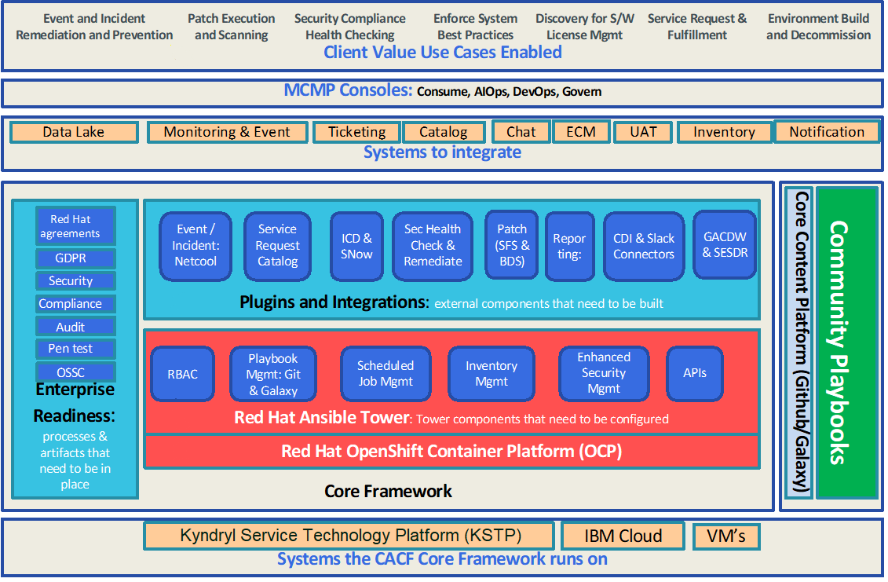
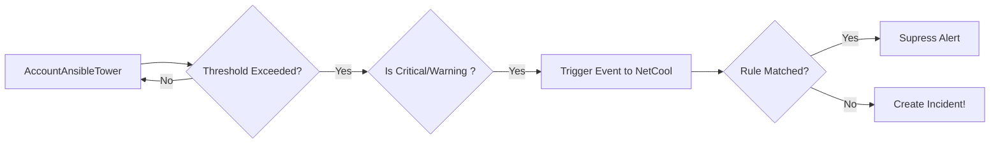

# Cloud Automation Community Framework
## Leverage automation relevant for the account

* Cloud Automation Community Framework (CACF) leverages Ansible Tower configurable functions to enable automation.
* Deployed on a containerized platform - OpenShift Container Platform (OCP) to ease deployment in heterogenous environments to deliver scalability, high availability and accelerate innovation.
* Manage IT through ‘agent-less’ connectivity
* Accelerate evolution thanks to common technical framework (GitHub to develop & manage playbooks) and global community (to promote DevOps & Agile principles)
* Combines knowledge of the entire Kyndryl delivery community based on the Continuous Engineering Model to support a structured automation or playbook development.
* Adheres to Kyndryl's commitment to strengthening partnerships and continually improve service delivery. 
* Provided as a Managed Service from IBM Cloud using Kyndryl Service Technology Platform (KSTP).

  

## Advances the science of service delivery to support automation

1. Incident – Automated fixes for the most common events and complex events thru Cognitive capabilities
2. Security & Compliance  – Automated compliance
3. Patching – Automated patch for OS and Middleware
4. Service Request – Automated implementation of requests from systems such as ServiceNOW from a common service request catalog
6. Provisioning – Build and Decom of servers using standard practice

    

