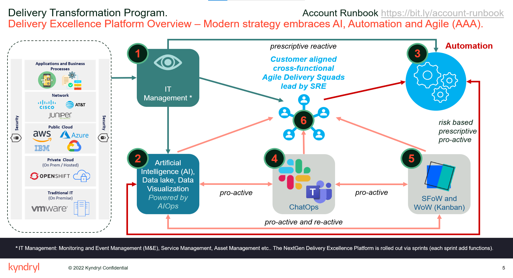

#   Kyndryl 8 Tools for AXA 
##  Overview

!!! tip "Kyndryl AAA Strategy: Automation & Optimization to achieve ‘Zero Touch’ delivery"

    - Achieve < 1 Incidents per server per month
    - Reach Maturity Level 3
    - Reduce non-actionable tickets < 10%
    
    

!!! tip "Why the Kyndryl 8 tools?"

    === "CACF"

        | **Tool** | Detail Description |
        |:-----------------------|:-----------------------|
        | **Cloud Automation Community Framework + NEXT** | Achieve improved efficiency to support dynamic business demands through a single automation framework. Achieve productivity by automation of BAU IT Operations enabling the team to focus on value add tasks to improve IT Operations infrastructures by consolidating multiple silo-ed solutions each of them addressing single use cases into a single optimized automation framework supporting multiple automation use cases at the AXA enterprise level. |
        | Bundle(s) | 000 – Basic Event Automation |
        |  | 001 – Monitor & Event Management|
        |  | 002 – Predict and Prevent Issues|
        |  | 009 – Security Patch Management |
        |  | 010 – Security Health Check |
        |  | 012 – vSphere |
        |  |  |
    


    === "KSI"

        | **Tool** | Detail Description |
        |:-----------------------|:-----------------------|
        | **Kyndryl Service Insights** | Kyndryl Service Insights is the way to visualise and interact with Data delivering beneficial analytics on any subject to see dashboards providing information related to services running on the Platform (e.g. application log data) to see visualisations, reports and dashboards providing information related to any solution in general (e.g. HWSW Currency, Catalyst, CACF, RCP etc) to have actionable insights generated and dispatched to the action owners for action (in some cases those actions will be performed by Automation). Enables Accounts to have standard and customized CACF dashboards for viewing  Automation Performance, Executive Dashboard, Global Automation Deployment, Incident Automation, MCMS Executive Dashboard, MCMS Incident, MNE & HST Event Reduction (Europe), RCP Dashboard, Server Health Check Best Practices. |
        | Bundle(s) | CU Inventory Correction |
        |  | Event Monitoring Noise Reduction | 
        |  | CACF Ansible Effectiveness Improvement |
        |  | EOL / EOS Hardware and Software |
        |  |  |


    === "MIE AIOPS"

        | **Tool** | Detail Description |
        |:-----------------------|:-----------------------|
        | **MIE AI Ops** | Single pane visibility into health  and performance  of IT  Operations  across data center and multi-cloud  environment Daily Sunrise Dashboard -This feature is to diminish or eliminate dependency on e-mail reporting and enable AIOps Console users with  a convenient report download  across ITSM tickets for a fixed 24 hour window.Service Management -Analysis of Incident., Problem and Change management tickets in  dashboardsthat  provide a graphical summary of KPI data to enable basic overview of the service. Also, Pervasive Insights Dashboard is available to provide a trend analysis of the top five affected servers.Alerts  and Health -Insights  of how  alerts in our  IT  estate occur  and the tagging of applications to a given resources  helps root cause the  issueand who  is accountable  to resolve  the issue. Understand  how  the  environment  is setup,  Tagging of resources is important  to identify  the  applications associated with  the resources.Inventory -Insights  on all the  resources that  belong to your  inventory  including  Data Centerand Cloud. Understanding  of all  the assets that  belong to your  inventory  including Data Centerand Cloud.  Ensure  the  resource data is ingested via adaptor or self-service  data ingestion.Monitoring and Visibility -Analysis of all  the live  data feeds that AIOps  is reading from  raw sources,  processed and visualization  layer.  This  help  triage data quality  issues.AIOps Admin Card •Resolver Group -In-scope / Out of Scope of tickets: Resolver  group  allows the  users to identify  all  the resolved  incident tickets,  as either In  scope OR  Out  of scope ticket. In-scope  Tickets are the Kyndrylmanaged tickets included for  various automation  metrics.•Self Service Data Upload (Bring Your Own Data): Users has  the ability to fill  in the data and manually  upload the  templates.  Different templates  are available for Event, tickets, inventory  and other  automation  areas. These  templates  can be uploaded to visualize AIOps  capabilities without  any  adapters connected. |
        | Bundle(s) | 000 – Basic Event Automation |
        |  | 001 – Monitor & Event Management|
        |  | 002 – Predict and Prevent Issues|
        |  | 004 – Optimise the Account Statistics |
        |  | 009 – Security Patch Management |
        |  | 010 – Security Health Check |
        |  | 012 – vSphere |
        |  |  |

        ``` mermaid
          journey
          title The AXA Transformation Journey
          section Incidents
            Dec 2021: 1: Kyndryl,AXA
            Jan-Mar 2022 > 39K: 2: Kyndryl
            Do work: 3: SRE, Automatiom
          section Onboard 8Tools
            CACF Next: 3: SRE
            SL1: 3: SRE
        ```

    === "ChatOps"

        | **Tool** | Detail Description |
        |:-----------------------|:-----------------------|
        | **Chat Operations** | ChatOps is a comprehensive collaboration platform that is extensible and brings people, processes and automation together. Streamline or remove processes, when possible, make complex processes simpler, quicker, and more relevant. Creates automation to make updated processes and collaboration succeed |
        | **Collaboration** | Not limited to just communication between people but includes collaboration between people and machines - Integrates the eco system using ChatOps to create full end to end processes, giving the squads the standardized data to reduce toil while providing insights into your environment to determine issues quicker, and third-party tooling integrations to execute any processes such as notification and major incident management. |
        | **Processes** | Streamline or remove processes when possible, make complex processes simpler, quicker, and more relevant |
        | **Automation** | Create automation to make our updated processes and collaboration succeed |
        
        | Bundle(s) | 004 – Optimise the Account Statistics |
        |  |  |    

    === "M&EaaS"
        | **Tool** | Detail Description |
        |:-----------------------|:-----------------------|
        | **Monitoring & Events aaS** | M&EaaS provide Resource Monitoring for Hybrid and Multi-Clouds, covering Compute, Storage, Network, Applications, Containers, Kubernetes & IoT(Internet of Things) areas. M&EaaS can also integrate with any IBM, non-IBM and client specific tools for Event Integration. M&EaaS is a consumable services under Kyndryl Service Technology Platform (KSTP) aligning with KSTP technology, platform, governance and comprises the following key elements: Automation & Self-Service : Automated enablement of Monitoring & Event Automations(Ticketing & Notification) and Self-Service capability to manage Monitoring & Alerting Orchestration of M&E Infrastructure & Services: Automated build of M&E infrastructure components based on account needs Continuous Delivery/DEVOPS Model for managing and M&E infrastructure and services. Centralized M&E infrastructures in each Geo and Centralized Operational Model |
        | Bundle(s) | 000 – Basic Event Automation |
        |  | 001 – Monitor & Event Management |
        |  |  |    


    === "SAT"

        | **Tool** | Detail Description |
        |:-----------------------|:-----------------------|
        | **SDE Automation Tool** | Getting ready for SAT onboarding. Arrange security and compliance for SAT, provide boarding form and secure approval.Onboarding SATUsage of SAT into daily management system of the account. |
        | Bundle(s) | 013 – Storage |
        |  |  |    

    === "HWSW Currency"

        | **Tool** | Detail Description |
        |:-----------------------|:-----------------------|
        | **HW & SW Currency** | Hardware Software Currency Management System is a global solution for Storage, Server & Networks life cycle Management.  It is aimed for use by GEO, Service Line Organizations and the Account Delivery teams offering them Smarter Management, Smarter Analytics and Smarter Solutions.   Proactively solving client issues is a key component in the goal to reduce all IT device incidents requiring our attention. |
        |Bundle(s) | 013 – Storage |
        |Key Features | Auto Capture |
        | | Keeping Vital Machine Updates |
        | | Optimize Machine Usage |
        | | Life Cycle Management System |
        | | Agile Development Methodology |
        | | Software License Optimization |
        | | Middleware/OS Management |
        | | Machine Healthcheck Analysis |
        | | HWSW360 |
        | | Auto Alerts |
        | | Predictive Risk Identification |
        | | Pre-Go-Live |
        |  |  |    

    === "SFoW"

        | **Tool** | Detail Description |
        |:-----------------------|:-----------------------|
        | **Single Funnel of Work** | An integration of several external systems starting with SNOW, ICD , Remedy for Incidents, Changes, Tasks, Problems, etc OR Analytics systems that will provide "Actionable Tasks" identified for the account. SFoW enables the Wall of Work - A Kanban capability to manage "work" assigned to SRE/SME's ​​|
        |  |  |

???+ info "Cloud Automation Community Framework (CACF)"
    Automation by leveraging the Ansible Tower configurable functions to implement and execute playbooks to perform:
    
    1. Health Check Scans – Automated health check
    2. Security & Compliance  – Automated compliance
    3. Patching – Automated patch for OS and Middleware
    4. Service Request – Automated implementation of requests from systems such as ServiceNOW from a common service request catalog (WIP)
    5. Provisioning – Build and Decom of servers using standard practices (WIP)
    6. Incident Auto-Correction – Automated fixes for the most common events and complex events thru Cognitive capabilities (WIP).

      ``` mermaid
          flowchart BT
            subgraph Kyndryl
              MCMP-AIOPS
              RCP
              ECM
            end
            subgraph KSTP[K S T P]
              
              subgraph CACF[CACF in RedHat OCP]
                  AT[Ansible Tower]
                  CN[NEXT]
                  MND[Metrics & Data]
                  SFS
              end
              BDS[Master BDS]
            end
            subgraph KA[Kyndryl AXA Account]
              direction TB
              subgraph AXA[AXA Domain]
                ITM6
                SSHP[SSH Proxies / Child BDS]
                subgraph 2.1[Managed Services]
                  D1[Linux/Unix]
                  D2[Windows]
                  D3[SpectrumProtect]
                  D4[Network]
                  D5[ESXi]
                end
              end
              subgraph SM[MCMS - Service Management Env]
                NC[NetCool Impact]
                SN[ServiceNow]
              end
            end
            2.1 <-- Monitoring --> ITM6
            style ITM6 fill:#f9f,stroke:#333,stroke-width:4px
            ITM6 <-- Event Flow --> NC
            NC --> CACF
            NC --> SN
            SSHP -- BDS Flow --> BDS
            SSHP --> 2.1
            SSHP -- Automation Flow --> CACF 
            CACF --> Kyndryl
      ```

???+ info "Monitoring and Events Management with ITM6 (Sunset Soon)"

    The IBM Tivoli Monitoring (ITM6) is configured in PIaaS and CoreIT devices to probe for various situations wherein the events/alerts triggered by these devices are captured by the MCMS NetCool Impact System which inturn then creates an Incident(s) in MCMS ServiceNow based on specific configuration setting(s) enabled on the NetCool. Though the events/alerts are captured but the Auto-Remediation correction using the Ansible Playbooks is not enabled or configured yet due to the disconnect in flow between MCMS NetCool Impact and CACF NEXT.

      ``` mermaid
          flowchart LR
            A[Device Probe] --> B{Threshold Exceeded?};
            B -->|Yes| B1{Is Critical/Warning?};
            B -->|No| A;
            B1 -->|Yes| C[Trigger Event to NetCool];
            C --> D{Rule Matched?};
            D --> |Yes| E[Supress Alert];
            D -->|No| F[Create Incident!];
      ```     
??? info "Monitoring and Events as a Service with ScienceLogic (On-Going)"

     In M&EaaS the IBM Tivoli Monitoring (ITM6) will be replaced with ScienceLogic SaaS tool configured for a PIaaS and CoreIT devices with various collectors delpoyed to proform the probe for various situations.  The events/alerts triggered by the devices are captured by the SL1 Collector and sent to Europe NetCool Impact System which inturn then creates an Incident(s) in Europe ServiceNow Instance Automation Queue as Auto-Remediation is configured the corretive action is executed using the Ansible Playbooks implemented in the CACF+CACF NEXT Component.

      ``` mermaid
      graph LR
        A[Device Probe] --> B[SL1 Collector]
        B --> B0{Threshold Exceeded?};
        B0 -->|Yes| B1{Is Critical/Warning ?};
        B -->|No| A;
        B1 -->|Yes| C[Trigger Event to NetCool];
        C --> D{Rule Matched?};
        D --> |Yes| E[Supress Alert];
        D -->|No| F[Create Incident!];
      ```     

??? info "CACF NEXT"
    Cloud Automation Community Framework NEXT Componet enahances the existing CACF Ansible infrastucture built for AXA organization to leverage capturing of the events/alerts triggered by the MCMS NetCool Impact System by creating an incdent in the Automation Queue so as to initiate the Auto-Remediation correction action by implementing existing plyabooks available in the Community Platform Engineering Catalog or create new Ansible Playbooks for fixing reported incident and then close the incident, on remediation failure the incident is moved from automation queue to the Command Center Queue or created as an Incident(s) in MCMS ServiceNow based on specific configuration setting enabled on the NetCool. 

      ``` mermaid
      graph LR
        DA[Device Alert] --> SNMP[ SNMP Trap ];
        SNMP --> NC[ MCMS NetCool ];
        NC --> B0{Threshold Exceeded?};
        B0 -->|Yes| B1{Is Critical/Warning ?};
        B0 -->|No| A[ okay ];
        B1 -->|Yes| CN[CACF Next];
        B1 -->|Yes| AQ[Automation Queue]
        N1 -->|No| CC[ okay ];
        NC --> D{Rule Matched?};
        D --> |Yes| E[Supress Alert];
        D -->|No| B1;      

        AN --> PB[Execute Playbook]
        PB --> CH{ Issue Fixed };
        CH -->|Yes| MG1[Update & Close Incident];
        CH -->|No| MG2[Move Incident to Command Centre Queue];  
      ```  

  
??? info "MIE/AIOps"
    Multicloud  Management  Platform  (MCMP) Internal Edition enables discovery of  all the assets into MCMP using our  discovery capabilities and provides and aggregated view  of Service Inventory, Health,  Incident, Problem, Change Management across multiple tools into a single pane visibility of health and performance of IT Operations across Data centers, Mainframe and multi-cloud environments.


??? info "Kyndryl Service Insights (KSI)"

    The new image can be used exactly like the official image.

??? info "Single Funnle of Work (SFOW)"

    The new image can be used exactly like the official image.

??? info "ChatOps"

    The new image can be used exactly like the official image.    

??? info "SAT"

    The new image can be used exactly like the official image.

??? info "HW SW Currency"

    The new image can be used exactly like the official image.  

??? tip "Kyndryl 8 Tools Status"

    === "CACF"

        * Cloud Automation Community Framework (CACF) leverages Ansible Tower configurable functions to enable automation.
        * Deployed on a containerized platform - OpenShift Container Platform (OCP) to ease deployment in heterogenous environments to deliver scalability, high availability and accelerate innovation.
        * Manage IT through ‘agent-less’ connectivity
        * Accelerate evolution thanks to common technical framework (GitHub to develop & manage playbooks) and global community (to promote DevOps & Agile principles)
        * Combines knowledge of the entire Kyndryl delivery community based on the Continuous Engineering Model to support a structured automation or playbook development.
        * Adheres to Kyndryl's commitment to strengthening partnerships and continually improve service delivery. 
        * Provided as a Managed Service from IBM Cloud using Kyndryl Service Technology Platform (KSTP).

    === "MIE/AIOps"

        1.  Ensure your editor of choice has support for YAML schema validation.

    === "KSI"

    === "SFoW"

    === "ChatOps"

    === "M&EaaS"

    === "SAT"

    === "HWSW Currency"

    


### What's in it for AXA
Each release offers new functions and improvements to help you take more innovation to the cloud, whether you are new to the product or if you are upgrading from a prior release. Review this information for a high-level summary of the new features and changes in each release.
### Release notes and additional product information
Links are provided to last-minute updates and known limitations for the product, additional product information, and the product support website.
Deprecated functions and replacements
Several functions are deprecated in this IBM Cloud Pak System release. The deprecated functions are still supported for compatibility with an earlier version. However, they are no longer enhanced and must not be used for new deployments or implementations.
Cloud Pak System Considerations for GDPR Readiness
IBM Cloud Pak System overview
IBM Cloud Pak System is a system to help you manage resources in a cloud-computing environment.
### Planning information
Review the specific hardware, software, and tool requirements to prepare for the installation and configuration of Cloud Pak System.
Notices

##  Architecture
### Overview

### Decisions

### Operation Diagram


##  Trouble Shooting
### Checklist

Planning information
Review the specific hardware, software, and tool requirements to prepare for the installation and configuration of Cloud Pak System.
Notices