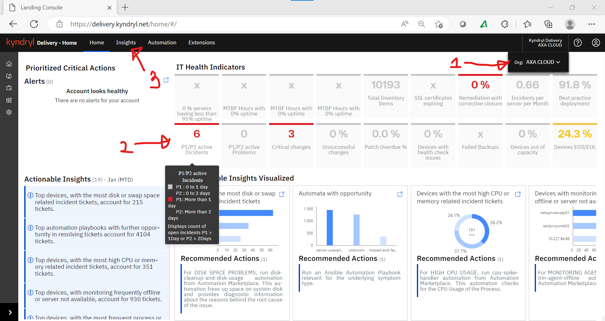

#   Integrated AI Ops (includes KSI)
##  Dashboard(s) 

### 100 – Daily SoD Report 

| **Dashboard View** |  |
|:-----------------------|:-----------------------|
| **Benefits** | Gives a complete view of the Account infra status.|
| **URL** | https://delivery.enterprise.net/home/#/ |
| **Frequency** | Daily |
| **Usage** | Applicable for all Squads |

## Steps to set view of the incident status fir the last 24hours

### 1. Verify the Enterprise Delivery Account shows Enterprise Cloud

### 2. Hover the mouse cursor on P1/P2 Active Incidents to bring the Legend as a Pop-up.

### 3. Click on the tab:"Insights" in the primary navigation and this will bring up the Insights landing page as shown below:

### 101 – Daily Sunrise Report 

| **Dashboard View** |  |
|:-----------------------|:-----------------------|
| **Benefits** | Gives a complete view of the incident status in the last 24hours.|
| **URL** | https://delivery.enterprise.net/home/#/ |
| **Frequency** | Daily |
| **Usage** | Applicable for all Squads |

### 102 – Incident Report

| **Dashboard View** |  |
|:-----------------------|:-----------------------|
| **Benefits** | Gives a complete view of the incident status in the last 24hours.|
| **URL** | https://delivery.enterprise.net/home/#/ |
| **Frequency** | Daily |
| **Usage** | Applicable for all Squads |

### 103 –  Report

| **Dashboard View** |  |
|:-----------------------|:-----------------------|
| **Benefits** | Gives a complete view of the incident status in the last 24hours.|
| **URL** | https://delivery.enterprise.net/home/#/ |
| **Frequency** | Daily |
| **Usage** | Applicable for all Squads |

### 104 –  Report

| **Dashboard View** |  |
|:-----------------------|:-----------------------|
| **Benefits** | Gives a complete view of the incident status in the last 24hours.|
| **URL** | https://delivery.enterprise.net/home/#/ |
| **Frequency** | Daily |
| **Usage** | Applicable for all Squads |

### 105 –  Report

| **Dashboard View** |  |
|:-----------------------|:-----------------------|
| **Benefits** | Gives a complete view of the incident status in the last 24hours.|
| **URL** | https://delivery.enterprise.net/home/#/ |
| **Frequency** | Daily |
| **Usage** | Applicable for all Squads |

##  Squad(s)

### Service Management

| **Dashboard(s)/Reports** | Benefit(s) |
|:-----------------------|:-----------------------|
| 101 – Daily Sunrise Report | Gives a complete view of the incident status in the last 24hours. |
| 102 – Incidents Reports | Enables viewing of the incidents for specific date & time range. |
| 103 – Service Requests| Enables viewing of the incidents for specific date & time range. |

### Security

| **Dashboard(s)/Reports** | Benefit(s) |
|:-----------------------|:-----------------------|
| 101 – Daily Sunrise Report | Gives a complete view of the incident status in the last 24hours. |
| 102 – Incidents Reports | Enables viewing of the incidents for specific date & time range. |
| 103 – Service Requests| Enables viewing of the incidents for specific date & time range. |

### Platform Windows

| **Dashboard(s)/Reports** | Benefit(s) |
|:-----------------------|:-----------------------|
| 101 – Daily Sunrise Report | Gives a complete view of the incident status in the last 24hours. |
| 102 – Incidents Reports | Enables viewing of the incidents for specific date & time range. |
| 103 – Service Requests| Enables viewing of the incidents for specific date & time range. |

### Platform Linux

| **Dashboard(s)/Reports** | Benefit(s) |
|:-----------------------|:-----------------------|
| 101 – Daily Sunrise Report | Gives a complete view of the incident status in the last 24hours. |
| 102 – Incidents Reports | Enables viewing of the incidents for specific date & time range. |
| 103 – Service Requests| Enables viewing of the incidents for specific date & time range. |

### Network

| **Dashboard(s)/Reports** | Benefit(s) |
|:-----------------------|:-----------------------|
| 101 – Daily Sunrise Report | Gives a complete view of the incident status in the last 24hours. |
| 102 – Incidents Reports | Enables viewing of the incidents for specific date & time range. |
| 103 – Service Requests| Enables viewing of the incidents for specific date & time range. |

### Storage
| **Dashboard(s)/Reports** | Benefit(s) |
|:-----------------------|:-----------------------|
| 101 – Daily Sunrise Report | Gives a complete view of the incident status in the last 24hours. |
| 102 – Incidents Reports | Enables viewing of the incidents for specific date & time range. |
| 103 – Service Requests| Enables viewing of the incidents for specific date & time range. |

### Backup

| **Dashboard(s)/Reports** | Benefit(s) |
|:-----------------------|:-----------------------|
| 101 – Daily Sunrise Report | Gives a complete view of the incident status in the last 24hours. |
| 102 – Incidents Reports | Enables viewing of the incidents for specific date & time range. |
| 103 – Service Requests| Enables viewing of the incidents for specific date & time range. |

### CPS

| **Dashboard(s)/Reports** | Benefit(s) |
|:-----------------------|:-----------------------|
| 101 – Daily Sunrise Report | Gives a complete view of the incident status in the last 24hours. |
| 102 – Incidents Reports | Enables viewing of the incidents for specific date & time range. |
| 103 – Service Requests| Enables viewing of the incidents for specific date & time range. |