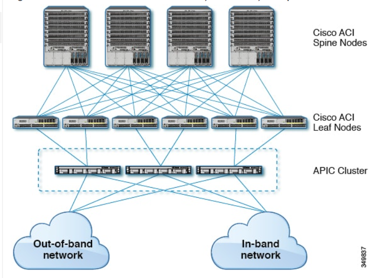
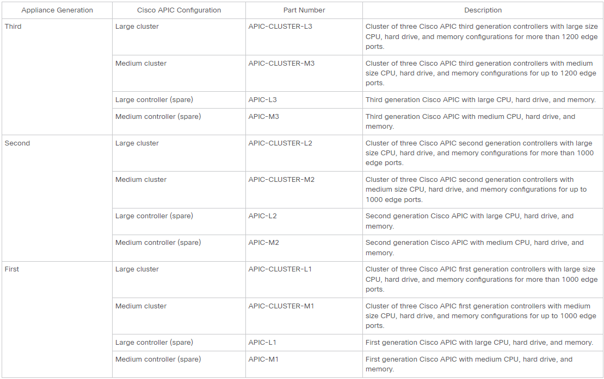
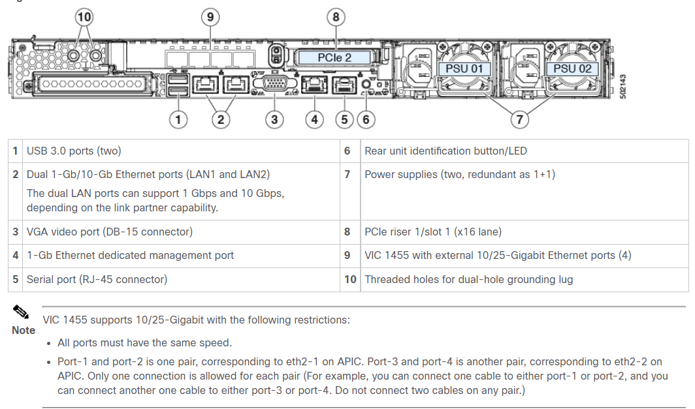
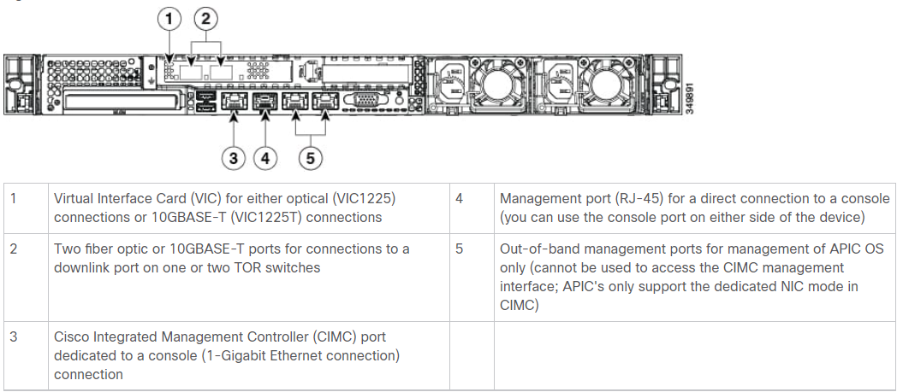
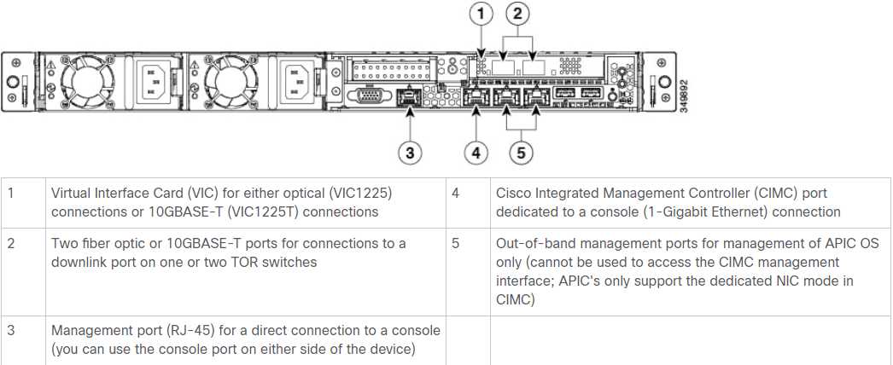
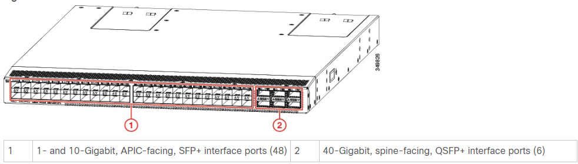
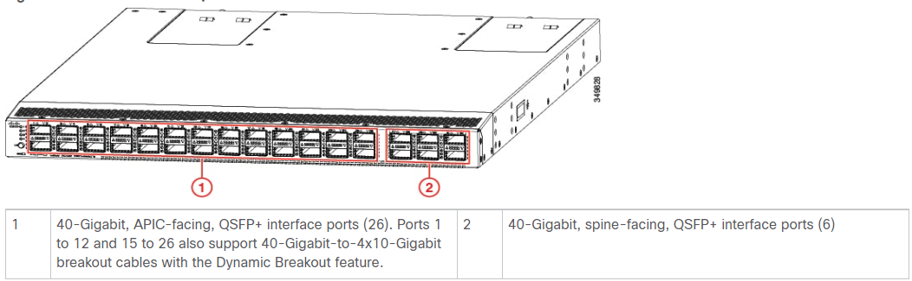

## 1. Introduction

                                                  
The Cisco Application Centric Infrastructure (ACI) allows application requirements to define the network. This architecture simplifies, optimizes, and accelerates the entire application deployment life cycle.

[Application Policy Infrastructure Controller (APIC)]

The APIC manages the scalable ACI multi-tenant fabric. The APIC provides a unified point of automation and management, policy programming, application deployment, and health monitoring for the fabric. The APIC, which is implemented as a replicated synchronized clustered controller, optimizes performance, supports any application anywhere, and provides unified operation of the physical and virtual infrastructure.

The APIC enables network administrators to easily define the optimal network for applications. Data center operators can clearly see how applications consume network resources, easily isolate and troubleshoot application and infrastructure problems, and monitor and profile resource usage patterns.

[ACI Fabric]

The Cisco Application Centric Infrastructure (ACI) Fabric includes Cisco Nexus 9000 Series switches with the APIC to run in the leaf/spine ACI fabric mode. These switches form a “fat-tree” network by connecting each leaf node to each spine node; all other devices connect to the leaf nodes. The APIC manages the ACI fabric.

The ACI fabric provides consistent low-latency forwarding across high-bandwidth links (40 Gbps, with a 100-Gbps future capability). Traffic with the source and destination on the same leaf switch is handled locally, and all other traffic travels from the ingress leaf to the egress leaf through a spine switch. Although this architecture appears as two hops from a physical perspective, it is actually a single Layer 3 hop because the fabric operates as a single Layer 3 switch.

All the switch nodes contain a complete copy of the concrete model. When an administrator creates a policy in the APIC that represents a configuration, the APIC updates the logical model. The APIC then performs the intermediate step of creating a fully elaborated policy that it pushes into all the switch nodes where the concrete model is updated.

The APIC is responsible for fabric activation, switch firmware management, network policy configuration, and instantiation. While the APIC acts as the centralized policy and network management engine for the fabric, it is completely removed from the data path, including the forwarding topology. Therefore, the fabric can still forward traffic even when communication with the APIC is lost.

## 2. Cisco ACI Installation Steps

### 2.1 ACI Fabric Topology

The ACI fabric topology includes the following major components:

Application Centric Infrastructure Controller (APIC) appliance (cluster of APICs)

Leaf switches (for switch compatibility, please see the data sheets here: https://www.cisco.com/c/en/us/products/switches/nexus-9000-series-switches/datasheet-listing.html

Spine switches (for switch compatibility, please see the data sheets here: https://www.cisco.com/c/en/us/products/switches/nexus-9000-series-switches/datasheet-listing.html

[ Sample Connectivity between APIC, Leaf Nodes, and Spine Nodes in ACI Fabric ]
    

### 2.2 ACI Fabric inter-connectivity

#### 2.2.1 Pre-requisite planning and recommendations

When preparing to connect the fabric devices, consider the following for each type of interface, and gather all of the required equipment before making the connections:

 - Cabling type required for each interface type

 - Distance limitations for each signal type

 - Additional interface equipment required

[ Note:  When running power and data cables in overhead or subfloor cable trays, we strongly recommend that you locate power cables and other potential noise sources as far away as practical from network cabling that terminates on Cisco equipment. In situations where long parallel cable runs cannot be separated by at least 3.3 feet (1 meter), we recommend that you shield any potential noise sources by housing them in a grounded metallic conduit. ] 

The optical transceivers that are not already assembled to their cables come separate from their cables. To prevent these transceivers and their cables from being damaged, we recommend that you keep the transceivers disconnected from their cables when installing them in ports and then insert the optical cable into the transceiver. When removing transceivers from ports, remove their cables before removing the transceivers.

To maximize the effectiveness and life of your transceivers and optical cables, do the following:

 - Wear an ESD-preventative wrist strap that is connected to an earth ground whenever handling transceivers. The switch is typically grounded when you install transceivers and provides an ESD port to which you can connect your wrist strap. If you cannot find an ESD port, connect the wrist strap to an earth ground (such as the grounding connection for the chassis).

 - Do not remove or insert a transceiver more often than necessary. Repeated removals and insertions can shorten its useful life.

 - Keep the transceivers and fiber-optic cables clean and dust free to maintain high signal accuracy and to prevent damage to the connectors. Attenuation (loss of light) increases with contamination and should be kept below 0.35 dB.

    - Clean these parts before installing them to prevent dust from scratching the fiber-optic cable ends.

    - Clean the connectors regularly; the required frequency of cleaning depends upon the environment. In addition, clean connectors if they are exposed to dust or accidentally touched. Both wet and dry cleaning techniques can be effective; refer to your site's fiber-optic connection cleaning procedures.

    - Do not touch the ends of connectors. Touching the ends can leave fingerprints and cause other contamination.

 - Inspect routinely for dust and damage. If you suspect damage, clean and then inspect fiber ends under a microscope to determine if damage has occurred.

#### 2.2.2 Setting up the APIC

Cisco APIC supports a simplified approach to configuring the ACI with the choice of two additional user interfaces. They are the NX-OS style CLI and the Basic GUI. The existing methods of configuration using REST API and Advanced GUI are supported as well. The Advanced GUI is equivalent to the GUI of the previous releases. 

In addition to the simple approach available for network administrators and other users of the NX-OS style CLI and the Basic GUI, there is intelligence embedded in these approaches as compared to the Advanced GUI or the REST API. 
In several instances, the NX-OS style CLI and the Basic GUI often create the ACI model constructs implicitly for a user's ease of use, and they also provide validations to ensure consistency in configuration. This functionality reduces and prevents faults.

##### 2.2.2.1 Cisco APIC Appliance Connection Features

The Cisco APIC appliance has two form factors for medium or large configurations. Medium configurations have medium-size CPU, hard drive, and memory for up to 1000 edge ports. Large configurations have large-size CPU, hard drive, and memory for more than 1000 edge ports.

An APIC appliance comprises either a cluster of Cisco APIC M3/L3 (third generation appliance), Cisco UCS 220 M4 (second generation appliance) or Cisco UCS 220 M3 (first generation appliance) servers manufactured with an image secured with Trusted Platform Module (TPM), certificates, and an APIC product ID (PID). To order these appliance clusters (and additional controllers), you must use the part numbers listed in the following table.

Cisco ACI APIC Generations:
    

Connection Features on a Third-Generation APIC Controller:
    

Connection Features on a Second-Generation APIC Controller:
    

Connection Features on a First-Generation APIC Controller:
    
    

The APIC controller ships with a default BIOS password. The default password is 'password'. When the boot process starts, the boot screen displays the BIOS information on the console server.

To change the default BIOS password perform the following task:

 1.   	During the BIOS boot process, when the screen displays Press <F2> Setup, press F2. The Entering Setup message displays as it accesses the setup menu.
 2.  	At the Enter Password dialog box, enter the current password.   
    [ Note: The default password is 'password' ]

 3.  	In the Setup Utility, choose the Security tab, and choose Set Administrator Password.
 4.   	In the Enter Current Password dialog box, enter the current password.
 5.  	In the Create New Password dialog box, enter the new password.
 6.  	In the Confirm New Password dialog box, re-enter the new password.
 7.   	Choose the Save & Exit tab.
 8.  	In the Save & Exit Setup dialog box, choose Yes.
 9.  	Wait for the reboot process to complete. The updated BIOS password is effective.

 When the APIC is launched for the first time, the APIC console presents a series of initial setup options. For many options, you can press Enter to choose the default setting that is displayed in brackets. At any point in the setup dialog, you can restart the dialog from the beginning by pressing Ctrl-C.

Important Notes

  - If the UNIX user ID is not explicitly specified in the response from the remote authentication server, then some APIC software releases assign a default ID of 23999 to all users. If the response from the remote authentication server fails to specify a UNIX ID, all users will share the same ID of 23999 and this can result in the users being granted higher or lower privileges than the configured privileges through the RBAC policies on the APIC.

  - Cisco recommends that you assign unique UNIX user IDs in the range of 16000 to 23999 for the AV Pairs that are assigned to the users when in Bash shell (using SSH, Telnet, or Serial/KVM consoles). If a situation arises where the Cisco AV Pair does not provide a UNIX user ID, the user is assigned a user ID of 23999 or similar number from the range that also enables the user's home directories, files, and processes accessible to the remote users with a UNIX ID of 23999.

  - To ensure that your remote authentication server does not explicitly assign a UNIX ID in its cisco-av-pair response, open an SSH session to the APIC and log in as an administrator (using a remote user account). Once logged in, run the following commands (replace userid with the username that you logged in with):

         admin@apic1: remoteuser-userid> cd /mit/uni/userext/remoteuser-userid                                               
         admin@apic1: remoteuser-userid> cat summary

  - If you are using a Cisco Integrated Management Controller (CIMC) for your setup, use only the port-side utility console port with the breakout cable. Setup the CIMC first, and then access the APIC through the CIMC KVM or continue to access the APIC locally through the port-side utility console port. Do not use the RJ-45 console port, unless access to the port side is restricted. If you choose the CIMC KVM access, you will have remote access available later which is required during operations.
   
  - If you are using RJ-45 console port, connect to CIMC using SSH and enable the Serial over LAN port using the following parameters:

        Scope SOL sol
        Set Enabled to Yes
        Commit
        Exit
After enabling, enter the command connect host to access the console. If the serial port is connected, either disconnect the serial port or ensure that the connected device has the proper configuration.

  - It is recommended not to modify any parameters using CIMC. If there are any issues, ensure that the default setting for CIMC management node is Dedicated Mode and not Shared. If Dedicated Mode is not used, it can prevent the discovery of fabric nodes.

  - Do not upgrade software or firmware using the CIMC user interface, XML, or SSH interfaces unless the modified property and software or firmware version are supported with your specific APIC version.

  - Set the NIC mode to Dedicated, when setting up the CIMC, in the CIMC Configuration Utility. After the CIMC is configured, in the CIMC GUI, verify that you have the following parameters set.

          Parameters           Settings

          LLDP                 Disabled on the VIC

          TPM Support          Enabled on the BIOS

          TPM Enabled Status   Enabled

          TPM Ownership        Owned

  - Starting with APIC release 1.2(2x), during the initial setup the system will prompt you to select IPv4, or IPv6, or dual stack configuration. Choosing dual stack will enable accessing the APIC and ACI fabric out-of-band management interfaces with either IPv4 or IPv6 addresses. While the examples in the table below use IPv4 addresses, you can use whatever IP address configuration options you chose to enable during the initial setup.

  - A minimum subnet mask of /19 is recommended.

  - Connecting the APIC (the controller cluster) to the ACI fabric requires a 10G interface on the ACI leaf. You cannot connect the APIC directly to the N9332PQ ACI leaf switch, unless you use a 40G to 10G converter (part number CVR-QSFP-SFP10G), in which case the port on the N9332PQ switch will auto-negotiate to 10G without requiring any manual configuration.

  - The fabric ID is set during the APIC controller setup and it cannot be changed unless you perform a clean reload of the fabric. To change the fabric ID, perform a clean reload on the APIC and leaf switches after changing the sam.config file. You must have separate fabric IDs if you want to connect two ACI fabric domains using Layer 2 links. This follows the dual-fabric design.

[NOTE: The High Availability functionality for an APIC cluster enables you to operate the APICs in a cluster in an active/standby mode. In an APIC cluster, the designated active APICs share the load and the designated standby APICs can act as an replacement for any of the APICs in an active cluster.

An admin user can set up the High Availability functionality when the APIC is launched for the first time. It is recommended that you have at least 3 active APICs in a cluster, and one or more standby APICs. An admin user will have to initiate the switch over to replace an active APIC with a standby APIC] 

##### 2.2.2.2 Setup for Active APIC

     Name	                                         Description	                                  Default Value
     Fabric name                                     Fabric domain name                               ACI Fabric1
     Fabric ID                                       Fabric ID                                        1
     Number of active controllers                    Cluster size                                     3 
                                                                                                      [Note: When setting up APIC in an active-standby mode, you must have at least 3 active APICs in a cluster]
     POD ID                                          POD ID                                           1
     Standby controller                              Setup standby controller                         NO
     Controller ID                                   Unique ID number for the active APIC instance    Range: 1-19
     Controller name                                 Active controller name                           apic1
     IP address pool for tunnel endpoint addresses   Tunnel endpoint address pool                     10.0.0.0/16 
                                                                                                       [Note: This value is   
                                                                                                       for the infrastructure virtual routing and forwarding (VRF) only.
                                                                                                       This subnet should not overlap with any other routed subnets in your network. If this subnet does overlap with another subnet, change this subnet to a different /16 subnet. The minimum supported subnet for a 3 APIC cluster is /23. If you are using Release 2.0(1) the minimum is /22.
     VLAN ID for infrastructure network               Infrastructure VLAN for APIC-to-switch           --
                                                      communication including virtual switches
                                                      [Note: 	Reserve this VLAN for APIC use only. 
                                                      The infrastructure VLAN ID must not be used 
                                                      elsewhere in your environment and must not 
                                                      overlap with any other reserved VLANs on other 
                                                      platforms.
     IP address pool for bridge domain                IP addresses used for fabric multicast           225.0.0.0/15
     multicast address (GIPo)                         For Cisco APIC in a Cisco ACI Multi-Site         Valid range: 225.0.0.0/15 to 231.
                                                      topology, this GIPo address can be the           254.0.0/15, prefixlen must be 15 
                                                      same across sites.                               (128k IPs)
     IPv4/IPv6 addresses for the                      IP address that you use to access                --
     out-of-band management                           the APIC through the GUI, CLI, or API.
                                                      This address must be a reserved address 
                                                      from the VRF of a customer
     IPv4/IPv6 addresses of the default               Gateway address for communication to external    --
     gateway                                          networks using out-of-band management
     Management interface speed/duplex mode           Interface speed and duplex mode for the 
                                                      out-of-band management interface                auto
                                                                                                      Valid values are as follows
                                                                                                      auto
                                                                                                      10baseT/Half
                                                                                                      10baseT/Full
                                                                                                      100baseT/Half
                                                                                                      100baseT/Full
                                                                                                      1000baseT/Full
     Strong password check                           Check for a strong password                      [Y]
     Password                                        Password of the system administrator             --
                                                     This password must be at least 8 
                                                     characters with one special character.

##### 2.2.2.3 Setup for Standby APIC

     Name	                                         Description	                                  Default Value
     Fabric name                                     Fabric domain name                               ACI Fabric1
     Fabric ID                                       Fabric ID                                        1
     Number of active controllers                    Cluster size                                     3 
                                                                                                      [Note: When setting up APIC in an active-standby mode, you must have at least 3 active APICs in a cluster]
     POD ID                                          POD ID                                           1
     Standby controller                              Setup standby controller                         YES
     Controller ID                                   Unique ID number for the active APIC instance    Recommended Range:>20
     Controller name                                 Active controller name                           NA
     IP address pool for tunnel endpoint addresses   Tunnel endpoint address pool                     10.0.0.0/16 
                                                                                                       [Note: This value is   
                                                                                                       for the infrastructure virtual routing and forwarding (VRF) only.
                                                                                                       This subnet should not overlap with any other routed subnets in your network. If this subnet does overlap with another subnet, change this subnet to a different /16 subnet. The minimum supported subnet for a 3 APIC cluster is /23. If you are using Release 2.0(1) the minimum is /22.
     VLAN ID for infrastructure network               Infrastructure VLAN for APIC-to-switch           --
                                                      communication including virtual switches
                                                      [Note: 	Reserve this VLAN for APIC use only. 
                                                      The infrastructure VLAN ID must not be used 
                                                      elsewhere in your environment and must not 
                                                      overlap with any other reserved VLANs on other 
                                                      platforms.
     IP address pool for bridge domain                IP addresses used for fabric multicast           225.0.0.0/15
     multicast address (GIPo)                         For Cisco APIC in a Cisco ACI Multi-Site         Valid range: 225.0.0.0/15 to 231.
                                                      topology, this GIPo address can be the           254.0.0/15, prefixlen must be 15 
                                                      same across sites.                               (128k IPs)
     IPv4/IPv6 addresses for the                      IP address that you use to access                --
     out-of-band management                           the APIC through the GUI, CLI, or API.
                                                      This address must be a reserved address 
                                                      from the VRF of a customer
     IPv4/IPv6 addresses of the default               Gateway address for communication to external    --
     gateway                                          networks using out-of-band management
     Management interface speed/duplex mode           Interface speed and duplex mode for the 
                                                      out-of-band management interface                auto
                                                                                                      Valid values are as follows
                                                                                                      auto
                                                                                                      10baseT/Half
                                                                                                      10baseT/Full
                                                                                                      100baseT/Half
                                                                                                      100baseT/Full
                                                                                                      1000baseT/Full
     Strong password check                           Check for a strong password                      [Y]
     Password                                        Password of the system administrator             --
                                                     This password must be at least 8 
                                                     characters with one special character.

The following is a sample of the initial setup dialog as displayed on the Command-Line Console of APIC:

        Cluster configuration ...
          Enter the fabric name [ACI Fabric1]:
          Enter the fabric ID (1-128) [1]:
          Enter the number of active controllers in the fabric (1-9) [3]:
          Enter the POD ID (1-9) [1]:
          Is this a standby controller? [NO]:
          Enter the controller ID (1-3) [1]:
          Enter the controller name [apic1]: sec-ifc5
          Enter address pool for TEP addresses [10.0.0.0/16]:
          Note: The infra VLAN ID should not be used elsewhere in your environment
          and should not overlap with any other reserved VLANs on other platforms.
          Enter the VLAN ID for infra network (2-4094): 4093
          Enter address pool for BD multicast addresses (GIPO) [225.0.0.0/15]:

        Out-of-band management configuration ...
          Enable IPv6 for Out of Band Mgmt Interface? [N]:
          Enter the IPv4 address [192.168.10.1/24]: 172.23.142.29/21
          Enter the IPv4 address of the default gateway [None]: 172.23.136.1
          Enter the interface speed/duplex mode [auto]:

        admin user configuration ...
          Enable strong passwords? [Y]:
          Enter the password for admin:

          Reenter the password for admin:

        Cluster configuration ...
          Fabric name: ACI Fabric1
          Fabric ID: 1
          Number of controllers: 3
          Controller name: sec-ifc5
          POD ID: 1
          Controller ID: 1
          TEP address pool: 10.0.0.0/16
          Infra VLAN ID: 4093
          Multicast address pool: 225.0.0.0/15

        Out-of-band management configuration ...
          Management IP address: 172.23.142.29/21
          Default gateway: 172.23.136.1
          Interface speed/duplex mode: auto

        admin user configuration ...
          Strong Passwords: Y
          User name: admin
          Password: ********

       The above configuration will be applied ...

       Warning: TEP address pool, Infra VLAN ID and Multicast address pool
         cannot be changed later, these are permanent until the
         fabric is wiped.

       Would you like to edit the configuration? (y/n) [n]:

#### 2.2.3 Connecting Leaf Switches to APICs
 
You must downlink one or two (recommended for redundancy) Cisco Nexus 9300 platform ACI-mode leaf switches to each Application Policy Infrastructure Controller (APIC) in your ACI fabric. The type of virtual interface card (VIC) installed on the APIC determines the types of interface cables that you can use to connect the leaf switches to the APICs.

- The VIC 1225T module supports copper connectors, copper cables, and switches with copper downlink ports (such as: Cisco Nexus 93108TC-EX, 93108TC-FX, 93120TX, 93128TX, 9372TX, 9372TX-E, and 9396TX switches).

- The VIC 1225 module supports optical transceivers, optical cables, and switches with optical downlink ports (such as: Cisco Nexus 93180LC-EX, 93180YC-EX, 93180YC-FX, 9332PQ, 9336C-FX2, 9348GC-FXP, 9372PX, 9372PX-E, 9396PX, and 93600CD-GC switches).

- The VIC 1455 module supports optical transceivers, optical cables, and switches with optical downlink ports (such as: Cisco Nexus 9336C-FX2, 93180LC-EX, 93180YC-EX, 93180YC-FX, 93240YC=FX2, and 93600CD-GC switches).

##### 2.2.3.1 Cisco ACI Leaf Switch Connection Features

The following figure identifies port features on the Cisco Nexus 9372PX and 9372PX-E ACI-mode switch.

Cisco Nexus 9372PX and 9372PX-E Switch ACI Fabric Features:
    

Before you begin to Step-1 in the below procedure, all the APICs and leaf switches in the fabric must be fully installed in their racks and grounded

##### 2.2.3.2 Procedure to connect APICs

Step 1	

Connect an interface cable to one of the two to four ports on the virtual interface card (VIC) installed on the APIC. If the cable is not already assembled to its transceivers, insert the transceiver into the VIC port and then connect the optical interface cable to the transceiver.

- For a VIC 1225T 10GBASE-T copper module, use 10GBASE-T cables with RJ-45 connectors.

- For a VIC 1225 optical module, use one of the following sets of transceivers and cables:

- For a VIC 1455 SFP28 module, 10-Gigabit only, use one of the following sets of transceivers and cables:

      - Cisco 10GBASE-LR transceivers (SFP-10G-LR) supporting a link length of up to 6.1 miles (10 km)

      - Cisco 10GBASE-SR transceivers (SFP-10G-SR) supporting the following link lengths:

         - Using 2000 MHz MMF (OM3) for up to 984 feet (300 m)

         - Using 4700 MHz MMF (OM4) for up to 1312 feet (400 m)

      - Cisco SFP+ Active Optical Cables (SFP-10G-AOCxM [where x=1, 2, 3, 5, 7, or 10 for lengths in meters])

      - Cisco SFP+ Twinax Cables (SFP-H10GB-CUxM [where x=1, 2, 3, 5, 7, or 10 for lengths in meters])

[Note: The VIC 1455 has 4 ports, port-1, port-2, port-3, and port-4 from left to right]

   - All ports must have the same speed, either 10-Gigabit or 25-Gigabit.

   - Port-1 and port-2 is one pair, corresponding to eth2-1 on APIC and port-3 and port-4 is another pair, corresponding to eth2-2 on APIC. Only one connection is allowed for each pair. For example, you can connect one cable to either port-1 or port-2, and connect another cable to either port-3 or port-4 (please do not connect two cables on any pair).

Step 2

Connect the other end of the interface cable to a downlink port on a leaf switch.

- For a Cisco 10GBASE-LR or -SR transceiver and cable, insert the transceiver into a downlink optical port on a leaf switch before connecting the cable to the transceiver.

- For Cisco SFP+ Active Optical Cables, insert the transceiver on the cable into a downlink optical port on a leaf switch.

- For a 10GBASE-T copper cable, insert the RJ-45 connector on the cable into a downlink BASE-T port on a leaf switch.

#### 2.2.4 Connecting Leaf Switches to Spine Switches

##### 2.2.2.4.1 Cisco Nexus 9332PQ Switch ACI Fabric Switch Features

The following figure identifies port features on the Cisco Nexus 9332PQ ACI-mode switch

Cisco Nexus 9332PQ Switch ACI Connection Features:
    

Before you begin connecting the leaf and spine switches in the fabric, these must be fully installed in their racks and grounded.

If there are modular switches in the fabric, their ACI-mode line cards must already be installed. The line cards can be of the following types:

- 36-port 40-Gigabit (such as: N9K-X9736PQ)

- 32-port 100-Gigabit (such as: N9K-X9732C-EX) (supported by Cisco Nexus 9504 and 9508 modular switches)

- 36-port 100-Gigabit (such as: N9K-X9736C-FX)

 Steps to Connect Physical inter-switch Links:

- For the transceivers with removable cables, make sure that the transceivers are separated from their interface cables.

- Insert the appropriate transceiver into an active uplink port on the leaf switch.

- Insert the same type of transceiver in the spine switch port on the line card.

- For transceivers with removable cables, insert the interface cable into the open end of each of those transceivers.

- Repeat Steps 1 through 4 for each spine switch in the ACI fabric.
  The leaf switch is connected to each spine switch in the ACI fabric.

- Repeat Steps 1 through 5 for each leaf switch in the ACI fabric.

Each leaf switch in the ACI fabric is connected to each spine switch in the network,
The fabric automatically implements Equal Cost Multi-Pathing (ECMP) and enables all links. You do not need to configure the links.

## 3. Appendix

### 3.1 References and Materials

https://www.cisco.com/c/en/us/td/docs/switches/datacenter/aci/apic/sw/1-x/getting-started/1_2_x/b_APIC_Getting_Started_Guide_Rel_1_2_1/b_APIC_Getting_Started_Guide_Rel_1_2_1_chapter_010.html [Cisco APIC Getting Started Guide]
https://www.cisco.com/c/en/us/td/docs/switches/datacenter/nexus9000/hw/aci_hig/guide/b_aci_hardware_install_guide/b_aci_hardware_install_guide_chapter_011.html [Cisco ACI Hardware Installation Guide]
https://www.cisco.com/c/en/us/td/docs/switches/datacenter/nexus9000/hw/aci_hig/guide/b_aci_hardware_install_guide/b_aci_hardware_install_guide_chapter_01.html  [Cisco ACI Hardware Installation Guide]