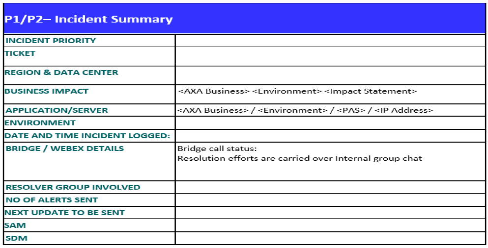
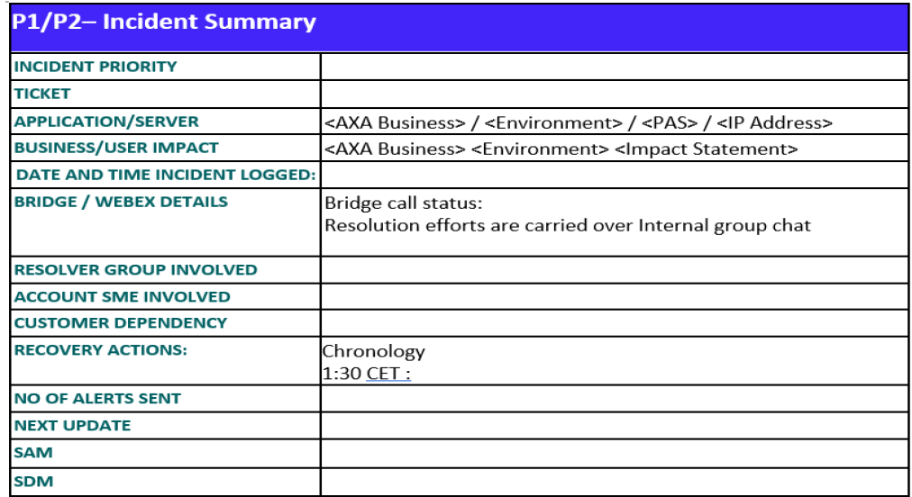
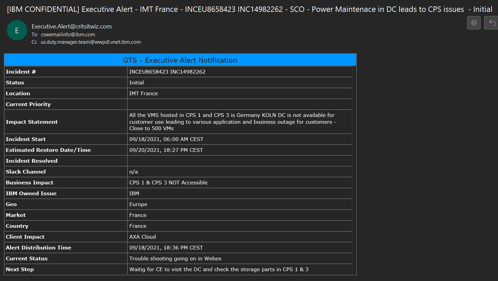

#   <b>Enterprise Incident Management</b>
##  InfraIT - Incident Management Overview
## 1. Enterprise impacted MI process
  
``` mermaid
  graph TD
    X((Start)) ==> T & S;
    T([Monitoring Alerts]) & S([From Silva]) ==> id;
    id[(SNOW tool)] ==>
    A[Command Center Queue] ==> B[Acknowledged by Command Center] 
    ==> D[CC to warm transfer to resolver teams & Inform SAM/SDM] ==> E{Enterprise impacted?};
    E ==>|Yes| E1[SAM Process established & Bridge the incident to SILVA];
    E1 ==> F[Call Global Enterprise MIM & Start the communication]
    ==> F1[Technical team to work and restore the service]
    ==> F2[Service restored, monitoring] 
    ==> F3[Close the incident with approval from Enterprise]
    ==>W((End))
    E ==>|No| E2[Assign the ticket to respective resolver groups for investigation] 
    ==> G[Resolver group works and closes the ticket]
    ==>Y((End))
```

### 1.1	Incident Management

   This section of the Enterprise / Enterprise Process Interface Manual provides customer interfaces for requesting and obtaining in-scope services pursuant to the Master Services Agreement with Enterprise. Nothing contained in this document is intended to amend the terms and conditions of the Agreement, and in the event of a conflict, the Agreement takes precedence.
   This document is intended to be used by both Enterprise and IBM personnel responsible for providing the required services.

## 2.	Description

   This document contains the complete policy details for all policies used by the Critical/Sev1 Incident Management Process.
   Incident Management is the process responsible for managing the lifecycle of all incidents. Incidents may be recognized by technical staff, detected and reported by event monitoring tools, communications from users or reported by third-party suppliers and service providers. 
   In ITIL terminology, an ‘incident’ is defined as an unplanned interruption to an IT service or reduction in the quality of an IT service or a failure of a CI that has not yet impacted an IT service (for example failure of one disk from a mirror set). 
   The purpose of incident management is to restore normal service operation within service level agreements (SLAs) and minimize the adverse impact on business operations, thus ensuring that agreed levels of service quality are maintained. ‘Normal service operation’ is defined as an operational state where services and Configuration Items (CIs) are performing within their agreed service and operational levels

## 3.	Incident Manager

   The Incident Manager ensures that the Incident Management process is executed and is responsible for day-to-day management and integrity of the Incident Management process execution. The Incident Manager role is the interface to the other process managers. The Incident Manager has responsibility for ensuring that Service Level Agreements or Objectives are achieved by managing the recovery of incidents. 
   Each Service Provider in the Multi-Sourcing Delivery Structure has at least one Incident Manager. The incidents are being assigned to the different Service Provider Incident Managers based on the scope of the incident.
   The Incident Manager’s role is then performed by the Service provider who has been assigned the responsibility for incident resolution. The role owns, monitors, tracks the progress and resolution of the assigned P1 and P2 Incidents, and is responsible for engaging the Service Manager in case Incident requires multi tower involvement and management, also in case the Incident is declared as Major Incident.

??? info "Specific responsibilities include:"

     - Acting as focal point for process execution to the IT organization and other stakeholders
     - Building upon the process framework defined by the Incident Management Process Owner
     - Performing/coordinating day to day incident management
     - Providing input to the Process Owner for process improvement and facilitating process improvement implementation as applicable
     - Identifying and submitting process exceptions and deviations to the Process Owner for review and approval
     - Being accountable for creation and maintenance of process/procedure documentation required for approved contractually required variation and deviation of standard processes/procedures and additional procedures, as needed.
     - Ensuring the standards/procedures are communicated to practitioners
     - Utilizing the appropriate reporting management system to provide process performance reports and analysis
     - Following defined escalation path when needed, as defined in the escalation policy
     - Monitoring, tracking and communicating process execution activities to identify, initiate and manage required action to meet service level agreements
     - Taking appropriate action in case of negative process performance trends
     - Identifying incidents that have not been acted upon in a timely manner and taking appropriate action
     - Verifying post-review of major incidents
     - Chairing Incident review/outage review meetings as needed 
     - Identifying and determining appropriate action for Incidents which need special attention or escalation
     - Reprioritizing incidents to major incident when major incident criteria are met during an incident’s lifecycle
     - Identifying and assigning IBM SAM as needed
     - Tailoring and maintaining the Major Incident Plan.

## 4. Service Availability Manager (SAM) / Duty Manager

The Service Availability manager / Duty Manager role is responsible for managing service recovery from a major incident.

??? info "Specific responsibilities include:"

    - Lead and drive all P1/ MI from start to closure 
    - Managing and owning the Major Incident through service recovery
    - Reviewing classification of the Incident as a Major Incident
    - Determining and handling the scope of the Major Incident
    - Provide updates to Enterprise during Major Incident lifecycle
    - Facilitate and lead information exchange between various resolver teams involved in Service Restoration
    - Working collaboratively with Enterprise convening and leading the required resources to support Resolution of the Major Incident
    - Prompt notification upon detection of Major Incident
    - Driving, assessing and handling the recovery plan
    - Assembling a team of resolver groups (other levels of support and across platforms as required) within the allowable time when additional support is required
    - Confirming that internal notification and escalation activities are executed
    - Facilitating conference bridges, as needed
    - Handling Incident determination activities
    - Confirming that the technical support (Resolver) contacts the Requester to confirm that the service has been restored to their satisfaction
    - Making service restoration/recovery decisions (engaging the service delivery organization as required)
    - Reviewing that the progress of the Major Incident recovery and relevant times are documented in the associated Incident Record(s)
    -	Participating in Major Incident reviews
    - Prompt Notification upon detection of Major Incident)
    - Obtaining regular updates regarding the status of resolution.
    - Provide updates to Enterprise during Major Incident lifecycle
    - Facilitate and lead information exchange between various resolver teams involved in Service Restoration.
    - Working collaboratively with Enterprise convening and leading the required resources to support Resolution of the Major Incident.

## 5. Incident Priority

   1.4	Incident Prioritization Policy and Classification Matrix:

   An important aspect of logging every incident is to agree and allocate an appropriate prioritization code as this will influence how the incident is handled both by support tools and support staff. 
   Prioritization is determined by taking into account both the impact and the urgency of the incident. 
   Contractual agreements may define additional criteria for prioritization based upon negotiations with the Customer.

   The priority may only be changed during the life of an Incident Record by following the Altering Incident Priority Policy.

   The following tables provide the characteristics for calculating both urgency and impact and arriving at an overall priority. In the priority matrix there are four levels of priority, with priority 1 being the most business critical.

   Impact indicates the effect of an unresolved incident on the business. Reference the table below when performing an impact assessment of an incident. Impact is to be assessed as High, Medium or Low.

??? Priority "Impact & Characteristics"

    === "High"
        
        Characteristics

        - Outage (or imminent outage) of a critical system(s) or network/major network component 
        - Critical service (i.e. application, operating system or infrastructure) is totally unavailable or seriously impaired such as degraded functionality or slow response with impact to Customer’s business
        - Total loss of service to one or more critical segment/production of a Customer’s business
        - Critical business commitments cannot be met (i.e. financial, market image, or regulatory or legislative implications)
        - A time-critical batch process has failed resulting in significant revenue or delivery schedule impact
        - Risk to life or limb.

    === "Medium"

        Characteristics

        - Outage of non-critical system or network component 
        - Non-critical service (i.e. application, operating system or infrastructure) is totally unavailable or seriously impaired such as degraded functionality,  unusable or slow response with minimal impact to the Customer’s business 
        - A non-critical batch process has failed resulting in revenue or delivery schedule impact
        - Partial/minimal loss of service to one or more critical segment/production of a Customer’s business
        - Scattered users affected

    === "Low"

        Characteristics
      
        - Unusable/degraded functionality or slow response of non-critical system or network component with minimal/no business impact
        - Non-critical batch process failed that has minimal to no business impact
        - Component, application, procedure not critical to customer is unusable/difficult to use with no business impact
        - No loss of service to one or more critical segment/production of a Customer’s business
        - Alternative system/solution is available; deferred maintenance is acceptable

   Urgency measures how long it will be before the incident has a significant impact on the business, i.e. how long the business can tolerate the unresolved incident.
   
   Reference the below when performing an urgency assessment of an incident.

??? Priority "Urgency assessment"

    === "High"
        
        Characteristics

        Indicates an incident with greater than normal urgency, i.e. one causing immediate disruption to the business, and where no suitable workaround is available. 

    === "Medium"

        Characteristics

        Indicates an incident of normal urgency i.e. One causing no or limited immediate business disruption, but where no suitable workaround is available.

    === "Low"

        Characteristics
      
        Indicates an incident of less than normal urgency i.e. one that is not causing immediate business disruption, and where a suitable workaround is available

   Priority is used to determine the relative timeframe in which incidents need to be addressed. Where multiple incidents have the same priority, the urgency is used to identify the work sequence to be performed.
   For example, a high Impact Incident may have low Urgency, if the Impact will not affect the business until the end of the financial year.

   4 Priority Levels:
   
         1 Critical
   
         2 High
   
         3 Medium	
   
         4 Low

### 5.1. Responsibility Matrix

??? info "RACI Matrix"
   
    |Incident Management Responsibility Matrix|Enterprise|Enterprise|
    ||:---------------:|:----------------:|
    |Identifying and reporting Incidents|x|x|
    |Providing additional clarifying information about the Incident|x|x|
    |Managing, resolving and integrating Incidents including Major Incident Management||x|
    |Managing, resolving and integrating Incidents for Enterprise retained applications|x|TBD|
    |Tracking, reporting and resolving production Incidents using Service Management Tool set||x|
    |Identifying the appropriate support group (including Third Party Vendors) and dispatching Incidents|x|x|
    |Providing appropriate Incident resolution|x|x|
    |Escalating and coordinating support groups and vendors until Incident is resolved||x|
    |Notifying appropriate management and escalate according to procedures||x|
    |Verifying that customer reported Incidents are resolved and service is restored|x|x|
    |Recording the history of the Incident (including those with Third 
Party Vendor responsibility) in the Service Management Tool set
|x|x|
    |Updating the Incident Record as important events transpire||x|
    |Collecting and reporting on Incident metrics||x|

## 6. MI Communication Template

??? "Initial Communication"
    

??? "Updated Communication"
    

??? "Final Communication"
    

## 7. InfraIT Governance
|Primary contacts|Name|Email|Phone|
|:-------------:|:----:|:---------:|:----------:|
|  |Yoann Walther|yoann.walther@sre.com 
BUFFER IT (Product Owner)
|+33 6 47 02 00 34|
|           |Miroslaw Nowicki|Miroslaw.Nowicki@sre.com 
BUFFER IT (Service Owner)
|+33 6 47 02 00 34|
|   Customer Focal      |Fabrice Astier|fabrice.astier@sre.com 
BAAS (Product Manager)
|+33 6 61034285|
|     |Francis Hufkens|francis.hufkens@sre.com 
BAAS (Service Owner)
|+32 3 286 2952|

Please Note:

NE DC: IBM to contact the German MIM as SPOC. German MIM will take care to involve Belgium MIM.

SE DC: IBM to contact French MIM as SPOC. French MIM will coordinate with other MIMs.

ME DC: IBM to contact the UK MIM as SPOC. UK MIM will take care to involve CH MIM.

## 8. CritSitWiz - Useful Links
   1. CritSitWiZ PROD: https://critsitwiz.mybluemix.net/#/login-message
   2. CritSitWiz TEST: https://critsitwiztest.mybluemix.net/#/login-message
   3. Instruction : https://enterprise.ent.box.com/s/utvq60tyfcnms8jng7z2j5ui5b8yop9k
   4. Global Major Incident Management Policy (Timeline Included) : https://enterprise.ent.box.com/s/5w0m97rc985il1wqwafevzk1nz7enwre
   5. Market France: Major Incident Management – Timelines: https://w3-01.ibm.com/services/pram/oslc/assets/841A27BA-70B3-5130-2882-8AD71489C995
   6. MIM Education Video: https://enterprise.ent.box.com/s/fmx88femoax2ik8jrqc25us3xx7w56f9
   7. Education link: https://w3.ibm.com/w3publisher/dsm-emea/processes/incident/critsitwiz-how-to-sessions

!!! Example
Sample of Exec email alert through CritsitWiz tool

