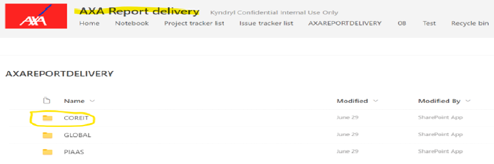
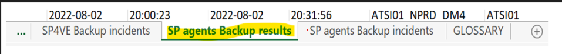
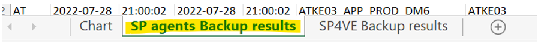
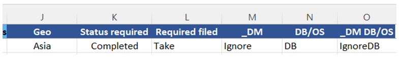
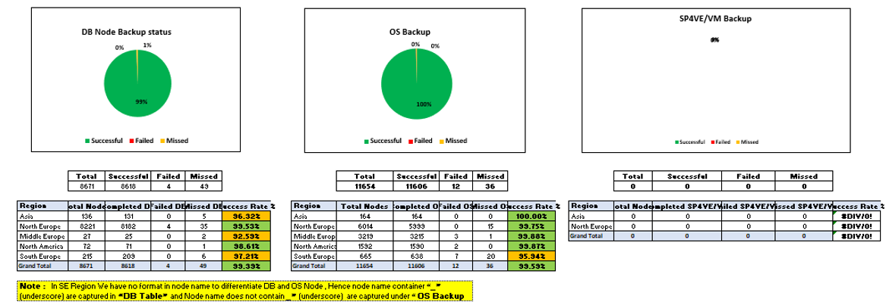

# InfraIT Daily Reports
## List of Reports

|Sl. No. |Report Name |Report Usage|Duration|Manual or Automated|Report Owner|
|:----------- | :--------- | :-------------| :------------- | :------------| :------------- |
|1 | [InfraIT Backup](#InfraIT Backup) |External | 20m | Automated | SAM |
|3| [2nd copy Taskforce](#2nd copy Taskforce)|External|45m|Manual|Abbas|
|4| [I2BCK SLA/SLO(2nd Copy Replication)](#I2BCK SLA/SLO)|External|1.5H|Manual|Abbas|

## 1. InfraIT Backup Report

???+ "Steps to create the report"

     <b><i>Step 1:</b></i>
            File Name - CORE IT Backup Daily Report XX Month YYYY(New) - Update the date for date for which report is prepared

     <b><i>Step 2:</b></i>
       Share point link for automated report:  https://enterprise.sharepoint.com/sites/EnterpriseReportdelivery/SitePages/ProjectHome.aspx
       

     <b><i>Step 3:</b></i>
       Path to download the automated report
       
 Enterprise Report delivery > EnterpriseREPORTDELIVERY>COREIT>REPORTS>BACKUP

 
     <b><i>Step 4:</b></i>
       We should use N-1 report e.g if we are preparing report for 4th Aug – should use automated report of 3rd Aug.
 
     <b><i>Step 5:</b></i>
       Download the automated report region wise.
 
     <b><i>Step 6</b></i>
       Copy the data from A to I Colum in “SP agents Backup results” tab automated report 
       
 
     <b><i>Step 7:</b></i>
       Paste the data to reporting file from A to I “SP agents Backup results” tab in CORE IT Backup Daily Report XX Month YYYY(New) 
       
 
     <b><i>Step 8:</b></i>
       Repeat this action for all the regions one after the other.
 
     <b><i>Step 9:</b></i>
       Check if the value has auto populated in J to O Colum. For the data pasted for the all the region.
       
 
     <b><i>Step 10</b></i>
        Check of the info is populated in Chart “DB Node Backup status”& “OS Backup” tab of reporting file
        
 
     <b><i>Step 11:</b></i>
        SP4VE/VM Backup report to be update by Back team. 
 
     <b><i>Step 12:</b></i>
        Once the report is ready send email to the following email ID’s

       In To : SUNITHA SREEJITH <Sunitha.Sreejith@enterprise.com>; Suma Maraiah <Suma.Maraiah@enterprise.com>; Abbas Ali R Abbas.Ali.R@enterprise.com

       In  CC : Enterprise_Backup <sre_backup@enterprise.com>; RAJESH PILLAI <Rajesh.Pillai@enterprise.com>; Kalli Reddy <Kalli.Reddy@enterprise.com>; SANJU PHILIP <Sanju.Philip@enterprise.com>; ANITHA KODIGEMAKKI <Anitha.Kodigemakki@enterprise.com>; Dinesh Pandey <Dinesh.Pandey@enterprise.com>; Shruthi Thimmareddygari <Shruthi.Thimmareddygari@enterprise.com>; Abhishek Anand <Abhishek.Anand@enterprise.com>; Raghav Nayak <Raghav.Nayak@enterprise.com>; Enterprise-SAMs Enterprise-SAMs@Enterprise.com

       <b>Note</b></i>: Report for Monday should be consolidated report of 3days (Friday, Saturday &Sunday ) e.g if we are publishing the report for  1st Aug report should consolidated of 29th Jul30th Jul & 31st Jul 

## 3. 2nd copy Taskforce Report

## 4. I2BCK SLA/SLO(2nd copy replication) Report